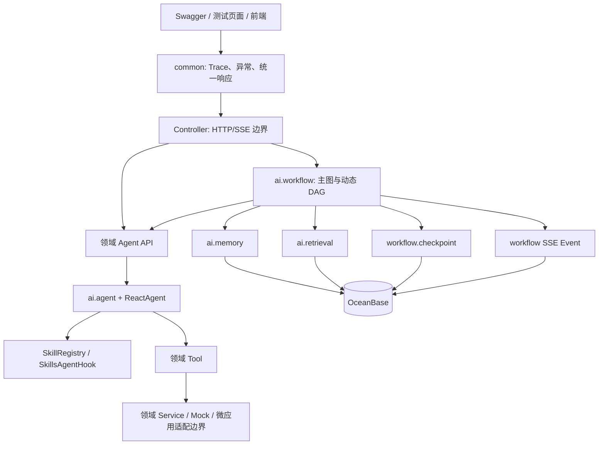
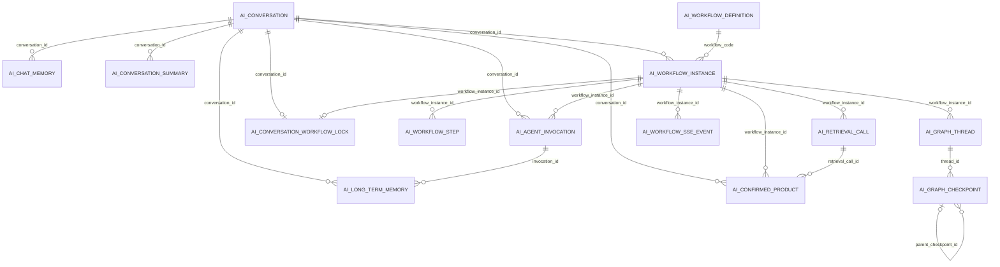

# Insurance Agent 项目理解与开发地图

## 1. 文档定位

本文是 `insurance-agent` 的长期项目地图，面向三类场景：

1. 新成员理解目录、类、Bean、数据库和调用链。
2. 在现有代码上继续开发时，判断新文件应该归属哪个包。
3. 排查 Agent、Workflow、Memory、Checkpoint、SSE 和数据库问题时快速定位入口。

本文以当前源码和本地 OceanBase 实际结构为准。当前技术基线：

| 项目 | 版本/选择 |
| --- | --- |
| Java | 21 编译目标 |
| Spring Boot | 3.5.8 |
| Spring AI | 1.1.2 |
| Spring AI Alibaba | 1.1.2.0 |
| 构建 | Gradle，单模块 |
| 数据库 | OceanBase MySQL 模式 |
| 工作流 | Spring AI Alibaba `StateGraph` / `CompiledGraph` |
| Agent | Spring AI Alibaba `ReactAgent` |
| 持久化 | MyBatis + Flyway + 自定义 OceanBase CheckpointSaver |

> Spring AI Alibaba API 的详细参考仍以 `docs/spring-ai-alibaba/` 为准；本文主要解释这些 API 在当前项目中的实际落点。

---

## 2. 先看整体分层



依赖方向应保持：

```text
common / ai-core能力
        ↑
product、knowledge、policy、asset
        ↑
ai.workflow 编排层
        ↑
controller
```

Workflow 可以调用领域 Agent；领域 Agent 不应反向依赖主 Workflow。

---

## 3. 根目录文件

| 文件/目录 | 作用 |
| --- | --- |
| `settings.gradle` | Gradle 工程名 `insurance-agent`。 |
| `build.gradle` | Java 21、Spring Boot、Spring AI、Spring AI Alibaba、MyBatis、Flyway、Springdoc、Lombok 依赖与版本。 |
| `gradlew` / `gradlew.bat` | 固定 Gradle Wrapper 入口。 |
| `AGENTS.md` | 给后续 Codex 开发使用的项目约束、技术决策和阶段记忆。 |
| `README.md` | 面向使用者的启动、接口和项目概览。 |
| `change.md` | 按阶段记录代码变化、验证结果和兼容性。 |
| `docs/spring-ai-alibaba/` | Spring AI Alibaba 1.1.2.0 的项目级参考文档。 |
| `docs/project-understanding-guide.md` | 本文，负责代码、目录和数据库导航。 |
| `src/main/java` | 生产 Java 代码。 |
| `src/main/resources` | 配置、Flyway、Skill 和静态测试页面。 |
| `src/test/java` | 单元、装配、Graph、Checkpoint、SSE 和回归测试。 |

`InsuranceAgentApplication.main(args)` 是唯一应用启动入口，负责调用 `SpringApplication.run(...)`。

---

## 4. Java 目录与文件职责

## 4.1 `com.xxx.insurance.ai.agent`

存放所有领域 Agent 都能复用的执行上下文、审计和流式模型能力。

| 文件 | 函数/结构 | 作用 |
| --- | --- | --- |
| `AgentExecutionContext` | 两个便捷构造器、`standalone()`、`auditedUserMessage()` | 携带 workflowInstanceId、stepId、taskId、原始问题和流式开关；独立 Agent 调用也能创建上下文。 |
| `AgentTokenStreamContext` | Record 字段 | 定义一次模型流的 conversationId、workflowId、taskId、agentName、phase、streamId。 |
| `AgentTokenStreamSink` | `publishToken()`、`complete()`、`abort()` | 流式 Token 输出端口；正常和异常结束都能刷新待发送正文，Agent 执行器不直接依赖 SSE。 |
| `ReactAgentStreamingExecutor` | 四个 `execute()` 重载；内部 `handleOutput()`、`extractAssistantMessage()`、`StreamPublication` | 消费一次 `ReactAgent.stream(...)`，发布增量 Token，并从最终 State 提取 AssistantMessage；1.1.2.0 的 `streamMessages()` 会过滤最终 State，不能直接替换。 |
| `ChatModelStreamingExecutor` | `execute()`；`publishChunk()`、`repairMissingObjectStart()` | 前置 LLM 节点直接消费 `ChatModel.stream(Prompt)`；聚合结构化输出并处理已知 DeepSeek JSON 起始边界问题。 |
| `AuditedReactAgentExecutor` | `execute()`；`call()`、`saveFailure()`、`invocation()` | 保单和资产 Agent 的公共执行器，统一同步/流式调用、耗时统计、成功/失败审计。 |

## 4.2 `com.xxx.insurance.ai.config`

AI 全局基础设施配置，不放具体业务 Tool。

| 文件 | Bean/函数 | 作用 |
| --- | --- | --- |
| `AiConfig` | `chatModel()` Bean | 根据 Spring AI OpenAI-compatible 配置创建全局复用的 `ChatModel`。所有 ReactAgent 共享该 Bean。 |
| `AiModelProperties` | Getter/Setter；内部 `Chat`、`Options` | 映射 API Key、Base URL、模型名、Temperature，供状态检查和审计读取。 |
| `SkillConfig` | 4 个 `SkillRegistry` Bean + 4 个 `SkillsAgentHook` Bean | 分别加载 `product-analysis`、`knowledge-qa`、`policy-query`、`asset-query` Skill 根目录，确保子智能体隔离。 |
| `AgentSafetyConfig` / `AgentSafetyProperties` | `domainAgentModelCallLimitHook()` Bean；`validate()` | 使用 Spring AI Alibaba `ModelCallLimitHook` 将四个领域 Agent 单次运行模型调用限制为默认8次。 |

`SkillConfig` 只负责 Skill 基础设施；ReactAgent 和 ToolCallback 在各业务域自己的 `config` 包装配。

## 4.3 `com.xxx.insurance.ai.controller/model/service`

| 文件 | 函数 | 作用 |
| --- | --- | --- |
| `AiModelStatusController` | `status()` | `GET /api/v1/ai/model/status`，返回脱敏模型配置状态。 |
| `AiModelStatusService` | `currentStatus()`、`maskApiKey()` | 汇总模型和产品 SkillRegistry 状态，API Key 只返回掩码。 |
| `AiModelStatus` | Record 字段 | 模型 Provider、Base URL、模型名、Temperature、Key 是否配置、Skill 数等状态 DTO。 |

## 4.4 `com.xxx.insurance.ai.memory`

### 目录作用

| 子目录 | 内容 |
| --- | --- |
| `config` | Spring AI `ChatMemory` 与 Repository Bean。 |
| `controller` | 历史会话查询和模型摘要 API。 |
| `mapper` | OceanBase MyBatis SQL。 |
| `model` | 表记录、查询视图、请求与响应 DTO。 |
| `repository` | Spring AI `ChatMemoryRepository` 适配。 |
| `service` | 记忆协调、查询、摘要、local-db 与 NoOp 实现。 |

### 配置、Controller 与 Repository

| 文件 | Bean/函数 | 作用 |
| --- | --- | --- |
| `ChatMemoryConfig` | `chatMemoryRepository()`、`chatMemory()` | local-db 下创建 MyBatis Repository 和 `MessageWindowChatMemory`。 |
| `AgentMemoryController` | `getConversationSnapshot()`、`summarizeConversation()` | 查询会话聚合视图；调用模型生成会话摘要。 |
| `MyBatisChatMemoryRepository` | `findConversationIds()`、`findByConversationId()`、`saveAll()`、`deleteByConversationId()` | 实现 Spring AI `ChatMemoryRepository`；处理 Message 与数据库记录/metadata JSON 转换。 |

### Mapper 文件

| 文件 | 方法 | 对应数据 |
| --- | --- | --- |
| `AgentConversationMapper` | `upsertActiveConversation()` | 新增或更新 `ai_conversation`。 |
| `ChatMemoryMapper` | `findConversationIds()`、`findByConversationId()`、`insert()`、`deleteByConversationId()` | `ai_chat_memory` 窗口消息。 |
| `LongTermMemoryMapper` | `insert()`；内部 `LongTermMemoryWriteRecord.from()` | `ai_long_term_memory` 追加式历史。 |
| `AgentInvocationMapper` | `insert()`；内部 `AgentInvocationWriteRecord.from()` | `ai_agent_invocation` 调用审计。 |
| `ConversationSummaryMapper` | `insert()` | `ai_conversation_summary`。 |
| `AgentMemoryQueryMapper` | `findConversation()`、`findChatMessages()`、`findLongTermMemories()`、`findLongTermMemoriesForSummary()`、`findSummaries()`、`findInvocations()` | 组合查询会话完整快照。 |

### Service 文件

| 文件 | 主要函数 | 作用 |
| --- | --- | --- |
| `AgentMemoryService` | `isEnabled()`、`getHistory()`、`saveSuccessfulExchange()`、`saveSuccessfulInvocation()`、`saveFailedInvocation()` | Agent 记忆与审计总端口。 |
| `JdbcAgentMemoryService` | 实现上述函数；`toConversationRecord()`、`toLongTermMemoryRecord()` | local-db 事务协调器；一次最终对话同时写窗口记忆、长期记忆、会话和调用流水。 |
| `NoOpAgentMemoryService` | 同接口空实现 | 非 local-db profile 保持 Agent 可运行但不持久化。 |
| `AgentConversationService` / `MyBatisAgentConversationService` | `upsertActiveConversation()` | 会话主记录端口与实现。 |
| `AgentInvocationService` / `MyBatisAgentInvocationService` | `save()` | 调用审计端口与 MyBatis 实现；转换缺失章节 JSON 和布尔值。 |
| `NoOpAgentInvocationService` | `save()` 空实现 | 非 local-db 兼容。 |
| `LongTermMemoryService` / `MyBatisLongTermMemoryService` | `save()` | 长期记忆端口与实现。 |
| `NoOpLongTermMemoryService` | `save()` 空实现 | 非 local-db 兼容。 |
| `AgentMemoryQueryService` / `MyBatisAgentMemoryQueryService` | `getConversationSnapshot()` | 聚合窗口、长期记忆、摘要和调用记录。 |
| `NoOpAgentMemoryQueryService` | 返回空快照 | 非 local-db 查询兼容。 |
| `ConversationSummaryService` | `summarize()` | 会话摘要端口。 |
| `ModelConversationSummaryService` | `summarize()`、`buildUserPrompt()`、`normalizeMaxMemories()` | 读取长期记忆，调用 ChatModel 总结并写摘要表。 |
| `NoOpConversationSummaryService` | 返回禁用结果 | 非 local-db 兼容。 |

### Model 文件

这些文件主要是不可变 Record，没有业务 Bean：

| 文件 | 表达的数据 |
| --- | --- |
| `AgentConversationRecord` | 会话主表写入记录。 |
| `AgentInvocationRecord` | Agent 调用完整审计记录。 |
| `AgentInvocationView` | 历史调用查询视图。 |
| `AgentMemoryExchange` | 一次用户/助手消息交换。 |
| `ChatMemoryMessageRecord` | ChatMemory 数据库记录。 |
| `ChatMemoryMessageView` | 对外历史消息视图。 |
| `LongTermMemoryRecord` / `LongTermMemoryView` | 长期记忆写入记录与查询视图。 |
| `ConversationSummaryRecord` / `ConversationSummaryView` | 摘要写入记录与查询视图。 |
| `ConversationSummaryRequest` / `ConversationSummaryResponse` | 摘要 API 请求与响应。 |
| `ConversationMemorySnapshot` | 会话、窗口消息、长期记忆、摘要、调用流水的聚合快照。 |

## 4.5 `com.xxx.insurance.ai.retrieval`

这是未来外部向量召回微应用的审计边界，当前产品召回使用 Mock，但仍记录调用。

| 文件 | 函数 | 作用 |
| --- | --- | --- |
| `RetrievalCallRecord` | Record 字段 | 召回编号、领域、查询、过滤条件、结果、耗时和状态。 |
| `RetrievalCallMapper` | `insert()` | 写 `ai_retrieval_call`。 |
| `RetrievalCallRecorder` | `record()` | 召回审计端口。 |
| `MyBatisRetrievalCallRecorder` | `record()` | local-db 持久化实现。 |
| `NoOpRetrievalCallRecorder` | `record()` 空实现 | 非 local-db 兼容。 |

## 4.6 `com.xxx.insurance.ai.workflow`

这是系统编排层，只负责任务理解、状态流转、Agent 调度、恢复和最终发布，不承载领域事实。

### `workflow.agent`

| 文件 | 函数 | 作用 |
| --- | --- | --- |
| `WorkflowPlannerAgent` | `plan()` 重载、`reactAgent()`、路由格式化函数 | 使用无 Tool ReactAgent 生成结构化 `WorkflowPlan`，再交 Java 校验器确定性校验。 |
| `WorkflowSummaryAgent` | `summarize()` 重载、`reactAgent()`、`buildInput()` | 单成功任务透传，多任务/混合结果调用模型总结；保留失败和跳过说明。 |

### `workflow.checkpoint`

| 文件 | Bean/函数 | 作用 |
| --- | --- | --- |
| `GraphCheckpointStateCodec` | `encode()`、`decode()`、`EncodedState` | 对项目 StateSerializer 做二进制编解码包装。 |
| `OceanBaseCheckpointSaver` | `list()`、`get()`、`put()`、`release()`、`markCompleted()`、`markFailed()`、`markWorkflowCompleted()`、`markWorkflowFailed()`、`purgeExpired()` | 自定义 `BaseCheckpointSaver`；通过线程版本乐观锁保存不可变 Checkpoint，并联表校验 execution owner、fencing token 和 lease。 |
| `GraphCheckpointConfig` | `mainWorkflowStateSerializer()`、`graphCheckpointStateCodec()`、`mainWorkflowCheckpointSaver()` Bean | 注册工作流 Record 的自定义 Jackson serializer/deserializer，解决 1.1.2.0 嵌套 Record 恢复为 Map 的兼容问题。内部类统一实现 `serialize()`、`serializeWithType()`、`deserialize()` 和类型规范化。 |
| `GraphCheckpointProperties` | Getter/Setter、`validate()` | ACTIVE/FAILED 7 天、COMPLETED 24 小时、State Schema 版本、写冲突重试次数。 |
| `GraphCheckpointMapper` | 线程插入/查询、`advanceThreadVersion()`、Checkpoint 插入/查询、状态更新、过期删除 | 操作 `ai_graph_thread` 和 `ai_graph_checkpoint`；执行期写入同时校验 `ai_workflow_instance` 执行权。 |
| `GraphCheckpointRecord` / `GraphCheckpointThreadRecord` | Record 字段 | Checkpoint 快照与线程元数据。 |

### `workflow.client`

| 文件 | 函数 | 作用 |
| --- | --- | --- |
| `OutputReviewGateway` | `review()` | 行内输出审核微应用端口。 |
| `MockOutputReviewGateway` | `review()` | 当前 Mock 实现，返回 PASS/REWRITE/BLOCK 合同。 |

### `workflow.config`

| 文件 | Bean/函数 | 作用 |
| --- | --- | --- |
| `MainWorkflowGraphConfig` | `mainWorkflowGraph()`、`mainWorkflowKeyStrategies()`、`tracked()`、`workflowStepIds()` | 注册主图节点/边、条件分支、Human Confirm 中断、Saver 和全部 ReplaceStrategy。 |
| `WorkflowTaskGraphConfig` | `agentInvokeNode()`、`workflowTaskGraph()` | 编译单任务子图 `mark-running -> agent-invoke`，让每个 DAG 任务有独立 Checkpoint。 |
| `WorkflowPlannerAgentConfig` | `workflowPlannerOutputConverter()`、`workflowPlannerReactAgent()`、`workflowPlannerAgent()` | Planner 结构化输出、ReactAgent 和业务门面 Bean。 |
| `WorkflowSummaryAgentConfig` | `workflowSummaryReactAgent()`、`workflowSummaryAgent()` | Summary ReactAgent 与门面 Bean。 |
| `OutputReviewConfig` | `outputReviewGateway()` | 注册当前 Mock 审核网关。 |
| `WorkflowExecutionConfig` | `workflowDagTaskExecutor()`、`workflowSseTaskExecutor()`、`workflowTokenFlushScheduler()`、`workflowMaintenanceTaskScheduler()`、`createExecutor()` | DAG/SSE 有界线程池；SSE 执行器采用零容量直接交付，最多8路立即运行、满载快速拒绝，不允许已连接请求静默排队；Token 批次刷新和 Spring `@Scheduled` 数据库轮询/清理/租约任务使用相互隔离的调度器；同时负责 MDC 传播、优雅关闭并启用 Scheduling。 |
| `WorkflowSseProperties` | Record 字段与默认校验 | SSE 连接超时、事件保留期、数据库轮询周期，以及 Token 批次最大延迟/字符数。最大延迟被限制在1秒以内。 |
| `WorkflowLifecycleProperties` | 租约 Getter/Setter、`validate()` | 配置实例 owner、执行/抢占/等待确认租约和 heartbeat 周期，并保证续租周期短于最短执行租约。 |

### `workflow.controller`

| 文件 | API 函数 | 作用 |
| --- | --- | --- |
| `MainWorkflowController` | `run()`、`confirmProducts()`、`resume()` | 同步启动主图、确认产品后恢复、异常中断后主动恢复。 |
| `MainWorkflowSseController` | `streamRun()`、`reconnect()`、`confirmProducts()` | SSE 启动、Last-Event-ID 重连、确认产品后继续流式恢复；仅 local-db。 |

### `workflow.job`

| 文件 | 函数 | 作用 |
| --- | --- | --- |
| `WorkflowPersistenceCleanupJob` | `cleanExpiredCheckpoints()`、`cleanExpiredSseEvents()` | Checkpoint 按小时物理清理7天/24小时到期数据；SSE 事件每30秒物理删除10分钟到期数据。 |
| `WorkflowLeaseRecoveryJob` | `renewOwnedLeases()`、`recoverExpiredClaims()` | 每分钟按当前 JVM owner 条件续租 RUNNING/CONFIRMING/RESUMING 实例及其会话锁；每30秒释放过期瞬时状态并物理回收失效会话锁。 |

### `workflow.mapper`

| 文件 | 方法 | 作用 |
| --- | --- | --- |
| `WorkflowExecutionMapper` | 实例/步骤 CRUD、确认与恢复 claim、`renewOwnedExecutionLeases()`、过期会话锁删除 | 工作流执行持久化；claim 递增 fencing token，执行期写入校验 owner、token 和未过期 lease，heartbeat 不改变 token。 |
| `WorkflowSseEventMapper` | 执行期/暂停/终态 sequence 分配、`lastAllocatedSequence()`、`insert()`、`findReplayEvents()`、`findHighWatermark()`、`deleteExpiredEvents()` | 分配工作流内 SSE 序号、持久化、重放和清理；事件写入按阶段校验 owner、fencing token、lease 或终态。人工确认事务提交后立即 flush，`human_confirm` 实际发送成功后才关闭本段连接。 |

### `workflow.node`

| 文件 | 核心函数 | 节点职责 |
| --- | --- | --- |
| `ProductReferenceResolutionNode` | `apply()`、`streamContext()` | 第一节点；加载当前 conversationId 已确认产品，识别产品线索并决定是否召回。 |
| `ProductCandidateRetrievalNode` | `apply()` | 调用产品召回 Service，产生候选列表。 |
| `HumanConfirmProductNode` | `apply()` | 中断恢复后校验标准产品已经写入 State，再流向上下文对齐。 |
| `ContextAlignmentNode` | `apply()`、`resolvedProducts()`、`streamContext()` | 调用上下文对齐服务，结合标准产品和历史改写问题。 |
| `IntentRecognitionNode` | `apply()`、`streamContext()` | 将改写问题映射到白名单意图与目标 Agent。 |
| `PlannerNode` | `apply()`、`streamContext()` | 调 Planner Agent 生成依赖计划。 |
| `DagExecutorNode` | `apply()` | 调统一动态 DAG 执行器。 |
| `TaskMarkRunningNode` | `apply()` | 单任务子图先生成 RUNNING 状态。 |
| `AgentInvokeNode` | `apply()`、`invokeWithRetry()`、`backoff()`、事件发布辅助函数 | 白名单调用一个领域 Agent，处理重试和任务终态 SSE。 |
| `SummaryNode` | `apply()` | 汇总 DAG 成功、失败和跳过结果。 |
| `OutputReviewNode` | `apply()`、`validateResult()` | 调一个审核网关方法；只有 publishableAnswer 可写入 finalAnswer。 |

### `workflow.service`

| 文件 | 核心函数 | 作用 |
| --- | --- | --- |
| `MainWorkflowService` | run/confirm/claim/resume 接口族 | 主工作流应用端口。 |
| `LocalDbMainWorkflowService` | `run()`、`confirmProducts()`、`claimProductConfirmation()`、`confirmClaimedProducts()`、`releaseProductConfirmationClaim()`、`resume()`、`waitingConfirmResponse()`、`complete()`、`fail()` | 创建实例/步骤、调用 Graph、中断响应、原子确认恢复、最终记忆和状态收口。 |
| `WorkflowStartService` | `start()` | 单事务内先条件清理当前 conversation 的过期失效锁，再插入会话锁、实例和步骤；主键冲突是多实例启动互斥的最终防线。 |
| `WorkflowFinalizationService` | `complete()`、`fail()`、内部 `finalize()` | 单事务收口实例终态、最终 Memory、步骤、Checkpoint、SSE Outbox 和 conversation 锁。 |
| `WorkflowPauseService` | `pauseForProductConfirmation()` | 单事务写入步骤暂停、WAITING_CONFIRM、会话锁续期和 human_confirm 事实事件。 |
| `NoOpMainWorkflowService` | 同接口禁用响应 | 非 local-db profile 的可启动替代。 |
| `ContextAlignmentService` | `align()` 重载、Prompt 拼装和确定性校验函数 | 加载会话快照，调用模型完成话题判断、指代消解、问题改写和确认信息合并。 |
| `IntentRecognitionService` | `recognize()` 重载、`validateAndMap()` | 结构化识别意图，并只允许四个白名单 Agent。 |
| `ProductReferenceResolutionService` | `resolve()` 重载、Prompt 与校验函数 | 当前问题先行产品实体判断，输出召回决定和历史产品映射。 |
| `WorkflowPlanValidator` | `validate()`、`validateTask()`、`validateDependencies()`、`validateAcyclic()` | 校验 taskId、agentType、query、dependsOn、自依赖和环。 |
| `WorkflowDagExecutor` | `execute()`、就绪判断、失败传播、完成等待函数 | 依据 dependsOn 动态提交任务；A 完成即可释放只依赖 A 的 B，无需等待无关 C。 |
| `WorkflowTaskGraphRunner` | `execute()`、`runnableConfig()`、`pending()` | 为每个任务生成独立 threadId，恢复 SUCCESS Checkpoint，执行任务子图。 |
| `WorkflowSubAgentRouter` | `invoke()`、`buildAgentQuery()`、结果转换函数 | 将受控 agentType 路由到产品、知识、保单、资产 Agent，只传最小任务上下文。 |
| `WorkflowNodeExecutionGuard` / `LocalDbWorkflowNodeExecutionGuard` | `execute()`；Lease/Fence 与步骤状态辅助函数 | 装饰主图 Node，强制步骤状态 CAS、Lease/Fence 门禁及结果审计；安全异常必须传播给 Graph。 |
| `NoOpWorkflowNodeExecutionGuard` | `execute()` 直接执行 | 非 local-db 替代。 |
| `MainWorkflowLifecycleListener` | `onStart()`、`before()`、`after()`、`onError()`、`onComplete()` | Spring AI Alibaba 原生 Graph Listener；负责 Graph/Node 日志、耗时和脱敏 Stage SSE，不承担安全门禁。 |
| `WorkflowEventPublisher` | `publish()`、`completeSubscribers()` | Workflow 事件输出端口。 |
| `LocalDbWorkflowSseEventService` | subscribe/reconnect/publish/poll/deliver/purge/complete；`SseClient.send()` | OceanBase 是事件事实源；每个连接按 sequenceNo 重放、跨实例轮询和幂等推送。 |
| `NoOpWorkflowEventPublisher` | 空发布 | 非 local-db 替代。 |
| `WorkflowSseService` | `start()`、`reconnect()`、`confirmProducts()`、后台 execute 函数 | 先建立或抢占 SSE，再把 Graph 放入有界线程池。 |
| `WorkflowAgentTokenStreamSink` | `publishToken()`、`complete()`、`abort()`、定时/阈值刷新函数 | 首个 Agent/前置模型块立即发布；后续小块按80ms或128字符合并为持久化 `agent_stream` 事件，结束前强制刷新。 |

### `workflow.model`

这些文件构成 Graph State、Planner 合同、执行结果、API 和持久化记录：

| 文件 | 作用/特殊函数 |
| --- | --- |
| `MainWorkflowStateKeys` | 主图全部 State Key；`all()` 供 KeyStrategy 注册。 |
| `WorkflowTaskStateKeys` | 子图 `taskResult` Key。 |
| `MainWorkflowRequest` / `MainWorkflowResponse` | 主工作流 HTTP 输入与完整输出。 |
| `WorkflowResumeRequest` | 主动恢复请求。 |
| `AlignedWorkflowContext` | 原问题、改写问题、话题关系、确认信息、历史和标准产品。 |
| `ContextAlignmentModelOutput` | 上下文模型结构化原始输出。 |
| `ConversationTopicRelation` | CONTINUE/SWITCH 等话题关系。 |
| `RecognizedIntent` | 支持的业务意图枚举。 |
| `IntentRecognitionModelOutput` | 意图模型原始输出。 |
| `IntentRoute` | 单个意图、目标 Agent、子查询和原因。 |
| `IntentRoutingResult` | 路由集合；兼容旧单路由构造器。 |
| `ProductRecallTrigger` | 首次、模糊、未映射等召回触发类型。 |
| `ProductRecallDecision` | 是否召回、触发原因和线索。 |
| `ProductReferenceResolutionModelOutput` | 产品线索模型输出。 |
| `ProductReferenceResolution` | 经 Java 校验后的产品解析结果。 |
| `WorkflowEntity` | 上下文中标准化实体。 |
| `WorkflowPlan` | Planner 的任务列表和展示 executionMode。 |
| `WorkflowPlanTask` | taskId、agentType、query、dependsOn、maxRetries、required；`agentName()`/`instruction()` 为兼容访问器。 |
| `WorkflowAgentTaskContext` | 子任务最小输入：任务、会话、工作流、确认产品和依赖结果。 |
| `AgentTaskStatus` | PENDING、READY、RUNNING、SUCCESS、FAILED、SKIPPED_DEPENDENCY_FAILED。 |
| `AgentTaskExecutionResult` | 单任务终态；`terminal()` 判断终态。 |
| `DagExecutionResult` | 任务结果聚合；`from()` 计算成功/失败/跳过。 |
| `SubAgentExecutionResult` | 四个领域 Agent 的统一输出。 |
| `WorkflowSummaryResult` | Summary 内容、是否模型生成、缺失任务信息。 |
| `OutputReviewDecision` | PASS、REWRITE、BLOCK。 |
| `OutputReviewRequest` / `OutputReviewResult` | 行内审核输入和输出。 |
| `WorkflowNodeDefinition` | 主图节点枚举；`code()`、`nodeName()`、`type()`、`target()`。 |
| `WorkflowInstanceRecord` / `WorkflowInstanceExecutionView` | 实例写入记录和状态查询视图。 |
| `WorkflowStepRecord` | 步骤写入记录。 |
| `WorkflowSseEventType` | start/stage/human_confirm/agent_start/agent_stream/agent_complete/summary/review/complete/error；`eventName()`。 |
| `WorkflowSseEvent` / `WorkflowSseEventRecord` | 前端事件和数据库事件记录。 |

## 4.7 `com.xxx.insurance.product`

产品分析与产品实体确认业务域。

| 子目录 | 文件与函数 |
| --- | --- |
| `agent` | `ProductAnalysisAgent`: `analyze()` 走确定性 Service；`chat()` 重载走 ReactAgent、Memory、审计和流式输出；`name()`、`description()`、`reactAgent()`、`skillsAgentHook()` 暴露元信息。 |
| `config` | `ProductAnalysisAgentConfig`: `productAnalysisToolCallbacks()`、`productAnalysisReactAgent()`、`productAnalysisAgent()` 三个 Bean。 |
| `controller` | `ProductAnalysisAgentController.chat()`；`ProductRecallController.recall()`。 |
| `formatter` | `ProductAnalysisFormatter.format()` 将原始产品数据转结果；`ProductAnalysisAnswerInspector.inspect()` 校验 Skill 要求的输出章节。 |
| `mapper` | `ConversationConfirmedProductMapper.findActiveByConversationId()`、`upsert()`。 |
| `service` | `ProductAnalysisService.queryProductAnalysisData()`；`MockProductAnalysisService`；`MockProductCatalog.products()`；`ProductRecallService.recall()`；`MockProductRecallService.recall()` 和匹配/审计辅助函数；`ConversationConfirmedProductService` 及其 `MyBatisConversationConfirmedProductService`、`NoOpConversationConfirmedProductService` 实现。 |
| `tool` | `ProductAnalysisTool.analyzeProducts()`，模型 Tool 名 `product_analysis`，先规范产品编码再调 Service/Formatter。 |

Model 文件：

| 文件 | 作用 |
| --- | --- |
| `ProductInfo` | Mock 产品目录中的标准产品。 |
| `ProductAnalysisRequest` / `ProductAnalysisData` / `ProductAnalysisResult` | 确定性分析请求、原始数据和格式化结果。 |
| `ProductAnalysisChatRequest` / `ProductAnalysisChatResponse` | ReactAgent API 合同。 |
| `ProductAnalysisAnswerInspection` | 输出格式检查结果。 |
| `ProductCandidate` | 产品召回候选、分数与匹配原因。 |
| `ProductRecallRequest` / `ProductRecallExecutionContext` / `ProductRecallResult` | 召回 API、审计上下文与结果。 |
| `ProductConfirmationRequest` | 人工选择产品编码请求。 |
| `ConfirmedProduct` | conversationId 内有效的标准化确认产品。 |

## 4.8 `com.xxx.insurance.knowledge`

| 文件组 | 函数/作用 |
| --- | --- |
| `KnowledgeQaAgent` | `chat()` 重载、元信息访问器、ReactAgent/Memory/审计辅助函数。 |
| `KnowledgeQaAgentConfig` | `knowledgeQaToolCallbacks()`、`knowledgeQaReactAgent()`、`knowledgeQaAgent()` Bean。 |
| `KnowledgeQaAgentController` | `chat()` API。 |
| `InsuranceKnowledgeTool` | `search()` Tool，调用知识查询 Service。 |
| `KnowledgeQueryService` / `MockKnowledgeQueryService` | `search()`；按关键词查询 Mock 保险知识。 |
| `KnowledgeArticle` | 知识条目。 |
| `KnowledgeQaChatRequest` / `KnowledgeQaChatResponse` | Agent API DTO。 |
| `KnowledgeQueryResult` | Tool 查询结果。 |

## 4.9 `com.xxx.insurance.policy`

| 文件 | 函数/作用 |
| --- | --- |
| `PolicyQueryAgent` | `query()` 重载调用公共审计 ReactAgent 执行器；提供 `reactAgent()`、`skillsAgentHook()`、`toolCallbacks()`。 |
| `PolicyQueryAgentConfig` | `policyQueryToolCallbacks()`、`policyQueryReactAgent()`、`policyQueryAgent()` Bean。 |
| `PolicyQueryTool` | `queryPolicies()` Tool。 |
| `PolicyQueryService` / `MockPolicyQueryService` | `queryPolicies()`；当前只允许 `MOCK-CUSTOMER-001`。 |
| `PolicyInfo` / `PolicyQueryResult` | 脱敏保单和查询结果 DTO。 |

## 4.10 `com.xxx.insurance.asset`

| 文件 | 函数/作用 |
| --- | --- |
| `AssetQueryAgent` | `query()` 重载调用公共审计 ReactAgent 执行器；提供 ReactAgent、Skill、Tool 访问器。 |
| `AssetQueryAgentConfig` | `assetQueryToolCallbacks()`、`assetQueryReactAgent()`、`assetQueryAgent()` Bean。 |
| `AssetQueryTool` | `queryAssets()` Tool。 |
| `AssetQueryService` / `MockAssetQueryService` | `queryAssets()`；当前只允许 `MOCK-CUSTOMER-001`。 |
| `AssetPosition` / `AssetQueryResult` | 脱敏资产持仓和汇总 DTO。 |

## 4.11 `com.xxx.insurance.common`

| 文件 | Bean/函数 | 作用 |
| --- | --- | --- |
| `OpenApiConfig` | `insuranceAgentOpenAPI()` Bean | Swagger/OpenAPI 标题、版本和说明。 |
| `TraceIdFilter` | `doFilterInternal()` | 读取或生成 traceId，写 MDC 和响应头。 |
| `ErrorCode` | `code()`、`message()`、`httpStatus()` | 统一错误码，包括 WORKFLOW-409。 |
| `BusinessException` | 两个构造器、`errorCode()` | 携带业务错误码。 |
| `GlobalExceptionHandler` | 参数、业务、IllegalState、未知异常处理函数 | 把异常统一转换为 `ApiResponse` 和 HTTP 状态。 |
| `ApiResponse<T>` | `success()`、`failure()` | 统一接口响应结构。 |
| `TraceIdUtil` | `currentTraceId()` | 从 MDC 获取当前链路号。 |

---

## 5. Resources 目录

| 文件/目录 | 作用 |
| --- | --- |
| `application.yml` | 默认 profile：端口、模型环境变量、Actuator、Swagger 和日志；禁用数据库/Flyway自动配置。 |
| `application-local-db.yml` | 恢复 DataSource/Flyway/MyBatis；配置 Checkpoint、SSE 轮询、Token 批次和清理周期。 |
| `db/migration/V1...V19` | 14 张项目表、Graph/SSE、幂等与租约扩展以及工作流定义演进；V19 增加 execution fencing token。已执行脚本不能回写修改。 |
| `skills/product-analysis/...` | 少量/批量产品分析 Skill。 |
| `skills/knowledge-qa/...` | 保险业务知识问答 Skill。 |
| `skills/policy-query/...` | 客户保单查询 Skill。 |
| `skills/asset-query/...` | 客户资产查询 Skill。 |
| `static/workflow-test/index.html` | 工作流流式测试页面。 |
| `static/workflow-test/app.js` | fetch + ReadableStream SSE 解析、Last-Event-ID、Human Confirm 和 Token 拼接。 |
| `static/workflow-test/styles.css` | 测试页面响应式样式。 |

### 5.1 配置文件速查

`application.yml` 是所有 profile 共用的基础配置。默认关闭 JDBC 与 Flyway，但仍装配
ChatModel、ReactAgent、Skill 和 Tool，适合不依赖数据库的单 Agent 验证。模型连接通过
`AI_API_KEY`、`AI_BASE_URL`、`AI_MODEL`、`AI_TEMPERATURE` 环境变量覆盖；Spring AI OpenAI
自动配置要求启动时提供非空 `AI_API_KEY`，即使只使用默认 profile 也不能省略。Actuator仅暴露 `health/info`，Swagger UI 位于
`/swagger-ui.html`，日志通过 MDC 输出 `traceId`。

`application-local-db.yml` 只在 `local-db` profile 下合并生效。它恢复 DataSource/Flyway
自动配置，通过 MySQL 协议连接 OceanBase，并开启 MyBatis 下划线转驼峰。工作流自定义配置分为：

| 配置组 | 当前值 | 运行语义 |
| --- | --- | --- |
| `checkpoint` | 活动7天、完成24小时、Schema v1、写重试5次 | 控制 Graph 状态恢复窗口、序列化版本和乐观锁重试。 |
| `sse` | 连接5分钟、事件10分钟、轮询500ms | 控制单段连接、Last-Event-ID 重放窗口和跨实例跟随延迟。 |
| `maintenance` | Checkpoint 每小时、SSE 每30秒、恢复每30秒 | 控制过期数据物理删除和失效 claim/lock 回收；调度周期会形成到期后的删除延迟。 |
| `lifecycle` | 执行15分钟、claim 2分钟、等待确认24小时、心跳1分钟 | 控制多实例 owner 租约、故障接管和同会话并发锁；heartbeat 必须短于执行及claim租约。 |

两份 YAML 已对每个属性添加就地注释，配置值本身未因此改变。SSE 的10分钟事件保留期与
Checkpoint 的7天/24小时保留期是两套独立生命周期，不能混用。

---

## 6. 测试目录

测试目录镜像生产包，不参与运行时 Bean：

| 目录/文件 | 覆盖重点 |
| --- | --- |
| `InsuranceAgentApplicationTests` | Spring 上下文、Bean、Skill、Tool、迁移脚本和基础约束。 |
| `ai/agent/*Tests` | ReactAgent/ChatModel 流式聚合、审计执行。 |
| `ai/memory/repository/MyBatisChatMemoryRepositoryTests` | Spring AI Message 与数据库记录转换。 |
| `ai/workflow/agent/*Tests` | Planner 与 Summary。 |
| `ai/workflow/checkpoint/*Tests` | State Codec、乐观锁 Saver、恢复与清理。 |
| `ai/workflow/config/MainWorkflowHumanConfirmGraphTests` | Human Confirm 中断和恢复拓扑。 |
| `ai/workflow/node/*Tests` | AgentInvoke、HumanConfirm、Summary、OutputReview。 |
| `ai/workflow/service/*Tests` | 前置模型、DAG、SSE、确认并发、任务子图和校验器。 |
| `ai/workflow/job/WorkflowPersistenceCleanupJobTests` | Checkpoint/SSE 定时清理及失败隔离。 |
| `ai/workflow/job/WorkflowLeaseRecoveryJobTests` | 当前 owner heartbeat 续租参数、瞬时状态恢复和过期 conversation 锁回收。 |
| `ai/workflow/mapper/WorkflowExecutionMapperLeaseSqlTests` | 锁回收、联合续租、恢复 claim 和确认 claim 的数据库 CAS 条件。 |
| `ai/workflow/WorkflowStreamTestPageTests` | 静态流式测试页面资源和安全约束。 |
| `product/knowledge/policy/asset/service/*Tests` | Mock 业务数据、过滤和客户边界。 |

---

## 7. 数据库：当前 15 张表

2026-08-10 已通过本地 OceanBase `show tables` 核对：**14 张项目表 + 1 张 Flyway 管理表**。

## 7.1 会话、记忆与审计（5 张）

| 表 | 主键 | 作用 | 主要关联 |
| --- | --- | --- | --- |
| `ai_conversation` | `conversation_id` | 会话主数据、Mock 身份、归属 Agent、标题和状态。 | 被所有 conversationId 数据逻辑引用。 |
| `ai_chat_memory` | `message_id` | Spring AI 短期窗口；`conversation_id + message_order` 唯一。 | conversationId → 会话。 |
| `ai_long_term_memory` | `memory_id` | 永久历史消息、摘要/事实扩展、标签和重要性。 | conversationId → 会话；invocationId → 调用流水。 |
| `ai_agent_invocation` | `invocation_id` | 每次 Agent/子 Agent 调用输入、输出、模型、耗时、格式和错误审计。 | conversationId；workflowInstanceId；workflowStepId。 |
| `ai_conversation_summary` | `summary_id` | 模型生成的会话摘要及覆盖消息范围。 | conversationId → 会话。 |

一致性规则：主工作流最终回答由 `WorkflowFinalizationService` 将实例终态、ChatMemory、两条长期记忆、调用流水、Checkpoint 和终态 SSE Outbox 放在同一个事务中提交。DAG 子 Agent 只写调用审计，不并发改 ChatMemory。

## 7.2 Workflow 执行与事件（6 张）

| 表 | 主键 | 作用 | 主要关联 |
| --- | --- | --- | --- |
| `ai_workflow_definition` | `workflow_code` | 工作流模板描述和 definition_json；当前主要为 `main-workflow-v1`。 | workflowCode → 实例。 |
| `ai_workflow_instance` | `workflow_instance_id` | 一次工作流运行、请求幂等号、输入输出、owner/lease、执行 fencing token、状态版本和 SSE 最大序号。 | conversationId、workflowCode。 |
| `ai_conversation_workflow_lock` | `conversation_id` | 同一会话只允许一个顶层工作流；运行中由 heartbeat 与实例租约同步续期，终态释放，过期且不再有效/可恢复时物理回收。 | workflowInstanceId、requestId。 |
| `ai_workflow_step` | `workflow_step_id` | 主图各业务节点开始、结束、输入输出和错误。 | workflowInstanceId → 实例。 |
| `ai_workflow_sse_event` | `event_id` | SSE 事实源、顺序重放和跨实例同步；workflow 内 sequenceNo 唯一。模型正文按低延迟可见批次保存，不按底层单 Token 保存。 | workflowInstanceId、conversationId、nodeCode。 |
| `ai_conversation_confirmed_product` | `confirmation_id` | conversationId 内有效的标准产品确认结果。 | conversationId、workflowInstanceId、retrievalCallId。 |

`ai_workflow_instance.status` 当前包括：

```text
RUNNING → WAITING_CONFIRM → CONFIRMING(lease) → RUNNING
RUNNING → RESUMING(lease) → RUNNING
最终：SUCCESS / PARTIAL_SUCCESS / FAILED / REVIEW_BLOCKED
```

## 7.3 Graph Checkpoint（2 张）

| 表 | 主键 | 作用 | 主要关联 |
| --- | --- | --- | --- |
| `ai_graph_thread` | `thread_id` | Graph 执行线程、最新 Checkpoint、乐观锁 version、状态和过期时间。 | workflowInstanceId、conversationId。一个工作流可有主图和多个任务子图线程。 |
| `ai_graph_checkpoint` | `checkpoint_id` | 不可变 State 快照、父快照、节点位置、State 二进制和 Schema 版本。 | threadId → Graph 线程；parentCheckpointId → 历史快照。 |

主图 threadId 使用 workflowInstanceId；子任务图使用包含 workflowInstanceId/taskId 的独立 threadId。V14 已取消 workflowInstanceId 唯一限制，因此一个工作流可以有多个子图 Checkpoint 线程。

版本字段不要混用：`execution_fence_token` 只在新建或执行权接管时变化，用于拒绝旧执行者；`ai_workflow_instance.state_version` 记录实例状态更新；`ai_graph_thread.version` 是单个 Graph Thread 的 Checkpoint 乐观锁。Checkpoint 写入必须同时通过后两类并发条件中的 thread version，以及 Workflow owner/token/lease 门禁。

## 7.4 召回审计（1 张）

| 表 | 主键 | 作用 | 主要关联 |
| --- | --- | --- | --- |
| `ai_retrieval_call` | `retrieval_call_id` | 产品/知识/保单/资产外部召回调用、查询、过滤器、结果和耗时。 | invocationId、workflowInstanceId、conversationId。 |

## 7.5 Flyway（1 张）

| 表 | 作用 |
| --- | --- |
| `flyway_schema_history` | Flyway 自动维护迁移版本、脚本名、Checksum、执行时间和成功状态，不属于业务表。 |

## 7.6 表关系图

当前迁移没有声明物理 Foreign Key，下面均为应用层软关联。这样避免 Agent 高并发写入和清理任务受到级联锁影响，但也意味着一致性必须由 Service、事务和清理顺序保证。



## 7.7 生命周期与清理

| 数据 | 当前保留策略 |
| --- | --- |
| ChatMemory | 窗口数据，由 Spring AI Repository 重写当前窗口。 |
| Long-term Memory | 当前永久保存；归档不等于删除。 |
| 调用、召回、步骤审计 | 当前未配置自动删除。 |
| 活动/运行中/失败 Checkpoint | 默认 7 天；到期前可恢复和排障。 |
| 完成 Checkpoint | 默认 24 小时。 |
| SSE Event | 默认 10 分钟；`expire_at` 之后不再参与 Last-Event-ID 重放，并由30秒周期清理任务物理删除，最大清理延迟约30秒。 |
| Workflow execution lease | RUNNING 默认15分钟，CONFIRMING/RESUMING 抢占默认2分钟；当前 owner 每1分钟续租实例及其 conversation lock。宕机后 heartbeat 停止，租约到期才允许其他实例恢复。 |
| Conversation workflow lock | 未过期锁始终阻止并发启动；过期锁仅在实例终态/等待确认超时/不存在，或执行租约已失效且无未过期 Graph Thread 时删除。 |
| 清理周期 | 启动 1 分钟后首次执行，之后每小时。 |

---

## 8. 关键运行链路

## 8.1 主工作流


链路边界：初始 SSE 在 `human_confirm` 后结束，不占用请求线程等待用户；确认时使用
`POST /runs/{workflowInstanceId}/product-confirmations/stream` 建立第二段流。所有事件先写
`ai_workflow_sse_event`，`complete.finalAnswer` 才是审核后的最终答案。

## 8.2 动态 DAG

```text
Planner 输出 WorkflowPlanTask(dependsOn)
→ WorkflowPlanValidator 校验白名单与无环
→ WorkflowDagExecutor 找 READY 任务
→ 每个任务进入独立 WorkflowTaskGraphRunner
→ AgentInvokeNode 调 WorkflowSubAgentRouter
→ Product / Knowledge / Policy / Asset Agent
→ 任一任务完成后立即释放自己的后继
→ 失败依赖标记 SKIPPED_DEPENDENCY_FAILED，独立任务继续
```

## 8.3 人工确认

```text
Graph 在 human-confirm-product 前中断
→ OceanBase 保存 Checkpoint
→ 实例状态 WAITING_CONFIRM
→ 确认请求原子抢占 WAITING_CONFIRM → CONFIRMING
→ 保存 conversationId 范围内的 ConfirmedProduct
→ updateState(resolvedProducts, humanConfirmRequired=false)
→ withResume() 从 Checkpoint 继续
```

## 8.4 SSE 与多实例

```text
Node/Agent 产生事件
→ WorkflowEventPublisher
→ ai_workflow_sse_event（唯一事实源）
→ 当前 JVM 立即按连接游标读取
→ 每个 JVM 每 500ms 为自己的连接扫描后续 sequenceNo
→ SseClient 幂等发送
→ Last-Event-ID 断线重放
```

不使用全局 `SENT` 状态，因为同一事件可能需要发送给多个 JVM 上的多个浏览器连接；消费位置属于每个内存 SseClient，而不是事件本身。

---

## 9. Profile 与启动差异

| 能力 | 默认 profile | `local-db` profile |
| --- | --- | --- |
| ChatModel/ReactAgent/Skill/Tool | 有 | 有 |
| DataSource/Flyway/MyBatis | 关闭 | 开启 |
| ChatMemory/长期记忆/审计 | NoOp | OceanBase |
| MainWorkflowService | 禁用响应 | 完整 Graph |
| CheckpointSaver | 无 | OceanBase Saver |
| SSE Controller | 无 | 有 |
| SSE 跨实例轮询 | 无 | 有 |
| 持久化清理 Job | 无 | 有 |

环境变量：

```text
AI_API_KEY
AI_BASE_URL
AI_MODEL
AI_TEMPERATURE
DB_URL
DB_USERNAME
DB_PASSWORD
```

API Key 不能写入代码、YAML、数据库事件或日志。

---

## 10. API 快速索引

| 方法 | 路径 | 作用 |
| --- | --- | --- |
| GET | `/api/v1/ai/model/status` | 模型与 Skill 状态。 |
| POST | `/api/v1/product-analysis-agent/chat` | 产品分析单 Agent。 |
| POST | `/api/v1/knowledge-qa-agent/chat` | 知识问答单 Agent。 |
| POST | `/api/v1/products/recall` | Mock 产品候选召回。 |
| GET | `/api/v1/ai/memory/conversations/{conversationId}` | 会话记忆快照。 |
| POST | `/api/v1/ai/memory/conversations/{conversationId}/summaries` | 生成会话摘要。 |
| POST | `/api/v1/workflows/main/runs` | 同步主工作流。 |
| POST | `/api/v1/workflows/main/runs/{id}/product-confirmations` | 同步确认并恢复。 |
| POST | `/api/v1/workflows/main/runs/{id}/resume` | 主动恢复 RUNNING 实例。 |
| POST | `/api/v1/workflows/main/runs/stream` | SSE 启动。 |
| GET | `/api/v1/workflows/main/runs/{id}/events` | Last-Event-ID 重放/续流。 |
| POST | `/api/v1/workflows/main/runs/{id}/product-confirmations/stream` | SSE 确认并恢复。 |

---

## 11. 后续开发放置规则

1. 新的业务事实和接口适配放对应领域 `service/tool/model`，不要写进 Workflow Node。
2. 新子智能体的 ReactAgent Bean 放自己的 `{domain}/config`；Skill 放 `resources/skills/{domain}`。
3. 新 Graph 节点放 `workflow/node`，编排注册放 `MainWorkflowGraphConfig`。
4. 新 State 字段先定义在 StateKeys，并配置 KeyStrategy；新增嵌套 Record 列表必须补 Checkpoint 连续恢复测试。
5. 外部微应用调用端口放 `workflow/client` 或对应业务域 `client`，Mock 和真实实现通过 Bean/Profile 切换。
6. 数据库新增只能添加新的 Flyway 版本，不能修改已执行脚本。
7. 涉及 conversationId、workflowInstanceId、threadId 时分别遵守：会话边界、执行边界、Checkpoint 边界。
8. 中间模型 Token 仅用于过程展示；最终业务答案只能使用审核后的 `complete.finalAnswer`。
9. 所有新增行为都要同步测试目录和 `change.md`，并更新本文相应章节。

---

## 12. 当前边界与待演进点

- 保单和资产仍为固定 Mock 客户；生产必须由服务端身份上下文注入 customerId 并由微应用再次鉴权。
- 产品、知识、保单、资产的数据源当前均为 Mock；领域 Service 接口已经保留真实微应用替换边界。
- 输出审核当前为 Mock Gateway；行内成熟审核能力接入时只替换实现。
- SSE 数据库轮询当前适合技术验证；大规模连接需要增加分页、查询批次、耗时指标和容量压测。
- 数据库没有物理外键；后续必须持续通过事务、条件更新、幂等键和定时审计保证软关联一致性。
- Workflow 定义表主要用于版本和审计，真实运行拓扑当前由 Java `MainWorkflowGraphConfig` 决定。
