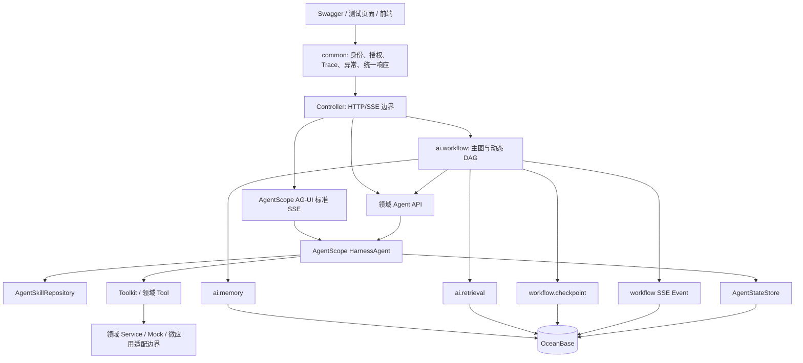
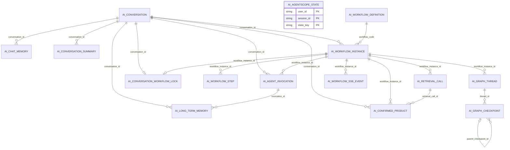

# Insurance Agent 项目理解与开发地图

## 1. 文档定位

本文是 `insurance-agent` 的长期项目地图，面向三类场景：

1. 新成员理解目录、类、Bean、数据库和调用链。
2. 在现有代码上继续开发时，判断新文件应该归属哪个包。
3. 排查 Agent、Workflow、Memory、Checkpoint、SSE 和数据库问题时快速定位入口。

本文以当前源码和本地 OceanBase 实际结构为准。当前技术基线：

| 项目 | 版本/选择 |
| --- | --- |
| Java | 21 编译目标 |
| Spring Boot | 3.5.8 |
| AgentScope Java | 2.0.3，领域 Agent/Tool/Skill/流式事件运行时 |
| Spring AI BOM | 1.1.2，仅用于约束 Graph Core 传递依赖版本；业务源码不再直接调用 Spring AI API |
| Spring AI Alibaba | 1.1.2.0，仅保留 Graph Core 运行时 |
| 构建 | Gradle，单模块 |
| 数据库 | OceanBase MySQL 模式 |
| 工作流 | Spring AI Alibaba `StateGraph` / `CompiledGraph` |
| Agent | AgentScope `HarnessAgent`（内部执行 ReAct/Tool/Skill 循环） |
| 持久化 | MyBatis + Flyway + 自定义 OceanBase CheckpointSaver |

> Spring AI Alibaba API 的详细参考仍以 `docs/spring-ai-alibaba/` 为准；本文主要解释这些 API 在当前项目中的实际落点。

当前 Agent、Model、Message、Tool、Skill、结构化输出、会话窗口与标准 Agent SSE 已迁移到 AgentScope；
Graph Runtime 暂不迁移，因为 AgentScope Harness/AG-UI 不提供当前主图所需的 Checkpoint、Human Confirm、
动态 DAG、Lease/Fence 和可重放 SSE Outbox 等价语义。
Spring Boot BOM 会把 AgentScope 2.0.3 声明的 Reactor 3.8.2、Jackson 2.21.x 约束到项目当前的
Reactor 3.7.13、Jackson 2.19.4；Graph Core 的依赖约束还会把 AgentScope 声明的 OpenTelemetry
1.61.x 解析为 1.49.x。自动化测试已通过，但真实 DeepSeek Tool Calling、AG-UI 长连接和遥测接入
仍是分支合并前必须执行的兼容性验收。

关键复合方法的 Javadoc 采用“外层即可看懂完整链路”的写法：除当前方法直接动作外，还应概括其同步调用
的事务/CAS、Lease/Fence、Checkpoint、SSE 事实落库和失败补偿语义；同时必须明确事务提交后的网络发送
属于即时 flush、数据库 Poller 或 Last-Event-ID 重放，不能把“事件已落库”描述成“前端已收到”。简单
getter、纯转换和显而易见委托保持短注释，避免注释重复代码本身。

当前代码阅读约定：复合类型/状态校验优先使用 Guard Clause；主流程使用具有业务含义的局部变量和私有方法；
仅在集合转换本身足够直观时使用 Stream/Optional 链。涉及 Graph Checkpoint、事务、Lease、Fence、CAS、
SSE sequence 或动态 DAG 并发的代码，优先保持协议完整性，不以减少行数为目标。

---

## 2. 先看整体分层


```mermaid
flowchart TB
    Client["Swagger / 测试页面 / 前端"] --> Common["common: 身份、授权、Trace、异常、统一响应"]
    Common --> Controller["Controller: HTTP/SSE 边界"]
    Controller --> Workflow["ai.workflow: 主图与动态 DAG"]
    Controller --> Agui["AgentScope AG-UI 标准 SSE"]
    Controller --> DomainAgent["领域 Agent API"]
    Workflow --> DomainAgent
    Agui --> HarnessAgent["AgentScope HarnessAgent"]
    DomainAgent --> HarnessAgent
    HarnessAgent --> Skill["AgentSkillRepository"]
    HarnessAgent --> Tool["Toolkit / 领域 Tool"]
    HarnessAgent --> AgentState["AgentStateStore"]
    Tool --> DomainService["领域 Service / Mock / 微应用适配边界"]
    Workflow --> Memory["ai.memory"]
    Workflow --> Retrieval["ai.retrieval"]
    Workflow --> Checkpoint["workflow.checkpoint"]
    Workflow --> SSE["workflow SSE Event"]
    Memory --> OB[("OceanBase")]
    Retrieval --> OB
    Checkpoint --> OB
    SSE --> OB
    AgentState --> OB
```

依赖方向应保持：

```text
common / ai-core能力
        ↑
product、knowledge、policy、asset
        ↑
ai.workflow 编排层
        ↑
controller
```

Workflow 可以调用领域 Agent；领域 Agent 不应反向依赖主 Workflow。

---

## 3. 根目录文件

| 文件/目录 | 作用 |
| --- | --- |
| `settings.gradle` | Gradle 工程名 `insurance-agent`。 |
| `build.gradle` | Java 21、Spring Boot、AgentScope core/harness/OpenAI/AG-UI、Spring AI Alibaba Graph Core、MyBatis、Flyway、Springdoc、Lombok 依赖与版本。 |
| `gradlew` / `gradlew.bat` | 固定 Gradle Wrapper 入口。 |
| `AGENTS.md` | 给后续 Codex 开发使用的项目约束、技术决策和阶段记忆。 |
| `README.md` | 面向使用者的启动、接口和项目概览。 |
| `change.md` | 按阶段记录代码变化、验证结果和兼容性。 |
| `docs/spring-ai-alibaba/` | Spring AI Alibaba 1.1.2.0 的项目级参考文档。 |
| `docs/project-understanding-guide.md` | 本文，负责代码、目录和数据库导航。 |
| `frontend/workflow-test` | React 18 + Vite 流式联调页面源码；构建后输出到 Spring Boot 静态资源目录。 |
| `src/main/java` | 生产 Java 代码。 |
| `src/main/resources` | 配置、Flyway、Skill 和静态测试页面。 |
| `src/test/java` | 单元、装配、Graph、Checkpoint、SSE 和回归测试。 |

`InsuranceAgentApplication.main(args)` 是唯一应用启动入口，负责调用 `SpringApplication.run(...)`。

---

## 4. Java 目录与文件职责

## 4.1 `com.xxx.insurance.ai.agent`

存放所有领域 Agent 都能复用的执行上下文、审计和流式模型能力。

| 文件 | 函数/结构 | 作用 |
| --- | --- | --- |
| `AgentExecutionContext` | 便捷构造器、`standalone()`、`auditedUserMessage()` | 携带 workflowInstanceId、stepId、taskId、原始问题、流式开关和可信调用方身份；独立 Agent 调用也能创建上下文。 |
| `AgentTokenStreamContext` | Record 字段 | 定义一次模型流的 conversationId、workflowId、taskId、agentName、phase、streamId。 |
| `AgentTokenStreamSink` | `publishToken()`、`complete()`、`abort()` | 流式 Token 输出端口；正常和异常结束都能刷新待发送正文，Agent 执行器不直接依赖 SSE。 |
| `AgentScopeAgentFactory` | `create()` | 以共享 Model、独立 Toolkit、隔离 SkillRepository、Agent 命名空间 StateStore 和统一 maxIters 创建 HarnessAgent；保留 Harness 默认上下文压缩和 Tool 结果淘汰，关闭本项目不允许暴露的 Shell、文件系统、子 Agent、工作区、transcript 和内置 Memory Hook。 |
| `ReactAgentStreamingExecutor` | 多个 `execute()` 重载；`runtimeContext()`、`putIfPresent()`、事件映射与消息转换辅助函数 | 消费一次 AgentScope `streamEvents(...)`，发布 `TextBlockDeltaEvent` Token，并从 `AgentResultEvent` 提取最终 AssistantMessage。构造 RuntimeContext 时只写入非空扩展字段，因为 Planner、Summary 等非 DAG 流允许 taskId 为空，而 AgentScope 底层 ConcurrentHashMap 不接受 null。 |
| `AgentScopeModelExecutor` | `execute()`、`appendResponse()`、`repairMissingObjectStart()` | 前置 LLM 节点直接消费 AgentScope `Model.stream(...)`；聚合 TextBlock、发布 Token 并受控修复已知 DeepSeek JSON 起始边界问题。 |
| `AgentScopeStructuredOutput` | `schema()`、`convert()` | 用 AgentScope `JsonSchemaUtils` 生成结构合同，并用项目 Jackson 严格转换模型 JSON；兼容 OpenAI-compatible 模型偶发生成的 `type/object + properties` Schema 外壳，解包后仍进入原有强类型和业务 Validator 校验。 |
| `AuditedReactAgentExecutor` | `execute()`；`call()`、`saveFailure()`、`invocation()` | 保单和资产 Agent 的公共执行器，统一同步/流式调用、耗时统计、成功/失败审计。 |

`ai.agent.state` 是 Harness 状态持久化层：`OceanBaseAgentStateStore` 实现 AgentScope `AgentStateStore`
及数据库 CAS，`NamespacedAgentStateStore` 给共享存储附加 Agent 名称，防止相同 userId/threadId 在不同
领域 Agent 间覆盖；`AgentScopeStateMapper` 操作 `ai_agentscope_state`。工作流内部调用使用一次性 session
并在结束后删除 Harness State，避免与 `ai_chat_memory` 双重注入；AG-UI 直连使用稳定 threadId，可跨请求续接状态。

## 4.2 `com.xxx.insurance.ai.config`

AI 全局基础设施配置，不放具体业务 Tool。

| 文件 | Bean/函数 | 作用 |
| --- | --- | --- |
| `AiConfig` | `agentScopeModel()` Bean | 创建 `OpenAIChatModel + DeepSeekFormatter`，供全部 HarnessAgent 和结构化前置节点共享。 |
| `AiModelProperties` | Getter/Setter | 映射 `insurance.ai.model.*` 的 API Key、Base URL、模型名和 Temperature，供模型、状态检查和审计读取。 |
| `SkillConfig` | 4 个 `AgentSkillRepository` Bean | 分别加载 `product-analysis`、`knowledge-qa`、`policy-query`、`asset-query` classpath Skill 根目录。 |
| `AgentSafetyConfig` / `AgentSafetyProperties` | 配置注册；`validate()` | 由 `AgentScopeAgentFactory` 把 `insurance.ai.agent.safety.max-iterations` 默认8轮映射为各 HarnessAgent 的 `maxIters`。 |
| `AgentScopeStateConfig` | `inMemoryAgentStateStore()`、`oceanBaseAgentStateStore()` | 默认/测试使用内存状态；local-db 使用 OceanBase CAS 状态仓库。 |

`SkillConfig` 只负责 Skill 仓库；HarnessAgent 和领域 Tool 在各业务域自己的 `config` 包装配。

## 4.3 `com.xxx.insurance.ai.controller/model/service`

| 文件 | 函数 | 作用 |
| --- | --- | --- |
| `AiModelStatusController` | `status()` | `GET /api/v1/ai/model/status`，返回脱敏模型配置状态。 |
| `AiModelStatusService` | `currentStatus()`、`maskApiKey()` | 汇总模型和产品 SkillRegistry 状态，API Key 只返回掩码。 |
| `AiModelStatus` | Record 字段 | 模型 Provider、Base URL、模型名、Temperature、Key 是否配置、Skill 数等状态 DTO。 |

`com.xxx.insurance.ai.agui` 提供 AgentScope 标准协议入口：

| 文件 | Bean/函数 | 作用 |
| --- | --- | --- |
| `AgentScopeAguiConfig` | `aguiAgentRegistry()`、`aguiAdapterConfig()`、`aguiEventEncoder()` | 只注册四个可公开领域 Agent；拒绝客户端 Tool 注入，开启正文、Tool、State 和 Token Usage 事件，关闭 reasoning 暴露。 |
| `AgentScopeAguiProperties` | `runTimeout` | 外部化 `insurance.ai.agui.run-timeout`，默认10分钟。 |
| `AgentScopeAguiController` | `run()`、`send()`、`validate()` | `POST /api/v1/agui/agents/{agentId}/runs`；用官方 Adapter/Encoder 把 Harness 事件编码为标准 AG-UI SSE，并在断开或超时时取消 Reactor subscription。 |

AG-UI 是领域 Agent 的标准实时协议，不是主 Graph 的可靠事件通道；它没有替换 OceanBase Outbox、
Last-Event-ID、跨实例 Poller 或人工确认恢复接口。

## 4.4 `com.xxx.insurance.ai.memory`

### 目录作用

| 子目录 | 内容 |
| --- | --- |
| `config` | 当前为空；原 Spring AI ChatMemory Bean 已移除。 |
| `controller` | 历史会话列表/快照/软删除和模型摘要 API。 |
| `mapper` | OceanBase MyBatis SQL。 |
| `model` | 表记录、查询视图、请求与响应 DTO。 |
| `repository` | AgentScope Msg 与 `ai_chat_memory` 的窗口仓库。 |
| `service` | 记忆协调、查询、摘要、local-db 与 NoOp 实现。 |

### 配置、Controller 与 Repository

| 文件 | Bean/函数 | 作用 |
| --- | --- | --- |
| `AgentMemoryController` | `listConversations()`、`getConversationSnapshot()`、`deleteConversation()`、`summarizeConversation()` | 查询历史列表和会话聚合视图、软删除空闲会话、调用模型生成摘要。 |
| `MyBatisChatMemoryRepository` | `findConversationIds()`、`findByConversationId()`、`add()`、`saveAll()`、`deleteByConversationId()` | 处理 AgentScope Msg 与数据库记录/metadata JSON 转换，并按配置裁剪完整短期窗口。 |

### Mapper 文件

| 文件 | 方法 | 对应数据 |
| --- | --- | --- |
| `AgentConversationMapper` | `upsertActiveConversation()` | 新增或更新 `ai_conversation`。 |
| `ChatMemoryMapper` | `findConversationIds()`、`findByConversationId()`、`insert()`、`deleteByConversationId()` | `ai_chat_memory` 窗口消息。 |
| `LongTermMemoryMapper` | `insert()`；内部 `LongTermMemoryWriteRecord.from()` | `ai_long_term_memory` 追加式历史。 |
| `AgentInvocationMapper` | `insert()`；内部 `AgentInvocationWriteRecord.from()` | `ai_agent_invocation` 调用审计。 |
| `ConversationSummaryMapper` | `insert()` | `ai_conversation_summary`。 |
| `AgentMemoryQueryMapper` | `findConversation()`、`findChatMessages()`、`findLongTermMemories()`、`findLongTermMemoriesForSummary()`、`findSummaries()`、`findInvocations()` | 组合查询会话完整快照。`findConversation()` 显式投影 `tenant_id`，其 `@ConstructorArgs` 必须与 `AgentConversationRecord` 的 `conversationId -> tenantId -> userId -> ... -> occurredAt` 构造参数顺序保持一致；租户字段或 Record 结构演进时需要同步修改 SQL、映射和回归测试。 |
| `ConversationManagementMapper` | `findActiveConversations()`、`archiveConversation()`、`countActiveUsage()` | 列出未删除会话；通过条件 UPDATE 软删除，并拒绝仍有活跃 Workflow 或有效 conversation lease 的会话。 |

### Service 文件

| 文件 | 主要函数 | 作用 |
| --- | --- | --- |
| `AgentMemoryService` | `isEnabled()`、`getHistory()`、`saveSuccessfulExchange()`、`saveSuccessfulInvocation()`、`saveFailedInvocation()` | Agent 记忆与审计总端口。 |
| `LocalDbAgentMemoryService` | 实现上述函数；`toConversationRecord()`、`toLongTermMemoryRecord()` | local-db 事务协调器；一次最终对话同时写窗口记忆、长期记忆、会话和调用流水。类名强调运行 Profile 和职责，不再误导为直接使用 JdbcTemplate。 |
| `NoOpAgentMemoryService` | 同接口空实现 | 非 local-db profile 保持 Agent 可运行但不持久化。 |
| `AgentConversationService` / `MyBatisAgentConversationService` | `upsertActiveConversation()` | 会话主记录端口与实现。 |
| `AgentInvocationService` / `MyBatisAgentInvocationService` | `save()` | 调用审计端口与 MyBatis 实现；转换缺失章节 JSON 和布尔值。 |
| `NoOpAgentInvocationService` | `save()` 空实现 | 非 local-db 兼容。 |
| `LongTermMemoryService` / `MyBatisLongTermMemoryService` | `save()` | 长期记忆端口与实现。 |
| `NoOpLongTermMemoryService` | `save()` 空实现 | 非 local-db 兼容。 |
| `AgentMemoryQueryService` / `MyBatisAgentMemoryQueryService` | `getConversationSnapshot()` | 聚合窗口、长期记忆、摘要和调用记录。 |
| `NoOpAgentMemoryQueryService` | 返回空快照 | 非 local-db 查询兼容。 |
| `ConversationManagementService` / `MyBatisConversationManagementService` | `listConversations()`、`archiveConversation()` | 历史列表与软删除边界；删除不清理 Memory、调用流水或 Workflow 审计。 |
| `NoOpConversationManagementService` | 返回空列表和幂等删除结果 | 非 local-db 启动兼容。 |
| `ConversationSummaryService` | `summarize()` | 会话摘要端口。 |
| `ModelConversationSummaryService` | `summarize()`、`buildUserPrompt()`、`normalizeMaxMemories()` | 读取长期记忆，调用 AgentScope Model 总结并写摘要表。 |
| `NoOpConversationSummaryService` | 返回禁用结果 | 非 local-db 兼容。 |

### Model 文件

这些文件主要是不可变 Record，没有业务 Bean：

| 文件 | 表达的数据 |
| --- | --- |
| `AgentConversationRecord` | 会话主表写入记录。 |
| `AgentInvocationRecord` | Agent 调用完整审计记录。 |
| `AgentInvocationView` | 历史调用查询视图。 |
| `AgentMemoryExchange` | 一次用户/助手消息交换。 |
| `ChatMemoryMessageRecord` | AgentScope 短期窗口数据库记录。 |
| `ChatMemoryMessageView` | 对外历史消息视图。 |
| `LongTermMemoryRecord` / `LongTermMemoryView` | 长期记忆写入记录与查询视图。 |
| `ConversationSummaryRecord` / `ConversationSummaryView` | 摘要写入记录与查询视图。 |
| `ConversationSummaryRequest` / `ConversationSummaryResponse` | 摘要 API 请求与响应。 |
| `ConversationMemorySnapshot` | 会话、窗口消息、长期记忆、摘要、调用流水的聚合快照。 |
| `ConversationListItem` | 历史会话编号、标题、Agent、长期消息数量和最近更新时间。 |

## 4.5 `com.xxx.insurance.ai.retrieval`

这是未来外部向量召回微应用的审计边界，当前产品召回使用 Mock，但仍记录调用。

| 文件 | 函数 | 作用 |
| --- | --- | --- |
| `RetrievalCallRecord` | Record 字段 | 召回编号、领域、查询、过滤条件、结果、耗时和状态。 |
| `RetrievalCallMapper` | `insert()` | 写 `ai_retrieval_call`。 |
| `RetrievalCallRecorder` | `record()` | 召回审计端口。 |
| `MyBatisRetrievalCallRecorder` | `record()` | local-db 持久化实现。 |
| `NoOpRetrievalCallRecorder` | `record()` 空实现 | 非 local-db 兼容。 |

## 4.6 `com.xxx.insurance.ai.workflow`

这是系统编排层，只负责任务理解、状态流转、Agent 调度、恢复和最终发布，不承载领域事实。

### `workflow.agent`

| 文件 | 函数 | 作用 |
| --- | --- | --- |
| `WorkflowPlannerAgent` | `plan()` 重载、`reactAgent()`、路由格式化函数 | 使用无 Tool HarnessAgent 生成结构化 `WorkflowPlan`，再交 Java 校验器确定性校验。 |
| `WorkflowSummaryAgent` | `summarize()` 重载、`reactAgent()`、`buildInput()` | 单成功任务透传，多任务/混合结果调用 HarnessAgent 总结；保留失败和跳过说明。 |

### `workflow.checkpoint`

| 文件 | Bean/函数 | 作用 |
| --- | --- | --- |
| `GraphCheckpointStateCodec` | `encode()`、`decode()`、`EncodedState` | 对项目 StateSerializer 做二进制编解码包装。 |
| `OceanBaseCheckpointSaver` | `list()`、`get()`、`put()`、`release()`、`markCompleted()`、`markFailed()`、`markWorkflowCompleted()`、`markWorkflowFailed()`、`purgeExpired()` | 自定义 `BaseCheckpointSaver`；通过线程版本乐观锁保存不可变 Checkpoint，并联表校验 execution owner、fencing token 和 lease。 |
| `GraphCheckpointConfig` | `mainWorkflowStateSerializer()`、`graphCheckpointStateCodec()`、`mainWorkflowCheckpointSaver()` Bean | 注册工作流 Record 的自定义 Jackson serializer/deserializer，解决 1.1.2.0 嵌套 Record 恢复为 Map 的兼容问题。内部类统一实现 `serialize()`、`serializeWithType()`、`deserialize()` 和类型规范化。 |
| `GraphCheckpointProperties` | Getter/Setter、`validate()` | ACTIVE/FAILED 7 天、COMPLETED 24 小时、State Schema 版本、写冲突重试次数。 |
| `GraphCheckpointMapper` | 线程插入/查询、`advanceThreadVersion()`、Checkpoint 插入/查询、状态更新、过期删除 | 操作 `ai_graph_thread` 和 `ai_graph_checkpoint`；执行期写入同时校验 `ai_workflow_instance` 执行权。 |
| `GraphCheckpointRecord` / `GraphCheckpointThreadRecord` | Record 字段 | Checkpoint 快照与线程元数据。 |

### `workflow.client`

| 文件 | 函数 | 作用 |
| --- | --- | --- |
| `OutputReviewGateway` | `review()` | 行内输出审核微应用端口。 |
| `MockOutputReviewGateway` | `review()` | 当前 Mock 实现，返回 PASS/REWRITE/BLOCK 合同。 |

### `workflow.config`

| 文件 | Bean/函数 | 作用 |
| --- | --- | --- |
| `MainWorkflowGraphConfig` | `mainWorkflowGraph()`、`mainWorkflowKeyStrategies()`、`tracked()`、`workflowStepIds()` | 注册主图节点/边、条件分支、Human Confirm 中断、Saver 和全部 ReplaceStrategy。 |
| `WorkflowTaskGraphConfig` | `agentInvokeNode()`、`workflowTaskGraph()` | 编译单任务子图 `mark-running -> agent-invoke`，让每个 DAG 任务有独立 Checkpoint。 |
| `WorkflowPlannerAgentConfig` | `workflowPlannerReactAgent()`、`workflowPlannerAgent()` | Planner HarnessAgent 和业务门面 Bean；结构 JSON 由 AgentScopeStructuredOutput 转换并由 Java 校验器验收。 |
| `WorkflowSummaryAgentConfig` | `workflowSummaryReactAgent()`、`workflowSummaryAgent()` | Summary HarnessAgent 与门面 Bean。 |
| `OutputReviewConfig` | `outputReviewGateway()` | 注册当前 Mock 审核网关。 |
| `WorkflowExecutionConfig` | `workflowDagTaskExecutor()`、`workflowSseTaskExecutor()`、`workflowTokenFlushScheduler()`、`workflowMaintenanceTaskScheduler()`、`createExecutor()` | DAG/SSE 有界线程池；SSE 执行器采用零容量直接交付，最多8路立即运行、满载快速拒绝，不允许已连接请求静默排队；Token 批次刷新和 Spring `@Scheduled` 数据库轮询/清理/租约任务使用相互隔离的调度器；同时负责 MDC 传播、优雅关闭并启用 Scheduling。 |
| `WorkflowLifecycleProperties` | 租约 Getter/Setter、`validate()` | 配置实例 owner、执行/抢占/等待确认租约和 heartbeat 周期，并保证续租周期短于最短执行租约。 |

### `workflow.controller`

| 文件 | API 函数 | 作用 |
| --- | --- | --- |
| `MainWorkflowController` | `run()`、`confirmProducts()`、`resume()` | 同步启动主图、确认产品后恢复、异常中断后主动恢复。 |
| `MainWorkflowSseController` | `streamRun()`、`reconnect()`、`confirmProducts()` | SSE 启动并以 `X-Workflow-Instance-Id` 返回预分配实例号、Last-Event-ID 重连、确认产品后继续流式恢复；仅 local-db。 |

### `workflow.job`

| 文件 | 函数 | 作用 |
| --- | --- | --- |
| `WorkflowPersistenceCleanupJob` | `cleanExpiredCheckpoints()`、`cleanExpiredSseEvents()` | Checkpoint 按小时物理清理7天/24小时到期数据；SSE 事件每30秒物理删除10分钟到期数据。 |
| `WorkflowLeaseRecoveryJob` | `renewOwnedLeases()`、`recoverExpiredClaims()` | 每分钟按当前 JVM owner 条件续租 RUNNING/CONFIRMING/RESUMING 实例及其会话锁；每30秒释放过期瞬时状态并物理回收失效会话锁。 |

### `workflow.mapper`

| 文件 | 方法 | 作用 |
| --- | --- | --- |
| `WorkflowExecutionMapper` | 实例/步骤 CRUD、确认与恢复 claim、`renewOwnedExecutionLeases()`、过期会话锁删除 | 工作流执行持久化；claim 递增 fencing token，执行期写入校验 owner、token 和未过期 lease，heartbeat 不改变 token。 |

### `workflow.node`

| 文件 | 核心函数 | 节点职责 |
| --- | --- | --- |
| `ProductReferenceResolutionNode` | `apply()`、`streamContext()` | 第一节点；加载当前 conversationId 已确认产品，识别产品线索并决定是否召回。 |
| `ProductCandidateRetrievalNode` | `apply()` | 调用产品召回 Service，产生候选列表。 |
| `HumanConfirmProductNode` | `apply()` | 中断恢复后校验标准产品已经写入 State，再流向上下文对齐。 |
| `ContextAlignmentNode` | `apply()`、`resolvedProducts()`、`streamContext()` | 调用上下文对齐服务，结合标准产品和历史改写问题。 |
| `IntentRecognitionNode` | `apply()`、`streamContext()` | 将改写问题映射到白名单意图与目标 Agent。 |
| `PlannerNode` | `apply()`、`streamContext()` | 调 Planner Agent 生成依赖计划。 |
| `DagExecutorNode` | `apply()` | 调统一动态 DAG 执行器。 |
| `TaskMarkRunningNode` | `apply()` | 单任务子图先生成 RUNNING 状态。 |
| `AgentInvokeNode` | `apply()`、`invokeWithRetry()`、`isRetryable()`、`backoff()`、事件发布辅助函数 | 白名单调用一个领域 Agent；参数错误立即失败，其他异常按计划重试，并发布任务终态 SSE。 |
| `SummaryNode` | `apply()` | 汇总 DAG 成功、失败和跳过结果。 |
| `OutputReviewNode` | `apply()`、`validateResult()` | 调一个审核网关方法；只有 publishableAnswer 可写入 finalAnswer。 |

### `workflow.service`

| 文件 | 核心函数 | 作用 |
| --- | --- | --- |
| `MainWorkflowService` | run/confirm/claim/resume 接口族 | 主工作流应用端口。 |
| `LocalDbMainWorkflowService` | `run()`、`confirmProducts()`、`claimProductConfirmation()`、`confirmClaimedProducts()`、`releaseProductConfirmationClaim()`、`resume()`、`waitingConfirmResponse()`、`complete()`、`fail()` | 创建实例/步骤、调用 Graph、中断响应、原子确认恢复、最终记忆和状态收口。 |
| `NoOpMainWorkflowService` | 同接口禁用响应 | 非 local-db profile 的可启动替代。 |
| `ContextAlignmentService` | `align()` 重载、Prompt 拼装和确定性校验函数 | 加载会话快照，调用模型完成话题判断、指代消解、问题改写和确认信息合并。 |
| `IntentRecognitionService` | `recognize()` 重载、`validateAndMap()`、`mergeRoutes()` | 结构化识别意图，并只允许四个白名单 Agent；模型误把同类目标拆成重复意图时，在每条都通过白名单和非空字段校验后按原顺序合并，完全相同文本去重。未知意图、空查询和空理由仍拒绝，不因容错放宽路由边界。 |
| `ProductReferenceResolutionService` | `resolve()` 重载、Prompt 与校验函数 | 当前问题先行产品实体判断，输出召回决定和历史产品映射。 |

### `workflow.execution`

动态任务执行子域。这里负责 Planner 计划的确定性校验和运行时 DAG 调度，不负责主工作流生命周期或 SSE 交付。

| 文件 | 核心函数 | 作用 |
| --- | --- | --- |
| `WorkflowPlanValidator` | `validate()`、`validateTask()`、`validateDependencies()`、`validateAcyclic()` | 校验 taskId、agentType、query、dependsOn、自依赖和环。 |
| `WorkflowDagExecutor` | `execute()`、就绪判断、失败传播、完成等待函数 | 依据 dependsOn 动态提交任务；A 完成即可释放只依赖 A 的 B，无需等待无关 C。 |
| `WorkflowTaskGraphRunner` | `execute()`、`runnableConfig()`、`pending()` | 为每个任务生成独立 threadId，恢复 SUCCESS Checkpoint，执行任务子图。 |
| `WorkflowSubAgentRouter` | `invoke()`、`buildAgentQuery()`、预算分配与结果转换函数 | 将受控 agentType 路由到四个领域 Agent；只传最小任务上下文，并将原始问题、产品和明确上游结果控制在2000字符预算内。 |

### `workflow.lifecycle`

工作流运行安全与状态机子域。事务开始、暂停、收口和节点执行门禁集中在此；这些类不能被普通 Graph 观测逻辑替代。

| 文件 | 核心函数 | 作用 |
| --- | --- | --- |
| `WorkflowStartService` | `start()` | 单事务内先条件清理当前 conversation 的过期失效锁，再插入会话锁、实例和步骤；主键冲突是多实例启动互斥的最终防线。 |
| `WorkflowFinalizationService` | `complete()`、`fail()`、内部 `finalize()` | 单事务收口实例终态、最终 Memory、步骤、Checkpoint、SSE Outbox 和 conversation 锁。 |
| `WorkflowPauseService` | `pauseForProductConfirmation()` | 单事务写入步骤暂停、WAITING_CONFIRM、会话锁续期和 human_confirm 事实事件。 |
| `WorkflowNodeExecutionGuard` / `LocalDbWorkflowNodeExecutionGuard` | `execute()`；Lease/Fence 与步骤状态辅助函数 | 装饰主图 Node，强制步骤状态 CAS、Lease/Fence 门禁及结果审计；安全异常必须传播给 Graph。 |
| `NoOpWorkflowNodeExecutionGuard` | `execute()` 直接执行 | 非 local-db 替代。 |
| `MainWorkflowLifecycleListener` | `onStart()`、`before()`、`after()`、`onError()`、`onComplete()` | Spring AI Alibaba 原生 Graph Listener；负责 Graph/Node 日志、耗时和脱敏 Stage SSE，不承担安全门禁。 |

### `workflow.sse`

可靠流式交付子域，内部按 `config/mapper/model/service` 分层。OceanBase 事件表是事实源，内存中的 `SseEmitter` 只代表当前 JVM 的连接。

| 文件 | 核心函数 | 作用 |
| --- | --- | --- |
| `sse.config.WorkflowSseProperties` | Record 字段与默认校验 | SSE 连接超时、10分钟事件保留、数据库轮询周期，以及 Token 批次最大延迟/字符数；最大延迟限制在1秒以内。 |
| `sse.mapper.WorkflowSseEventMapper` | sequence 分配、`insert()`、`findReplayEvents()`、`deleteExpiredEvents()` | 按工作流分配事件序号、持久化、重放和清理；执行期写入按阶段校验 owner、fencing token、lease 或终态。 |
| `sse.model.WorkflowSseEventType` | `eventName()` | 定义 start、stage、human_confirm、agent_stream、complete、error 等协议事件。 |
| `sse.model.WorkflowSseEvent` / `WorkflowSseEventRecord` | Record 字段 | 前端事件与数据库事件记录。 |
| `sse.model.WorkflowSseSubscription` | Record 字段 | 绑定预分配 workflowInstanceId 与已注册 SseEmitter，使 Controller 可在首事件前返回恢复主键。 |
| `WorkflowEventPublisher` | `publish()`、`completeSubscribers()` | Workflow 事件输出端口。 |
| `LocalDbWorkflowSseEventService` | subscribe/reconnect/publish/poll/deliver/purge/complete；`SseClient.send()` | OceanBase 是事件事实源；每个连接按 sequenceNo 重放、跨实例轮询和幂等推送。 |
| `NoOpWorkflowEventPublisher` | 空发布 | 非 local-db 替代。 |
| `WorkflowSseService` | `start()`、`reconnect()`、`confirmProducts()`、后台 execute 函数 | 预分配实例号，先建立或抢占 SSE，再把 Graph 放入有界线程池；启动时返回实例号与连接句柄。 |
| `WorkflowAgentTokenStreamSink` | `publishToken()`、`complete()`、`abort()`、定时/阈值刷新函数 | 首个 Agent/前置模型块立即发布；后续小块按80ms或128字符合并为持久化 `agent_stream` 事件，结束前强制刷新。 |

### `workflow.model`

这些文件构成 Graph State、Planner 合同、执行结果、API 和持久化记录：

| 文件 | 作用/特殊函数 |
| --- | --- |
| `MainWorkflowStateKeys` | 主图全部 State Key；`all()` 供 KeyStrategy 注册。 |
| `WorkflowTaskStateKeys` | 子图 `taskResult` Key。 |
| `MainWorkflowRequest` / `MainWorkflowResponse` | 主工作流 HTTP 输入与完整输出。 |
| `WorkflowResumeRequest` | 主动恢复请求。 |
| `AlignedWorkflowContext` | 原问题、改写问题、话题关系、确认信息、历史和标准产品。 |
| `ContextAlignmentModelOutput` | 上下文模型结构化原始输出。 |
| `ConversationTopicRelation` | CONTINUE/SWITCH 等话题关系。 |
| `RecognizedIntent` | 支持的业务意图枚举。 |
| `IntentRecognitionModelOutput` | 意图模型原始输出。 |
| `IntentRoute` | 单个意图、目标 Agent、子查询和原因。 |
| `IntentRoutingResult` | 路由集合；兼容旧单路由构造器。 |
| `ProductRecallTrigger` | 首次、模糊、未映射等召回触发类型。 |
| `ProductRecallDecision` | 是否召回、触发原因和线索。 |
| `ProductReferenceResolutionModelOutput` | 产品线索模型输出。 |
| `ProductReferenceResolution` | 经 Java 校验后的产品解析结果。 |
| `WorkflowEntity` | 上下文中标准化实体。 |
| `WorkflowPlan` | Planner 的任务列表和展示 executionMode。 |
| `WorkflowPlanTask` | taskId、agentType、query、dependsOn、maxRetries、required；`agentName()`/`instruction()` 为兼容访问器。 |
| `WorkflowAgentTaskContext` | 子任务最小输入：任务、会话、工作流、确认产品和依赖结果。 |
| `AgentTaskStatus` | PENDING、READY、RUNNING、SUCCESS、FAILED、SKIPPED_DEPENDENCY_FAILED。 |
| `AgentTaskExecutionResult` | 单任务终态；`terminal()` 判断终态。 |
| `DagExecutionResult` | 任务结果聚合；`from()` 计算成功/失败/跳过。 |
| `SubAgentExecutionResult` | 四个领域 Agent 的统一输出。 |
| `WorkflowSummaryResult` | Summary 内容、是否模型生成、缺失任务信息。 |
| `OutputReviewDecision` | PASS、REWRITE、BLOCK。 |
| `OutputReviewRequest` / `OutputReviewResult` | 行内审核输入和输出。 |
| `WorkflowNodeDefinition` | 主图节点枚举；`code()`、`nodeName()`、`type()`、`target()`。 |
| `WorkflowInstanceRecord` / `WorkflowInstanceExecutionView` | 实例写入记录和状态查询视图。 |
| `WorkflowStepRecord` | 步骤写入记录。 |

## 4.7 `com.xxx.insurance.product`

产品分析与产品实体确认业务域。

| 子目录 | 文件与函数 |
| --- | --- |
| `agent` | `ProductAnalysisAgent`: `analyze()` 走确定性 Service；`chat()` 重载走 AgentScope HarnessAgent、Memory、审计和流式输出；元信息访问器用于状态与装配验证。 |
| `config` | `ProductAnalysisAgentConfig`: `productAnalysisReactAgent()`、`productAnalysisAgent()` Bean；Tool 由工厂注册进该 HarnessAgent 的独立 Toolkit。 |
| `controller` | `ProductAnalysisAgentController.chat()`；`ProductRecallController.recall()`。 |
| `formatter` | `ProductAnalysisFormatter.format()` 将原始产品数据转结果；`ProductAnalysisAnswerInspector.inspect()` 校验 Skill 要求的输出章节。 |
| `mapper` | `ConversationConfirmedProductMapper.findActiveByConversationId()`、`upsert()`。 |
| `service` | `ProductAnalysisService.queryProductAnalysisData()`；`MockProductAnalysisService`；`MockProductCatalog.products()`；`ProductRecallService.recall()`；`MockProductRecallService.recall()` 和匹配/审计辅助函数；`ConversationConfirmedProductService` 及其 `MyBatisConversationConfirmedProductService`、`NoOpConversationConfirmedProductService` 实现。 |
| `tool` | `ProductAnalysisTool.analyzeProducts()`，模型 Tool 名 `product_analysis`，先规范产品编码再调 Service/Formatter。 |

Model 文件：

| 文件 | 作用 |
| --- | --- |
| `ProductInfo` | Mock 产品目录中的标准产品。 |
| `ProductAnalysisRequest` / `ProductAnalysisData` / `ProductAnalysisResult` | 确定性分析请求、原始数据和格式化结果。 |
| `ProductAnalysisChatRequest` / `ProductAnalysisChatResponse` | HarnessAgent API 合同。 |
| `ProductAnalysisAnswerInspection` | 输出格式检查结果。 |
| `ProductCandidate` | 产品召回候选、分数与匹配原因。 |
| `ProductRecallRequest` / `ProductRecallExecutionContext` / `ProductRecallResult` | 召回 API、审计上下文与结果。 |
| `ProductConfirmationRequest` | 人工选择产品编码请求。 |
| `ConfirmedProduct` | conversationId 内有效的标准化确认产品。 |

## 4.8 `com.xxx.insurance.knowledge`

| 文件组 | 函数/作用 |
| --- | --- |
| `KnowledgeQaAgent` | `chat()` 重载、元信息访问器、HarnessAgent/Memory/审计辅助函数。 |
| `KnowledgeQaAgentConfig` | `knowledgeQaReactAgent()`、`knowledgeQaAgent()` Bean；绑定知识域 SkillRepository 与 Tool。 |
| `KnowledgeQaAgentController` | `chat()` API。 |
| `InsuranceKnowledgeTool` | `search()` Tool，调用知识查询 Service。 |
| `KnowledgeQueryService` / `MockKnowledgeQueryService` | `search()`；按关键词查询 Mock 保险知识。 |
| `KnowledgeArticle` | 知识条目。 |
| `KnowledgeQaChatRequest` / `KnowledgeQaChatResponse` | Agent API DTO。 |
| `KnowledgeQueryResult` | Tool 查询结果。 |

## 4.9 `com.xxx.insurance.policy`

| 文件 | 函数/作用 |
| --- | --- |
| `PolicyQueryAgent` | `query()` 重载调用公共审计 HarnessAgent 执行器；只暴露底层 Agent 供装配验证。 |
| `PolicyQueryAgentConfig` | `policyQueryReactAgent()`、`policyQueryAgent()` Bean；绑定保单域 SkillRepository 与 Tool。 |
| `PolicyQueryTool` | `queryPolicies()` Tool。 |
| `PolicyQueryService` / `MockPolicyQueryService` | `queryPolicies()`；当前只允许 `MOCK-CUSTOMER-001`。 |
| `PolicyInfo` / `PolicyQueryResult` | 脱敏保单和查询结果 DTO。 |

## 4.10 `com.xxx.insurance.asset`

| 文件 | 函数/作用 |
| --- | --- |
| `AssetQueryAgent` | `query()` 重载调用公共审计 HarnessAgent 执行器；只暴露底层 Agent 供装配验证。 |
| `AssetQueryAgentConfig` | `assetQueryReactAgent()`、`assetQueryAgent()` Bean；绑定资产域 SkillRepository 与 Tool。 |
| `AssetQueryTool` | `queryAssets()` Tool。 |
| `AssetQueryService` / `MockAssetQueryService` | `queryAssets()`；当前只允许 `MOCK-CUSTOMER-001`。 |
| `AssetPosition` / `AssetQueryResult` | 脱敏资产持仓和汇总 DTO。 |

## 4.11 `com.xxx.insurance.common`

| 文件 | Bean/函数 | 作用 |
| --- | --- | --- |
| `OpenApiConfig` | `insuranceAgentOpenAPI()`、`trustedIdentityHeadersOpenApiCustomizer()` Bean | Swagger/OpenAPI 元数据；对使用 RequestIdentity 的接口展示真实可信身份请求头并隐藏错误展开的对象参数。 |
| `TraceIdFilter` | `doFilterInternal()` | 读取或生成 traceId，写 MDC 和响应头。 |
| `ErrorCode` | `code()`、`message()`、`httpStatus()` | 统一错误码，包括 WORKFLOW-409。 |
| `BusinessException` | 两个构造器、`errorCode()` | 携带业务错误码。 |
| `GlobalExceptionHandler` | 参数、业务、IllegalState、未知异常处理函数 | 把异常统一转换为 `ApiResponse` 和 HTTP 状态。 |
| `ApiResponse<T>` | `success()`、`failure()` | 统一接口响应结构。 |
| `TraceIdUtil` | `currentTraceId()` | 从 MDC 获取当前链路号。 |

`common.security` 是统一身份和资源授权层：

| 文件 | Bean/函数 | 作用 |
| --- | --- | --- |
| `RequestIdentity` | `localDefault()`、`namespacedUserId()` | 不可变租户、用户、客户、操作员身份；AgentScope 使用租户限定的用户命名空间。 |
| `SecurityIdentityProperties` | Getter/Setter | 映射 `insurance.security.identity.*`，控制严格请求头模式和本地默认值。 |
| `RequestIdentityArgumentResolver` | `supportsParameter()`、`resolveArgument()` | 统一读取和白名单校验 `X-Tenant-Id` 等可信请求头；严格模式缺少租户/用户时返回401。 |
| `SecurityWebConfig` | `addArgumentResolvers()` | 把身份解析器注册到 Spring MVC。 |
| `ResourceAccessService` | `claimConversation()`、`requireConversationAccess()`、`requireWorkflowAccess()` | 定义会话认领和会话/工作流所有权校验边界。 |
| `LocalDbResourceAccessService` | 三个接口实现 | 通过 OceanBase 根记录执行租户+用户精确授权；冲突或越权统一返回404。 |
| `NoOpResourceAccessService` | 三个接口实现 | 无数据库 Profile 的单 Agent 兼容实现；生产资源隔离必须使用 `local-db`。 |
| `ResourceAccessMapper` | 会话占位插入和两个归属查询 | 首次认领后不允许 upsert 覆盖 owner；工作流按实例主键直接校验租户和用户。 |

这层不执行登录或 Token 验签。生产环境由网关完成认证、清除外部伪造头并注入可信身份，应用负责把
身份贯穿 Agent、Graph State、Checkpoint、Memory 和审计，并在读取资源前进行数据库授权。

---

## 5. Resources 目录

| 文件/目录 | 作用 |
| --- | --- |
| `application.properties` | 当前主配置：默认端口、模型环境变量、Actuator、Swagger、日志、Agent安全限制及 Profile Group。 |
| `application-local-db.properties` | 当前 local-db 主配置：恢复 DataSource/Flyway/MyBatis；配置 Checkpoint、SSE、维护和租约。 |
| `application-debug-timing.properties` | 当前 debug-timing 主配置：IDEA 长断点时间覆盖。 |
| `application.yml` | 保留的基础配置迁移对照；同目录存在 properties 时优先级更低。 |
| `application-local-db.yml` | 保留的 local-db 配置迁移对照；内容应与 properties 同步。 |
| `application-debug-timing.yml` | 保留的断点调试配置迁移对照；内容应与 properties 同步。 |
| `db/migration/V1...V21` | 15 张项目表、Graph/SSE、幂等与租约、AgentScope StateStore、租户所有权及工作流定义演进；V20 新增 AgentScope 状态表，V21 为根资源和审计数据增加 tenant 字段及索引。已执行脚本不能回写修改。 |
| `skills/product-analysis/...` | 少量/批量产品分析 Skill。 |
| `skills/knowledge-qa/...` | 保险业务知识问答 Skill。 |
| `skills/policy-query/...` | 客户保单查询 Skill。 |
| `skills/asset-query/...` | 客户资产查询 Skill。 |
| `static/workflow-test/index.html` | React 工作流流式测试页面入口，由 Vite 构建生成。 |
| `static/workflow-test/assets/app.js` | React 生产构建产物；负责 fetch + ReadableStream SSE 解析、运行游标会话存储、Last-Event-ID 自动重连、Human Confirm、Token 拼接和自动滚动状态。 |
| `static/workflow-test/assets/styles.css` | React 页面生产样式产物，包含会话优先布局、固定 Composer、工作流详情抽屉及移动端响应式样式。 |

### 5.1 React 流式联调页面

工作台采用浅色导航、实时流程和对话输出分栏，输入区固定在内容顶部且不参与收缩，页面使用100dvh限制高度，
输出与流程内部滚动。1250px及以下历史会话可折叠，对话/流程/确认使用工作区切换；收到人工确认事件自动展示候选。
`WorkflowProgress.jsx` 从实际收到的 `stage`、模型流阶段和人工确认事件投影本次真正经过的主节点，
不会预先展示固定的完整流程；产品召回与人工确认节点只在本轮确实进入该分支时出现。动态 DAG 任务以 taskId 区分并行 Agent，缺少完成事件时不会推断成功。“实时过程”显示全部模型增量，
“对话结果”聚焦领域 Agent 和总结输出。人工确认面板仅在 WAITING_CONFIRM 时显示；最终审核答案单独保留。
`workbench.css` 覆盖基础页面样式并适配手机/平板。Vite 开发服务器将 `/api` 代理到本机8080。

源码位于 `frontend/workflow-test/src`。`App.jsx` 管理历史会话列表、按需快照查询、单条/批量软删除确认、工作流请求、SSE 帧消费、产品确认续流和页面状态；`WorkflowProgress.jsx` 将已收到的 Stage 与 taskId 事实投影成 Graph/DAG 进度；`styles.css` 管理会话优先布局和响应式抽屉。中央区域只承载历史消息、本轮问题、实时模型输出、人工确认和最终答案，Composer 固定在独立底部网格行，因此不会被长输出挤出首屏。左侧负责历史会话，右侧“运行详情”负责 Graph 节点、动态 DAG 任务和原始事件；1180px 以下两者均变为遮罩抽屉。选择历史会话后，页面优先按发生时间展示最多200条永久长期记忆，长期记忆为空时回退到 ChatMemory 窗口；新建对话只生成新 conversationId，首次成功问答完成后由既有 Memory 事务写入并进入历史列表。删除只把 `ai_conversation.status` 更新为 `DELETED`，不会物理删除永久历史或审计数据。

历史侧栏的“管理”模式支持多选和全选。前端不会使用一条宽泛的批量数据库更新，而是顺序调用既有单会话删除接口，确保每个 conversationId 都独立经过可信身份、所有权、活跃 Workflow 和有效 conversation lease 校验。批量操作允许部分成功：成功项从列表移除，失败项继续保持选中并提示数量；删除当前会话后自动生成新的 conversationId。工作流处于 `RUNNING` 或 `WAITING_CONFIRM` 时，管理入口和删除动作均保持禁用。

产品召回需要人工确认时，候选不会切换到独立页面，而是作为助手消息内的确认卡片展示；确认按钮仍调用既有 `/product-confirmations/stream`，并带 Last-Event-ID 从当前 Checkpoint 继续执行。中央对话区不会直接暴露产品解析、上下文对齐、意图识别和 Planner 的结构化 JSON，而是将实际收到的 Graph/Agent 事件投影为“识别产品信息、理解问题、选择专业能力、查询分析、整理答复”等用户可理解阶段；Summary Token 作为 Markdown 草稿实时展示。全部原始模型输出仍保留在右侧运行详情的折叠排障区。对话与流程区域都默认跟随最新内容；鼠标滚轮、触摸或指针干预后暂停自动跟随，用户回到底部或点击恢复按钮后再继续。

启动流的响应头 `X-Workflow-Instance-Id` 会在首个数据事件前提供恢复主键。页面把实例编号、最后事件 ID、请求号和 `RUNNING/WAITING_CONFIRM` 状态写入 `sessionStorage`：运行中断线会以指数退避调用 `GET /runs/{workflowInstanceId}/events`；刷新运行中的页面会自动重连；刷新等待确认的页面会恢复候选和勾选结果。等待确认不是终态，期间禁止切换或删除会话、清空页面和启动另一轮工作流，避免前端丢失仍占有 conversation lock 的后端实例。

页面维护执行阶段和对话输出两个独立的自动跟随状态：内容新增时默认滚到底部；只有向上滚轮或向下拖动触摸等明确阅读历史的手势才会立即停止跟随并取消已排队的动画帧；已经到底后继续向下滚动、程序滚动及 DOM 重排不会切换状态，避免恢复按钮和对话内容闪动。用户滚回底部或点击恢复按钮后继续自动跟随。

历史助手消息、实时 Summary 草稿和最终回答通过 `react-markdown` 与 `remark-gfm` 转换为语义化 HTML，支持常用 Markdown 标题、列表、表格、引用、代码块和链接。进入渲染器前会清理零宽空格、空白占位行和超过一个的连续空行，并修正常见的 `##标题`、`-列表`、`1.列表` 缺空格格式；CSS 对 Markdown 直接子区块使用确定的相邻间距并清除空段落，避免模型标准双换行被浏览器默认 margin 放大成大片留白。渲染器启用 `skipHtml`，不会执行模型输出中的原始 HTML，外部链接使用 `target="_blank"` 以及 `rel="noopener noreferrer"`。产品解析、上下文对齐、意图识别和 Planner 的原始 Token 不作为用户答案渲染，仅在运行详情中按纯文本提供技术排障。

`WorkflowTestResourceConfig` 只为 `/workflow-test/**` 注册 classpath 静态资源并返回 `Cache-Control: no-store`。联调页构建产物使用固定 `assets/app.js` 和 `assets/styles.css` 文件名，因此该配置用于防止重新构建、重启 Spring Boot 后浏览器仍运行旧 bundle；其他业务静态资源缓存策略不受影响。

执行 `cd frontend/workflow-test && npm ci && npm run build` 会清空并重新生成 `src/main/resources/static/workflow-test`。后端 Gradle 构建不强制依赖 Node.js，仓库保留构建产物，确保只启动 Spring Boot 也能访问测试页。

### 5.2 配置文件速查

`application.properties` 是所有 profile 共用的主配置。默认关闭 JDBC 与 Flyway，但仍装配
AgentScope Model、HarnessAgent、Skill、Tool 和 AG-UI，适合不依赖数据库的单 Agent 验证。模型连接由
`insurance.ai.model.*` 映射，并通过 `AI_API_KEY`、`AI_BASE_URL`、`AI_MODEL`、`AI_TEMPERATURE`
环境变量覆盖；`insurance.ai.agui.run-timeout` 默认10分钟。Actuator仅暴露 `health/info`，Swagger UI 位于
`/swagger-ui.html`，日志通过 MDC 输出 `traceId`。

`insurance.security.identity.*` 控制调用方身份。默认 `require-headers=false`，IDEA、Swagger 和 React
测试台使用稳定本地身份；生产设置 `IDENTITY_HEADERS_REQUIRED=true` 后，缺少 `X-Tenant-Id` 或
`X-User-Id` 会返回401。`X-Customer-Id` 和 `X-Operator-Id` 可使用环境默认值，但四个值均只允许
1～64位字母、数字和 `._@+-`。这些请求头必须来自可信网关，不能把“请求头存在”当作认证完成。

`application-local-db.properties` 只在 `local-db` profile 下合并生效。它恢复 DataSource/Flyway
自动配置，通过 MySQL 协议连接 OceanBase，并开启 MyBatis 下划线转驼峰。工作流自定义配置分为：

| 配置组 | 当前值 | 运行语义 |
| --- | --- | --- |
| `memory` | 窗口20条 | 控制每个 conversationId 注入 AgentScope Model 的短期消息上限；不删除长期历史。 |
| `checkpoint` | 活动7天、完成24小时、Schema v1、写重试5次 | 控制 Graph 状态恢复窗口、序列化版本和乐观锁重试。 |
| `sse` | 连接5分钟、事件10分钟、轮询500ms | 控制单段连接、Last-Event-ID 重放窗口和跨实例跟随延迟。 |
| `maintenance` | Checkpoint 每小时、SSE 每30秒、恢复每30秒 | 控制过期数据物理删除和失效 claim/lock 回收；调度周期会形成到期后的删除延迟。 |
| `lifecycle` | 执行15分钟、claim 2分钟、等待确认24小时、心跳1分钟 | 控制多实例 owner 租约、故障接管和同会话并发锁；heartbeat 必须短于执行及claim租约。 |

三份 properties 是当前运行配置，原有三份 YAML 保留为低优先级迁移对照。Spring Boot 在同一位置
同时发现 `.properties` 和 YAML 时优先采用 properties；`ApplicationPropertiesPriorityTests` 固定基础配置和
local-db Profile 的优先级及数据库排除项清空语义。两种格式均保留就地注释，后续修改必须同步。
SSE 的10分钟事件保留期与
Checkpoint 的7天/24小时保留期是两套独立生命周期，不能混用。

### 5.3 IDEA 断点调试 Profile

IDEA 调试 Main Workflow 时使用 `local-debug`，它是 `application.properties` 中定义的 Profile Group：

```text
local-debug -> local-db -> debug-timing
```

`local-db` 先启用 OceanBase、Flyway、Checkpoint 和 SSE 事实表；`debug-timing` 再将 SSE
连接/事件保留、execution lease 和 claim lease 放宽到4小时，将人工确认租约放宽到7天，
将 heartbeat 推迟到3小时，并把物理清理首次执行推迟到4小时。数据库轮询仍为500ms、Token 合并仍为80ms/128字符，
所以调试 Profile 不牺牲前端首响应和持续流式体验。该配置用于防止 IDEA `Suspend All`
同时暂停 heartbeat 后工作流丢失 lease，也避免断点事务持有实例行时后台 heartbeat 频繁等待数据库锁。
heartbeat 遇到明确的 `CannotAcquireLockException` 时仅跳过本轮并等待下一周期；其他数据库异常仍正常暴露。
该 Profile 不应进入生产运行参数。

---

## 6. 测试目录

测试目录镜像生产包，不参与运行时 Bean：

| 目录/文件 | 覆盖重点 |
| --- | --- |
| `InsuranceAgentApplicationTests` | Spring 上下文、AgentScope Model/Harness Bean、Skill 和基础约束。 |
| `ai/agent/*Tests` | Harness 事件流、AgentScope Model 流式聚合、结构化输出和审计执行。 |
| `ai/agent/state/*Tests` | Agent 命名空间隔离、OceanBase StateStore JSON 与 CAS。 |
| `ai/agui/*Tests` | 公共 Agent 白名单、Tool 合并策略、事件开关和运行超时。 |
| `ai/memory/repository/MyBatisChatMemoryRepositoryTests` | AgentScope Msg 与数据库记录转换、窗口覆盖语义。 |
| `ai/workflow/agent/*Tests` | Planner 与 Summary。 |
| `ai/workflow/checkpoint/*Tests` | State Codec、乐观锁 Saver、恢复与清理。 |
| `ai/workflow/config/MainWorkflowHumanConfirmGraphTests` | Human Confirm 中断和恢复拓扑。 |
| `ai/workflow/node/*Tests` | AgentInvoke、HumanConfirm、Summary、OutputReview。 |
| `ai/workflow/service/*Tests` | 主工作流应用编排、前置模型和确认并发。 |
| `ai/workflow/execution/*Tests` | 计划校验、动态 DAG、任务子图和子智能体路由。 |
| `ai/workflow/lifecycle/*Tests` | Lease/Fence 执行门禁、生命周期观测、启动和事务收口。 |
| `ai/workflow/sse/{config,mapper,service}/*Tests` | SSE 配置、事件写入围栏、重放、多实例轮询和 Token 合并。 |
| `ai/workflow/job/WorkflowPersistenceCleanupJobTests` | Checkpoint/SSE 定时清理及失败隔离。 |
| `ai/workflow/job/WorkflowLeaseRecoveryJobTests` | 当前 owner heartbeat 续租参数、瞬时状态恢复和过期 conversation 锁回收。 |
| `ai/workflow/mapper/WorkflowExecutionMapperLeaseSqlTests` | 锁回收、联合续租、恢复 claim 和确认 claim 的数据库 CAS 条件。 |
| `ai/workflow/WorkflowStreamTestPageTests` | React 构建产物、SSE 协议、自动跟随交互和源码安全约束。 |
| `common/security/*Tests` | 请求头严格模式、标识符白名单、租户/用户越权404、owner不可覆盖及V21持久化合同。 |
| `product/knowledge/policy/asset/service/*Tests` | Mock 业务数据、过滤和客户边界。 |

---

## 7. 数据库：当前 16 张表

V21 迁移完成后的目标结构为：**15 张项目表 + 1 张 Flyway 管理表**。V21 不新增表，给
`ai_conversation`、`ai_workflow_instance`、`ai_agent_invocation` 和 `ai_long_term_memory` 增加租户字段
与查询索引；已有环境由 Flyway 在下次 `local-db` 启动时迁移。

## 7.1 会话、记忆与审计（5 张）

| 表 | 主键 | 作用 | 主要关联 |
| --- | --- | --- | --- |
| `ai_conversation` | `conversation_id` | 会话所有权根、租户/用户/客户/操作员身份、归属 Agent、标题和状态；首次认领后 owner 不可被 upsert 覆盖。 | 被所有 conversationId 数据逻辑引用。 |
| `ai_chat_memory` | `message_id` | AgentScope Msg 短期窗口；`conversation_id + message_order` 唯一。 | conversationId → 会话。 |
| `ai_long_term_memory` | `memory_id` | 追加式永久用户/助手消息，保存 tenant/user/customer/operator 和调用关联。 | conversationId、invocationId → 会话/调用。 |
| `ai_agent_invocation` | `invocation_id` | 每次 Agent/子 Agent 调用输入、输出、模型、耗时、格式和错误审计，保存 tenantId。 | conversationId；workflowInstanceId；workflowStepId。 |
| `ai_conversation_summary` | `summary_id` | 模型生成的会话摘要及覆盖消息范围。 | conversationId → 会话。 |

一致性规则：主工作流最终回答由 `WorkflowFinalizationService` 将实例终态、短期窗口、两条长期记忆、调用流水、Checkpoint 和终态 SSE Outbox 放在同一个事务中提交。DAG 子 Agent 只写调用审计，不并发改短期窗口。

## 7.2 AgentScope 运行状态（1 张）

| 表 | 主键 | 作用 | 主要关联 |
| --- | --- | --- | --- |
| `ai_agentscope_state` | `(user_id, session_id, state_key)` | Harness/AG-UI 会话状态 JSON、单值/列表标记和 CAS 版本。 | sessionId 在应用层带 Agent 名称前缀；不与 Graph Checkpoint 或业务 conversation memory 混用。 |

## 7.3 Workflow 执行与事件（6 张）

| 表 | 主键 | 作用 | 主要关联 |
| --- | --- | --- | --- |
| `ai_workflow_definition` | `workflow_code` | 工作流模板描述和 definition_json；当前主要为 `main-workflow-v1`。 | workflowCode → 实例。 |
| `ai_workflow_instance` | `workflow_instance_id` | 工作流所有权根，保存租户/用户/客户/操作员、请求幂等号、输入输出、owner/lease、fencing token、状态版本和 SSE 最大序号。 | conversationId、workflowCode。 |
| `ai_conversation_workflow_lock` | `conversation_id` | 同一会话只允许一个顶层工作流；运行中由 heartbeat 与实例租约同步续期，终态释放，过期且不再有效/可恢复时物理回收。 | workflowInstanceId、requestId。 |
| `ai_workflow_step` | `workflow_step_id` | 主图各业务节点开始、结束、输入输出和错误。 | workflowInstanceId → 实例。 |
| `ai_workflow_sse_event` | `event_id` | SSE 事实源、顺序重放和跨实例同步；workflow 内 sequenceNo 唯一。模型正文按低延迟可见批次保存，不按底层单 Token 保存。 | workflowInstanceId、conversationId、nodeCode。 |
| `ai_conversation_confirmed_product` | `confirmation_id` | conversationId 内有效的标准产品确认结果。 | conversationId、workflowInstanceId、retrievalCallId。 |

`ai_workflow_instance.status` 当前包括：

```text
RUNNING → WAITING_CONFIRM → CONFIRMING(lease) → RUNNING
RUNNING → RESUMING(lease) → RUNNING
最终：SUCCESS / PARTIAL_SUCCESS / FAILED / REVIEW_BLOCKED
```

## 7.4 Graph Checkpoint（2 张）

| 表 | 主键 | 作用 | 主要关联 |
| --- | --- | --- | --- |
| `ai_graph_thread` | `thread_id` | Graph 执行线程、最新 Checkpoint、乐观锁 version、状态和过期时间。 | workflowInstanceId、conversationId。一个工作流可有主图和多个任务子图线程。 |
| `ai_graph_checkpoint` | `checkpoint_id` | 不可变 State 快照、父快照、节点位置、State 二进制和 Schema 版本。 | threadId → Graph 线程；parentCheckpointId → 历史快照。 |

主图 threadId 使用 workflowInstanceId；子任务图使用包含 workflowInstanceId/taskId 的独立 threadId。V14 已取消 workflowInstanceId 唯一限制，因此一个工作流可以有多个子图 Checkpoint 线程。

版本字段不要混用：`execution_fence_token` 只在新建或执行权接管时变化，用于拒绝旧执行者；`ai_workflow_instance.state_version` 记录实例状态更新；`ai_graph_thread.version` 是单个 Graph Thread 的 Checkpoint 乐观锁。Checkpoint 写入必须同时通过后两类并发条件中的 thread version，以及 Workflow owner/token/lease 门禁。

## 7.5 召回审计（1 张）

| 表 | 主键 | 作用 | 主要关联 |
| --- | --- | --- | --- |
| `ai_retrieval_call` | `retrieval_call_id` | 产品/知识/保单/资产外部召回调用、查询、过滤器、结果和耗时。 | invocationId、workflowInstanceId、conversationId。 |

## 7.6 Flyway（1 张）

| 表 | 作用 |
| --- | --- |
| `flyway_schema_history` | Flyway 自动维护迁移版本、脚本名、Checksum、执行时间和成功状态，不属于业务表。 |

## 7.7 表关系图

当前迁移没有声明物理 Foreign Key，下面均为应用层软关联。这样避免 Agent 高并发写入和清理任务受到级联锁影响，但也意味着一致性必须由 Service、事务和清理顺序保证。


```mermaid
erDiagram
    AI_CONVERSATION ||--o{ AI_CHAT_MEMORY : conversation_id
    AI_CONVERSATION ||--o{ AI_LONG_TERM_MEMORY : conversation_id
    AI_CONVERSATION ||--o{ AI_AGENT_INVOCATION : conversation_id
    AI_CONVERSATION ||--o{ AI_CONVERSATION_SUMMARY : conversation_id
    AI_CONVERSATION ||--o{ AI_WORKFLOW_INSTANCE : conversation_id
    AI_CONVERSATION ||--o| AI_CONVERSATION_WORKFLOW_LOCK : conversation_id
    AI_CONVERSATION ||--o{ AI_CONFIRMED_PRODUCT : conversation_id
    AI_AGENTSCOPE_STATE {
        string user_id PK
        string session_id PK
        string state_key PK
    }

    AI_WORKFLOW_DEFINITION ||--o{ AI_WORKFLOW_INSTANCE : workflow_code
    AI_WORKFLOW_INSTANCE ||--o{ AI_WORKFLOW_STEP : workflow_instance_id
    AI_WORKFLOW_INSTANCE ||--o| AI_CONVERSATION_WORKFLOW_LOCK : workflow_instance_id
    AI_WORKFLOW_INSTANCE ||--o{ AI_AGENT_INVOCATION : workflow_instance_id
    AI_WORKFLOW_INSTANCE ||--o{ AI_RETRIEVAL_CALL : workflow_instance_id
    AI_WORKFLOW_INSTANCE ||--o{ AI_CONFIRMED_PRODUCT : workflow_instance_id
    AI_WORKFLOW_INSTANCE ||--o{ AI_GRAPH_THREAD : workflow_instance_id
    AI_WORKFLOW_INSTANCE ||--o{ AI_WORKFLOW_SSE_EVENT : workflow_instance_id

    AI_GRAPH_THREAD ||--o{ AI_GRAPH_CHECKPOINT : thread_id
    AI_GRAPH_CHECKPOINT o|--o{ AI_GRAPH_CHECKPOINT : parent_checkpoint_id
    AI_AGENT_INVOCATION ||--o{ AI_LONG_TERM_MEMORY : invocation_id
    AI_RETRIEVAL_CALL ||--o{ AI_CONFIRMED_PRODUCT : retrieval_call_id
```

## 7.8 生命周期与清理

| 数据 | 当前保留策略 |
| --- | --- |
| 业务短期窗口 | `MyBatisChatMemoryRepository` 按容量重写当前 AgentScope Msg 窗口。 |
| AgentScope State | AG-UI 稳定 threadId 可复用；工作流内部一次性 session 在 Agent 执行结束后主动删除。当前未配置定时保留策略。 |
| Long-term Memory | 当前永久保存；归档不等于删除。 |
| 调用、召回、步骤审计 | 当前未配置自动删除。 |
| 活动/运行中/失败 Checkpoint | 默认 7 天；到期前可恢复和排障。 |
| 完成 Checkpoint | 默认 24 小时。 |
| SSE Event | 默认 10 分钟；`expire_at` 之后不再参与 Last-Event-ID 重放，并由30秒周期清理任务物理删除，最大清理延迟约30秒。 |
| Workflow execution lease | RUNNING 默认15分钟，CONFIRMING/RESUMING 抢占默认2分钟；当前 owner 每1分钟续租实例及其 conversation lock。宕机后 heartbeat 停止，租约到期才允许其他实例恢复。 |
| Conversation workflow lock | 未过期锁始终阻止并发启动；过期锁仅在实例终态/等待确认超时/不存在，或执行租约已失效且无未过期 Graph Thread 时删除。 |
| 清理周期 | 启动 1 分钟后首次执行，之后每小时。 |

---

## 8. 关键运行链路

## 8.1 主工作流


```mermaid
flowchart LR
    A["1 POST /runs/stream"] --> B["2 预分配实例号 + 订阅 SSE，再提交后台任务"]
    B --> C["3 会话锁 + instance/steps"]
    C --> D["4 start + invoke Main Graph"]
    D --> E["5 resolve-product-reference"]
    E -->|需要召回| F["6 retrieve-product-candidates"]
    F --> G["7 interruptBefore + human_confirm"]
    G --> H["8 确认接口抢占 + 重放/订阅"]
    H --> I["9 保存产品 + updateState + withResume"]
    I --> J["10 human-confirm-product 校验"]
    E -->|无需召回| K["11 context-alignment"]
    J --> K
    K --> L["12 intent-recognition"]
    L --> M["13 planner-agent"]
    M --> N["14 dynamic DAG"]
    N --> O["15 summary"]
    O --> P["16 output-review"]
    P --> Q["17 原子收口 + complete"]
```

链路边界：启动响应通过 `X-Workflow-Instance-Id` 返回预分配实例号，浏览器据此在首事件丢失或网络断开时调用
`GET /runs/{workflowInstanceId}/events`。初始 SSE 在 `human_confirm` 后结束，不占用请求线程等待用户；确认时使用
`POST /runs/{workflowInstanceId}/product-confirmations/stream` 建立第二段流。所有事件先写
`ai_workflow_sse_event`，`complete.finalAnswer` 才是审核后的最终答案。

## 8.2 动态 DAG

```text
Planner 输出 WorkflowPlanTask(dependsOn)
→ WorkflowPlanValidator 校验白名单与无环
→ WorkflowDagExecutor 找 READY 任务
→ 每个任务进入独立 WorkflowTaskGraphRunner
→ AgentInvokeNode 调 WorkflowSubAgentRouter
→ Product / Knowledge / Policy / Asset Agent
→ 任一任务完成后立即释放自己的后继
→ 失败依赖标记 SKIPPED_DEPENDENCY_FAILED，独立任务继续
```

`WorkflowSubAgentRouter` 不直接拼接无限长度的上游回答：任务原始 query 优先保留，剩余预算用于已确认产品和
`dependsOn` 结果；多个依赖公平分配空间并带截断标记。`AgentInvokeNode` 只重试可能恢复的调用异常，直接
`IllegalArgumentException` 属于确定性输入错误，首次失败后立即记录终态，避免重复消耗线程和模型调用预算。

## 8.3 人工确认

```text
Graph 在 human-confirm-product 前中断
→ OceanBase 保存 Checkpoint
→ 实例状态 WAITING_CONFIRM
→ 确认请求原子抢占 WAITING_CONFIRM → CONFIRMING
→ 保存 conversationId 范围内的 ConfirmedProduct
→ updateState(resolvedProducts, humanConfirmRequired=false)
→ withResume() 从 Checkpoint 继续
```

## 8.4 SSE 与多实例

```text
Node/Agent 产生事件
→ WorkflowEventPublisher
→ ai_workflow_sse_event（唯一事实源）
→ 当前 JVM 立即按连接游标读取
→ 每个 JVM 每 500ms 为自己的连接扫描后续 sequenceNo
→ SseClient 幂等发送
→ 浏览器持久化 workflowInstanceId + Last-Event-ID
→ 断线/刷新后自动重放并衔接实时事件
```

不使用全局 `SENT` 状态，因为同一事件可能需要发送给多个 JVM 上的多个浏览器连接；消费位置属于每个内存 SseClient，而不是事件本身。

---

## 9. Profile 与启动差异

| 能力 | 默认 profile | `local-db` profile |
| --- | --- | --- |
| AgentScope Model/HarnessAgent/Skill/Tool/AG-UI | 有 | 有 |
| DataSource/Flyway/MyBatis | 关闭 | 开启 |
| 短期窗口/长期记忆/审计 | NoOp | OceanBase |
| AgentScope StateStore | 内存 | OceanBase CAS Store |
| MainWorkflowService | 禁用响应 | 完整 Graph |
| CheckpointSaver | 无 | OceanBase Saver |
| SSE Controller | 无 | 有 |
| SSE 跨实例轮询 | 无 | 有 |
| 持久化清理 Job | 无 | 有 |

环境变量：

```text
AI_API_KEY
AI_BASE_URL
AI_MODEL
AI_TEMPERATURE
DB_URL
DB_USERNAME
DB_PASSWORD
```

API Key 不能写入代码、YAML、数据库事件或日志。

---

## 10. API 快速索引

| 方法 | 路径 | 作用 |
| --- | --- | --- |
| GET | `/api/v1/ai/model/status` | 模型与 Skill 状态。 |
| POST | `/api/v1/product-analysis-agent/chat` | 产品分析单 Agent。 |
| POST | `/api/v1/knowledge-qa-agent/chat` | 知识问答单 Agent。 |
| POST | `/api/v1/agui/agents/{agentId}/runs` | AgentScope 标准 AG-UI SSE；只开放四个领域 Agent。 |
| POST | `/api/v1/products/recall` | Mock 产品候选召回。 |
| GET | `/api/v1/ai/memory/conversations/{conversationId}` | 会话记忆快照。 |
| GET | `/api/v1/ai/memory/conversations?limit=50` | 最近历史会话列表。 |
| DELETE | `/api/v1/ai/memory/conversations/{conversationId}` | 软删除空闲会话；保留 Memory 和审计。 |
| POST | `/api/v1/ai/memory/conversations/{conversationId}/summaries` | 生成会话摘要。 |
| POST | `/api/v1/workflows/main/runs` | 同步主工作流。 |
| POST | `/api/v1/workflows/main/runs/{id}/product-confirmations` | 同步确认并恢复。 |
| POST | `/api/v1/workflows/main/runs/{id}/resume` | 主动恢复 RUNNING 实例。 |
| POST | `/api/v1/workflows/main/runs/stream` | SSE 启动；响应头 `X-Workflow-Instance-Id` 提供断线恢复实例号。 |
| GET | `/api/v1/workflows/main/runs/{id}/events` | Last-Event-ID 重放/续流。 |
| POST | `/api/v1/workflows/main/runs/{id}/product-confirmations/stream` | SSE 确认并恢复。 |

---

## 11. 后续开发放置规则

1. 新的业务事实和接口适配放对应领域 `service/tool/model`，不要写进 Workflow Node。
2. 新子智能体的 HarnessAgent Bean 放自己的 `{domain}/config`；Skill 放 `resources/skills/{domain}`。
3. 新 Graph 节点放 `workflow/node`，编排注册放 `MainWorkflowGraphConfig`。
4. 新 State 字段先定义在 StateKeys，并配置 KeyStrategy；新增嵌套 Record 列表必须补 Checkpoint 连续恢复测试。
5. 外部微应用调用端口放 `workflow/client` 或对应业务域 `client`，Mock 和真实实现通过 Bean/Profile 切换。
6. 数据库新增只能添加新的 Flyway 版本，不能修改已执行脚本。
7. 涉及 conversationId、workflowInstanceId、threadId 时分别遵守：会话边界、执行边界、Checkpoint 边界。
8. 中间模型 Token 仅用于过程展示；最终业务答案只能使用审核后的 `complete.finalAnswer`。
9. 所有新增行为都要同步测试目录和 `change.md`，并更新本文相应章节。
10. MyBatis Mapper 注释不能只复述增删改查；工作流、Checkpoint、SSE SQL 要说明 owner、Lease、
    fencing token、状态机、乐观锁、幂等和保留条件，CAS 方法必须明确返回 0 的业务含义。
11. Memory Mapper 注释必须区分短期窗口覆盖、长期历史追加、调用审计和只读观测，避免混淆数据语义。
12. 新增复合判断时优先逐项 Guard Clause；方法同时承担解析、执行和收口时，应按稳定业务阶段提取具名私有方法，
    但不能借可读性重构改变 Graph 拓扑、事务边界、Checkpoint、Retry、SSE 或 Lease/Fence/CAS 语义。

---

## 12. 当前边界与待演进点

- 保单和资产仍为固定 Mock 客户；生产必须由服务端身份上下文注入 customerId 并由微应用再次鉴权。
- 产品、知识、保单、资产的数据源当前均为 Mock；领域 Service 接口已经保留真实微应用替换边界。
- 输出审核当前为 Mock Gateway；行内成熟审核能力接入时只替换实现。
- SSE 数据库轮询当前适合技术验证；大规模连接需要增加分页、查询批次、耗时指标和容量压测。
- 数据库没有物理外键；后续必须持续通过事务、条件更新、幂等键和定时审计保证软关联一致性。
- Workflow 定义表主要用于版本和审计，真实运行拓扑当前由 Java `MainWorkflowGraphConfig` 决定。
- `ai_agentscope_state` 当前没有独立 retention job；工作流内部临时状态会主动删除，AG-UI 长会话状态的归档/清理策略需在正式开放前确定。
- AgentScope AG-UI 当前是标准实时流，不提供项目 Main Workflow SSE 的 OceanBase 重放、多实例游标和 Last-Event-ID 可靠交付保证。
