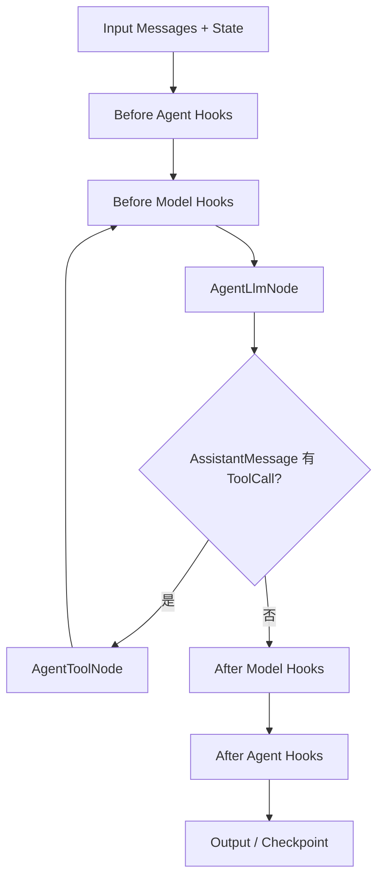

# Agent Framework 开发参考

> 官方架构与功能基线：Spring AI Alibaba `v1.1.2.0`。项目编译适配版本：`1.1.2.0`。除明确标为“官网当前版/待验证”的内容外，类名和方法均已用本地 `1.1.2.0` sources JAR 核对。

## 1. 定位与运行原理

Agent Framework 在 Spring AI 的 `ChatModel`、Message 和 ToolCallback 之上提供 Agent 生命周期、ReAct 循环、Hook/Interceptor、Skill 与多智能体编排。`ReactAgent` 的核心链路如下。



源码中 `ReactAgent.initGraph()` 创建模型、工具和 Hook 节点，条件边在“继续调用 Tool”与“结束”之间路由。ReAct 循环不是业务线程中的手写 `while`；由 Graph Runtime 驱动，并受递归限制、Hook、Tool 结果和模型结束信号控制。

### 创建、调用与销毁

`ReactAgent` 通常作为 Spring 单例 Bean：Builder 保存不可变配置，首次调用时惰性编译图，之后复用 `CompiledGraph`。`ChatModel` 和 Agent 应复用；请求级数据放输入 Map、Message、`RunnableConfig` 或 `ToolContext`，不要写入 Agent 成员变量。框架没有要求每次请求显式销毁 Agent；自定义 Executor、SSE 订阅和外部客户端需要由 Spring 生命周期或 Reactor 终止信号释放。

```java
import com.alibaba.cloud.ai.graph.RunnableConfig;
import com.alibaba.cloud.ai.graph.agent.ReactAgent;
import org.springframework.ai.chat.messages.AssistantMessage;
import org.springframework.ai.chat.model.ChatModel;

ReactAgent agent = ReactAgent.builder()
        .name("product-analysis-agent")
        .description("保险产品分析")
        .model(chatModel)
        .instruction("仅依据工具结果分析，不编造条款")
        .build();

RunnableConfig config = RunnableConfig.builder()
        .threadId(conversationId)
        .build();
AssistantMessage answer = agent.call("比较 P001 和 P002", config);
```

### call、invoke、stream、streamMessages

| API | 返回值 | 使用场景 |
|---|---|---|
| `ReactAgent.call(...)` | `AssistantMessage` | 只关心最终模型消息 |
| `Agent.invoke(...)` | `Optional<OverAllState>` | 读取完整最终 State、结构化输出或附加字段 |
| `Agent.stream(...)` | `Flux<NodeOutput>` | 需要模型、Tool、Hook、Graph 节点级事件 |
| `Agent.streamMessages(...)` | `Flux<Message>` | 只消费消息，不关心编排事件 |

所有 API 都有 `String`、`UserMessage`、`List<Message>`、`Map<String,Object>` 及带 `RunnableConfig` 的重载。`call` 是 `invoke` 后从 `messages` State 提取最后一个 `AssistantMessage` 的便捷封装。

### RunnableConfig 与 threadId

`com.alibaba.cloud.ai.graph.RunnableConfig` 是单次执行配置，包含 `threadId`、`checkPointId`、streamMode、metadata、Store、恢复标记、并行 Executor 与聚合策略。`threadId` 是 Saver 中一条会话/执行分支的隔离键，不等同于用户名，也不自动等同于项目自建的 `conversationId`。

项目建议统一映射 `threadId = conversationId`，但必须校验租户和客户权限，避免只凭前端提供的 conversationId 读取其他会话。

## 2. 模型、Prompt 与上下文

### ChatModel

Builder 支持 `.model(ChatModel)` 或 `.chatClient(ChatClient)`。当前项目使用全局 OpenAI-compatible `ChatModel`，适合单模型阶段；未来 Model Router 应在 Agent 配置边界选择模型，不应让 Tool 自行选择模型。

`instruction` 是任务指令，框架通过内置 `InstructionAgentHook` 注入执行上下文；`systemPrompt` 直接配置系统提示。`1.1.2.0` 两个 Builder 方法均存在。动态数据优先通过输入 Map 传递，由模板读取；客户数据不得拼进全局 Bean 的静态 Prompt。

```java
Map<String, Object> input = Map.of(
        "messages", List.of(new UserMessage("分析已确认产品")),
        "confirmedProducts", confirmedProducts,
        "tenantId", tenantId);
AssistantMessage result = agent.call(input, config);
```

Message 使用 Spring AI 类型：`SystemMessage`、`UserMessage`、`AssistantMessage`、`ToolResponseMessage`。模型上下文应只放当前任务必要的信息；完整历史和审计数据应保存在数据库，不应全部塞入 Token 窗口。

### ToolContext

`org.springframework.ai.chat.model.ToolContext` 中的数据不会作为 Tool JSON Schema 暴露给模型，适合传租户、用户、追踪号和已授权资源范围。它不是安全边界：Tool 内仍必须做服务端鉴权。

### 短期记忆、Saver 与 Checkpoint

Agent Framework 的短期记忆来自 Graph State + Checkpoint Saver：相同 `threadId` 的后续调用可恢复 State。项目当前使用 Spring AI `ChatMemory` 手工读取历史再传给 `ReactAgent.call(List<Message>)`，与 Graph Saver 是两套机制。

建议分阶段迁移：保留 ChatMemory 作为对话窗口；主 Graph 增加 Saver 管理流程恢复。不要让两套机制都无条件把同一批消息追加给模型，否则会重复上下文。

## 3. Tools

### 定义与注册

Spring AI 支持 `@Tool` 方法经 `ToolCallbacks.from(...)` 转成 `ToolCallback`，也可直接构造 `FunctionToolCallback`。当前项目的 `ProductAnalysisTool` 采用注解方式是合适的。

```java
import org.springframework.ai.chat.model.ToolContext;
import org.springframework.ai.tool.annotation.Tool;
import org.springframework.ai.tool.annotation.ToolParam;

public final class PolicyTools {
    @Tool(description = "按保单号查询当前客户有权查看的保单")
    public PolicyView queryPolicy(
            @ToolParam(description = "保单号") String policyNo,
            ToolContext context) {
        String customerId = (String) context.getContext().get("customerId");
        return policyService.queryAuthorized(customerId, policyNo);
    }
}
```

注册方式：`.methodTools(toolObject)`、`.tools(ToolCallback...)`、`.toolCallbackProviders(...)` 或 `.toolNames(...) + resolver(...)`。多 Tool 时描述应互斥、参数 Schema 清晰；高风险 Tool 应通过 `ToolSelectionInterceptor` 或自定义拦截器限制动态可见集合。

### 参数、异常、同步和异步

- 参数对象使用 Bean Validation，并在 Service 层二次验证业务权限。
- `.toolExecutionExceptionProcessor(...)` 可统一转换工具异常；不要把数据库栈或客户隐私返回模型。
- `ToolRetryInterceptor` 只重试幂等、可恢复错误；写操作必须有幂等键。
- `1.1.2.0` Builder 支持 `parallelToolExecution`、`maxParallelTools`、`toolExecutionTimeout` 和 `wrapSyncToolsAsAsync`。
- 同步 Tool 被包装异步后仍会占 Executor 线程；数据库连接与线程池容量必须联合配置。

### returnDirect

Spring AI Tool 可声明 `returnDirect`，框架在 `1.1.2.0` 起支持直接返回 Tool 结果，跳过后续模型总结。仅适合已格式化、安全审查完成的确定性响应；保险分析答案不宜默认使用，因为通常还需合规审核和总结。

## 4. Hooks 与 Interceptors

| 维度 | Hook | Interceptor |
|---|---|---|
| 定位 | Graph 生命周期节点 | 模型或 Tool 调用的包装链 |
| 核心类型 | `Hook`、`AgentHook`、`ModelHook` | `ModelInterceptor`、`ToolInterceptor`、`StreamingModelInterceptor` |
| 时机 | before/after Agent，before/after Model | 调用前后，可决定是否继续 handler |
| 可修改内容 | 返回 State update；可声明 KeyStrategy、Tool、跳转 | 模型 Request/Response、Tool Request/Response、流式 chunk |
| 适合 | 摘要、HITL、调用上限、全局生命周期审计 | 重试、降级、Tool 选择、脱敏、消息裁剪 |

关键签名：

```java
CompletableFuture<Map<String, Object>> beforeAgent(OverAllState state, RunnableConfig config);
CompletableFuture<Map<String, Object>> beforeModel(OverAllState state, RunnableConfig config);
ModelResponse interceptModel(ModelRequest request, ModelCallHandler handler);
ToolCallResponse interceptToolCall(ToolCallRequest request, ToolCallHandler handler);
```

Hook 返回 Map 会按 State KeyStrategy 合并，因此可修改状态；`MessagesAgentHook` / `MessagesModelHook` 可直接处理消息。Interceptor 可以替换消息、动态 Tool、模型选项和结果。日志审计要记录节点、Agent、Tool 名、耗时、状态和 traceId，不记录 API Key、完整身份证号或未经脱敏的 Tool 参数。

重试放 Interceptor，流程补偿放 Graph；消息裁剪可用 `ContextEditingInterceptor`/`SummarizationHook`；人工确认可用 `HumanInTheLoopHook`，但跨节点业务确认更推荐主 Graph interrupt。

## 5. Skills

Skill 是可按需加载的领域指令，不是 Tool。Tool 执行动作；Skill 告诉模型何时、按什么规则组合动作。

```text
skills/product-analysis/
├── limited-product-analysis/
│   └── SKILL.md
└── batch-product-analysis/
    └── SKILL.md
```

加载过程：Registry 启动时扫描 `SKILL.md` 元数据 -> `SkillsInterceptor` 将名称/描述注入系统上下文 -> 模型匹配任务 -> 调用 `read_skill` 加载全文 -> `groupedTools` 或 Skill 声明的工具按需加入模型请求。`1.1.2.0` 的 `SkillsAgentHook` 还提供 `search_skills`、`disable_skill`。

```java
import com.alibaba.cloud.ai.graph.agent.hook.skills.SkillsAgentHook;
import com.alibaba.cloud.ai.graph.skills.registry.SkillRegistry;
import com.alibaba.cloud.ai.graph.skills.registry.classpath.ClasspathSkillRegistry;

SkillRegistry registry = ClasspathSkillRegistry.builder()
        .classpathPath("skills/product-analysis")
        .build();
SkillsAgentHook hook = SkillsAgentHook.builder()
        .skillRegistry(registry)
        .autoReload(false)
        .groupedTools(Map.of("limited-product-analysis", productTools))
        .build();
```

`FileSystemSkillRegistry` 适合运行期维护，可配置用户级和项目级目录，项目级同名 Skill 覆盖用户级；`ClasspathSkillRegistry` 适合随应用版本发布，并支持 JAR 资源。生产环境默认 `autoReload(false)`，变更走发布或受控刷新。

当前项目按子智能体隔离根目录是正确设计。若使用 `.classpathPath("skills")`，会把未来 policy、asset、knowledge Skill 一并暴露给产品 Agent，造成能力越权和上下文污染。

## 6. 结构化输出

Builder 提供 `.outputType(Class<?>)` 和 `.outputSchema(String)`。框架基于 Spring AI `BeanOutputConverter`/JSON Schema 约束模型输出。结构化输出仍是“模型生成 + 解析”，不是数据库级保证。

**当前项目 1.1.2.0 兼容性说明（根据本地依赖源码与回归测试）**：`AgentLlmNode` 会在模型调用前
使用 `PromptTemplate` 渲染消息。若把 `BeanOutputConverter.getFormat()` 直接拼入 `instruction`，默认
`StTemplateRenderer` 会把 JSON Schema 的 `{}` 识别为模板表达式并抛出
`The template string is not valid`。固定 Java 输出合同应使用 `.outputType(...)`；对于不需要运行时模板
变量的 Agent，同时配置 `NoOpTemplateRenderer`，保证框架追加到用户消息中的 Schema 不会再次被解析。

```java
public record ReviewResult(boolean passed, List<String> risks, String revisedAnswer) {}

ReactAgent reviewer = ReactAgent.builder()
        .name("output-review-agent")
        .model(chatModel)
        .instruction("审核保险回答，严格按 schema 输出")
        .outputType(ReviewResult.class)
        .build();

OverAllState state = reviewer.invoke(answer).orElseThrow();
```

解析前应设最大输出长度；解析失败可做一次带原错误的修复重试，仍失败则进入确定性降级，不把原始 JSON 直接发布。官网不同页面对结果位于 AssistantMessage 还是 State 的描述存在演进差异，`1.1.2.0` 项目中应通过 `invoke` 检查实际 State，并为输出解析添加集成测试。

## 7. 流式输出与 SSE

`stream()` 发出 `NodeOutput`。当对象是 `StreamingOutput<?>` 时，`getOutputType()` 可区分：

- `AGENT_MODEL_STREAMING` / `AGENT_MODEL_FINISHED`
- `AGENT_TOOL_STREAMING` / `AGENT_TOOL_FINISHED`
- `AGENT_HOOK_STREAMING` / `AGENT_HOOK_FINISHED`
- `GRAPH_NODE_STREAMING` / `GRAPH_NODE_FINISHED`

文本从 `streaming.message()` 读取；`chunk()` 在 `1.1.2.0` 已标记 deprecated。ToolCall 类型的 AssistantMessage 可能没有文本，应过滤空内容，不能把每个 NodeOutput 都当 Token。

```java
Flux<NodeOutput> flux = agent.stream(input, config);
flux.subscribe(output -> {
    if (output instanceof StreamingOutput<?> streaming
            && streaming.getOutputType() == OutputType.AGENT_MODEL_STREAMING
            && streaming.message() instanceof AssistantMessage message
            && message.getText() != null && !message.getText().isEmpty()) {
        log.info("[Agent] stream={}", message.getText());
        emitter.send(SseEmitter.event().name("agent_stream").data(message.getText()));
    }
}, error -> {
    safeSendError(emitter, error);
    emitter.completeWithError(error);
}, emitter::complete);
```

生产适配必须：在 `emitter.onCompletion/onTimeout/onError` 中取消 Reactor `Disposable`；用有界 Executor；串行化 `SseEmitter.send`；设置心跳和总超时；客户端断开后停止模型流；`doFinally` 清理资源。Spring MVC `SseEmitter` 没有完整 Reactive 背压，若吞吐上升应考虑 WebFlux 或在协议层合并 Token。

## 8. 多智能体模式

### Routing

`LlmRoutingAgent` 用模型根据描述选择一个或多个子 Agent，再汇总结果。State 由 FlowAgent 的共享图传递，子 Agent 的 `includeContents`、`outputKey` 决定暴露内容。适合自然语言多域路由；不适合把客户权限交给模型判断。

```java
LlmRoutingAgent router = LlmRoutingAgent.builder()
        .name("insurance-router")
        .model(chatModel)
        .instruction("根据问题选择产品、知识、保单或资产专家")
        .subAgents(List.of(productAgent, knowledgeAgent))
        .build();
```

### Supervisor

中心 Agent 按需调用专家并综合结果，适合任务不确定的开放式协作；缺点是成本、循环和上下文污染风险高。官网当前文档有 Supervisor 模式，但本地 `1.1.2.0` sources JAR 未发现独立 `SupervisorAgent` 类。可用 `AgentTool` 把子 Agent 暴露为工具，或主 Graph 显式实现；具体官网示例 Builder 标记为**待验证**。

### Agent As Tool

`com.alibaba.cloud.ai.graph.agent.AgentTool` 将 Agent 包装成 Tool，控制 Agent 只看到工具输入，并把结果返回控制 Agent，天然比共享全部 State 更隔离。适合 Supervisor；不适合固定审批链。

```java
ToolCallback productAgentTool = AgentTool.getFunctionToolCallback(productReactAgent);
ReactAgent supervisor = ReactAgent.builder()
        .name("supervisor")
        .model(chatModel)
        .tools(productAgentTool)
        .build();
```

注意：上述方法名已在本地 `AgentTool.java` 核对；仍应为客户上下文建立显式白名单，而不是把主 State 全量传给子 Agent。

### Handoffs

当前 Agent 主动把控制权转给另一个 Agent，并保留 `active_agent` 等状态。优点是对话自然；缺点是控制权漂移、循环和审计复杂。`1.1.2.0` 没有独立 Handoff Builder，推荐用 handoff Tool 更新 State，再由 StateGraph 条件边路由。

### Sequential

`SequentialAgent` 按列表依次执行，前一 Agent 输出进入共享 State。适合改写 -> 分析 -> 总结；不适合运行时复杂分支。

```java
SequentialAgent flow = SequentialAgent.builder()
        .name("analysis-review")
        .subAgents(List.of(productAgent, reviewAgent))
        .build();
```

### Parallel

`ParallelAgent` 并行运行至少两个 `BaseAgent`，支持 `maxConcurrency`、mergeStrategy 和 mergeOutputKey。子 Agent 应使用不同 outputKey，避免覆盖。适合互不依赖的多专家读取任务；不适合并行写同一外部资源。

```java
ParallelAgent flow = ParallelAgent.builder()
        .name("customer-overview")
        .subAgents(List.of(policyAgent, assetAgent))
        .maxConcurrency(2)
        .build();
```

### Loop

`LoopAgent` 包装一个子 Agent，支持次数、条件和数组模式。必须设置 `LoopStrategy`，并配置框架递归上限、业务迭代上限和超时。适合迭代修订；不适合无确定终止条件的对话。

```java
LoopAgent loop = LoopAgent.builder()
        .name("review-loop")
        .subAgent(reviewAgent)
        .loopStrategy(LoopMode.count(2))
        .build();
```

### Custom Workflow

直接用 StateGraph 混合普通节点、Agent 节点、条件边和子图，控制力最强。保险主流程、产品确认、并行查询和审核应采用该模式，详见第 4 篇。

## 9. 常见错误与排查

1. `threadId` 缺失：Saver、interrupt 和恢复无法定位执行；统一在入口生成或校验。
2. Skill 路径过宽：模型看到其他子 Agent Skill；按领域根目录隔离。
3. 同时注入 ChatMemory 和 Checkpoint messages：历史重复；明确单一模型上下文装配器。
4. 把所有 StreamingOutput 当文本：Tool/Hook 完成事件可能无 message；按 `OutputType` 过滤。
5. Tool 重试写操作：造成重复交易；仅对幂等查询重试。
6. 在单例 Agent 保存请求状态：并发串话；请求数据只放 State/Config/ToolContext。
7. 官网类无法导入：先检查本地 sources JAR；Supervisor 等滚动文档能力可能没有对应独立类。

主要来源：[Agents](https://java2ai.com/en/docs/frameworks/agent-framework/tutorials/agents/)、[Tools](https://java2ai.com/en/docs/frameworks/agent-framework/tutorials/tools/)、[Hooks](https://java2ai.com/docs/frameworks/agent-framework/tutorials/hooks/)、[Skills](https://java2ai.com/docs/frameworks/agent-framework/tutorials/skills/)、[Multi-agent](https://java2ai.com/docs/frameworks/agent-framework/advanced/multi-agent/) 和本地 `1.1.2.0` 源码。
