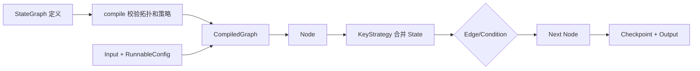
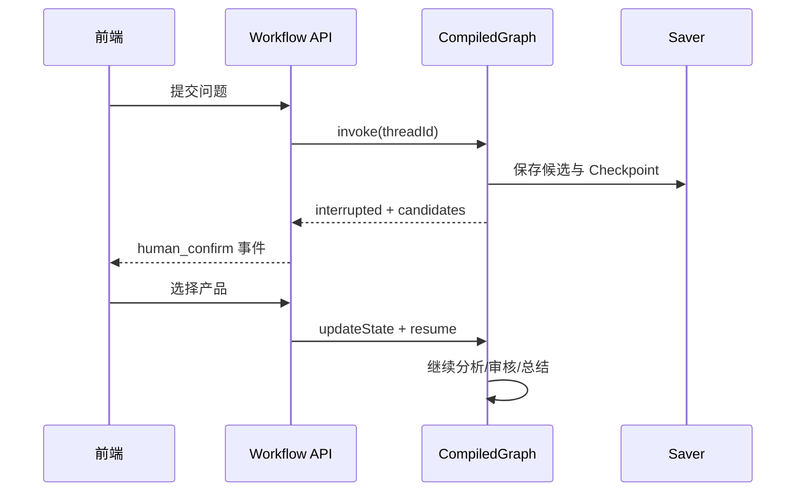

# Graph Core 开发参考

> 官方架构与功能基线：Spring AI Alibaba `v1.1.2.0`。项目编译适配版本：Graph Core `1.1.2.0`。本文将官网概念与本地源码 API 分开陈述。

## 1. 核心概念

Graph Core 是长运行、有状态 Agent 与工作流的底层运行时。`StateGraph` 定义图，`compile()` 校验并生成可执行的 `CompiledGraph`；节点只读取当前 `OverAllState` 并返回增量 Map，框架按 KeyStrategy 合并。

| 概念 | 当前版本类/常量 | 作用 |
|---|---|---|
| 图定义 | `com.alibaba.cloud.ai.graph.StateGraph` | 注册节点、边和 State 策略 |
| 可执行图 | `com.alibaba.cloud.ai.graph.CompiledGraph` | invoke、stream、状态查询和恢复 |
| 状态 | `com.alibaba.cloud.ai.graph.OverAllState` | 一次 thread 的共享状态视图 |
| 节点 | `com.alibaba.cloud.ai.graph.action.NodeAction` / `AsyncNodeAction` | 一步计算或副作用；内部 `Node` 类型通常无需业务代码直接使用 |
| 边 | `addEdge`、`addConditionalEdges` | 控制下一节点 |
| 起止点 | `StateGraph.START`、`StateGraph.END` | 图入口和完成标记 |
| 执行配置 | `RunnableConfig` | thread、checkpoint、stream、resume、metadata |



### 最小可运行骨架

```java
import com.alibaba.cloud.ai.graph.CompiledGraph;
import com.alibaba.cloud.ai.graph.StateGraph;
import com.alibaba.cloud.ai.graph.action.NodeAction;
import java.util.HashMap;
import java.util.Map;
import static com.alibaba.cloud.ai.graph.StateGraph.END;
import static com.alibaba.cloud.ai.graph.StateGraph.START;
import static com.alibaba.cloud.ai.graph.action.AsyncNodeAction.node_async;

NodeAction normalize = state -> Map.of(
        "normalizedQuery", state.value("userQuery", String.class)
                .map(String::trim)
                .orElseThrow());

CompiledGraph graph = new StateGraph("query-flow", HashMap::new)
        .addNode("normalize", node_async(normalize))
        .addEdge(START, "normalize")
        .addEdge("normalize", END)
        .compile();
```

## 2. State 设计

State 是工作流数据平面，不是任意对象仓库。应保存：节点间必要输入输出、路由决策、业务标识、可序列化的检查点数据。不要保存：Spring Bean、数据库连接、Flux/Emitter、未关闭资源、API Key、超大文档全文和不可序列化对象。

原始数据与格式化 Prompt 必须分离。例如保存 `confirmedProducts: List<ProductRef>`，调用 Agent 时临时格式化；不要只保存一段无法审计和重组的 Prompt 文本。

### KeyStrategyFactory

`KeyStrategyFactory` 为每个字段返回合并策略：

- `ReplaceStrategy`：后写覆盖前写，适合 query、route、finalAnswer。
- `AppendStrategy`：追加列表，适合 events、failedAgents、agentResults（按事件形态）。
- `MergeStrategy`：按合并函数整合复杂对象/Map，适合并行分支聚合。

```java
import com.alibaba.cloud.ai.graph.KeyStrategyFactory;
import com.alibaba.cloud.ai.graph.state.strategy.AppendStrategy;
import com.alibaba.cloud.ai.graph.state.strategy.ReplaceStrategy;
import java.util.HashMap;

KeyStrategyFactory strategies = () -> {
    HashMap<String, com.alibaba.cloud.ai.graph.KeyStrategy> map = new HashMap<>();
    map.put("finalAnswer", new ReplaceStrategy());
    map.put("streamEvents", new AppendStrategy());
    return map;
};
```

注意：节点写入未注册 Key 时会使用默认替换语义，但 1.1.2.0 从 Checkpoint 恢复时只会把
`KeyStrategyFactory` 中已注册的 Key 合并回 `OverAllState`。因此需要暂停恢复的 Graph 必须显式注册
所有持久化状态字段；当前项目的 Main Graph 已为全部状态键注册 `ReplaceStrategy`。引入并行前还需
为并行聚合字段单独调整为 `AppendStrategy` 或 `MergeStrategy`。

多个并行节点写同一 Replace 字段会产生覆盖或不确定结果。优先让每个 Agent 写独立 key，再在汇聚节点合并；确需共同字段时使用 `MergeStrategy` 或 RunnableConfig 的 `NodeAggregationStrategy`。

### 类型与空值

用 `state.value(key, Type.class)` 做显式转换；缺失值区分“未执行”和“执行后为空”。State DTO 应可被 Jackson 序列化。不要用 `null` 表示多种状态，建议使用状态枚举、空集合和独立 error 字段。

## 3. 节点

### 类型

- 同步节点：`NodeAction`，适合短 CPU 计算；通过 `node_async` 适配图。
- 异步节点：`AsyncNodeAction` / `AsyncNodeActionWithConfig`，返回 `CompletableFuture<Map<String,Object>>`。
- LLM 节点：普通 NodeAction 内调用 ChatModel，或复用 Agent 模型节点。
- Tool 节点：执行确定性 ToolCallback/Service；精确查询通常不需要 ReactAgent。
- Agent 节点：`ReactAgent.asNode(...)` 或 `StateGraph.addNode(id, compiledSubGraph)`。
- Human 节点：产生候选并在编译配置指定 interrupt。
- 子图节点：`addNode(id, StateGraph)` 或 `addNode(id, CompiledGraph)`。

### 输入、输出与幂等

节点读取 State，返回“增量更新”，不要原地修改共享集合。副作用节点使用 `workflowInstanceId + nodeId + attempt` 作为幂等键；恢复或 Replay 可能再次执行节点。数据库事务只覆盖节点自身，不跨人工等待。

### 异常与重试

Graph 节点异常会终止当前执行流，调用方从 Flux error 或 GraphRunnerException 感知。当前版本没有通用 `.retry(node, n)` Builder；重试应在节点包装器、Reactor `retryWhen`（仅流式消费边界）或 Tool/Model Interceptor 中实现。

金融项目建议错误分类：

1. 参数/权限错误：不重试，路由到失败结果。
2. 网络/限流：指数退避且限制次数。
3. 模型格式错误：一次修复重试。
4. 非幂等副作用：查询执行记录后再决定补偿，不盲重试。

## 4. 边、路由、并行与循环

### 普通与条件边

`addEdge(source, target)` 表示固定转移；也支持一个源到多个目标和多个源到汇聚目标。条件边使用 `AsyncCommandAction` 或 `AsyncEdgeAction` 返回映射 key。

```java
graph.addConditionalEdges(
        "check_recall",
        edge_async(state -> state.value("humanConfirmRequired", Boolean.class)
                .orElse(false) ? "confirm" : "route"),
        Map.of("confirm", "human_confirm", "route", "route_agents"));
```

上例需静态导入 `com.alibaba.cloud.ai.graph.action.AsyncEdgeAction.edge_async`。

条件函数必须纯净、可重放；不要在边中调用外部系统。

### 并行边与分支聚合

`addEdge(source, List<String> targets)` 可扇出；`addEdge(List<String> sources, target)` 表示汇聚。动态多分支使用 `addParallelConditionalEdges` 和 `AsyncMultiCommandAction`。当前版本还支持在 `RunnableConfig` 为目标节点配置并行 Executor 和 `NodeAggregationStrategy`。

官方 release 将并行聚合称为 allOf/anyOf；本地源码没有公开名为 `AllOf` 或 `AnyOf` 的 API 类。默认内部实现使用 `CompletableFuture.allOf` 等待分支；anyOf 语义应通过具体 `NodeAggregationStrategy` 或自定义路由验证后再采用，不能直接照搬不存在的 Builder。

### 循环

条件边可以回指已执行节点形成循环。设置 `CompileConfig.builder().recursionLimit(n)` 或 `compiledGraph.setMaxIterations(n)`，并在 State 保存 `iteration`、`lastError`、`qualityScore`。同时设置模型/Tool 调用上限和总超时，避免逻辑条件失效造成死循环。

## 5. RunnableConfig

```java
import com.alibaba.cloud.ai.graph.CompiledGraph;
import com.alibaba.cloud.ai.graph.RunnableConfig;

RunnableConfig config = RunnableConfig.builder()
        .threadId(conversationId)
        .streamMode(CompiledGraph.StreamMode.SNAPSHOTS)
        .build();
```

主要字段：`threadId`、`checkPointId`、`nextNode`、streamMode、human feedback、resume、state update、metadata、Store、并行 Executor/聚合策略。Config 是每次执行对象，不应作为跨请求可变单例共享。

## 6. 持久化、Checkpoint 与恢复

### Saver 配置

```java
import com.alibaba.cloud.ai.graph.CompileConfig;
import com.alibaba.cloud.ai.graph.checkpoint.config.SaverConfig;
import com.alibaba.cloud.ai.graph.checkpoint.savers.MemorySaver;

MemorySaver saver = new MemorySaver();
CompileConfig compileConfig = CompileConfig.builder()
        .saverConfig(SaverConfig.builder().register(saver).build())
        .build();
CompiledGraph graph = stateGraph.compile(compileConfig);
```

`MemorySaver` 仅进程内测试，重启丢失。当前源码包含：

| Saver | 完整类名 | 生产说明 |
|---|---|---|
| 内存 | `...checkpoint.savers.MemorySaver` | 测试/单实例临时状态 |
| Redis | `...checkpoint.savers.redis.RedisSaver` | 低延迟共享状态，需验证持久策略 |
| PostgreSQL | `...checkpoint.savers.postgresql.PostgresSaver` | 注意类名是 `PostgresSaver` |
| MongoDB | `...checkpoint.savers.mongo.MongoSaver` | 文档型状态 |

这些类在 `graph-core:1.1.2.0` 源码存在，但项目尚未声明对应客户端依赖，也未对 OceanBase 做适配。具体构造参数和建表脚本在接入阶段必须做独立 PoC，本文不声称当前工程可直接启用。

### 当前项目：OceanBase 自定义 Saver

项目不直接采用 Redis、Postgres 或 Mongo Saver，当前已实现：

```text
com.xxx.insurance.ai.workflow.checkpoint.OceanBaseCheckpointSaver
    implements com.alibaba.cloud.ai.graph.checkpoint.BaseCheckpointSaver
```

`BaseCheckpointSaver` 在当前版本要求实现 `list`、`get`、`put`、`release` 四个方法：

| 方法 | OceanBase 实现语义 |
|---|---|
| `list(config)` | 按 threadId 查询未过期 Checkpoint，顺序与框架最新优先语义保持一致 |
| `get(config)` | 有 checkpointId 时精确查询，否则读取 thread 最新 Checkpoint |
| `put(config, checkpoint)` | 同一事务写 Checkpoint 并更新 thread 最新指针；返回包含 checkpointId 的新 Config |
| `release(config)` | 将 thread 标记为 RELEASED，返回释放前的 Checkpoint；不在请求线程物理删除 |

当前使用两张表：`ai_graph_thread` 保存 thread 状态、最新 Checkpoint、乐观锁版本和过期时间；`ai_graph_checkpoint` 保存 checkpointId、父 Checkpoint、版本、nodeId、nextNodeId、序列化 State 和创建时间。实现满足：

- `(thread_id, checkpoint_id)` 唯一，sequenceNo 单调递增。
- 更新 latestCheckpointId 时使用乐观锁，拒绝同一 thread 并发覆盖。
- State 通过框架兼容的 Jackson Serializer 序列化，并记录 schemaVersion。
- Mapper 只负责持久化，Saver 负责 `RunnableConfig` 和 `Checkpoint` 语义转换。
- `release` 采用逻辑释放，定时任务根据保留策略物理清理。
- 禁止通过继承 `MemorySaver` 实现生产 Saver，避免全量 Checkpoint 常驻 JVM 内存。

保留策略：运行中、人工中断、失败的 Checkpoint 自最后更新时间保留 7 天；成功完成后的完整 Checkpoint 在线保留 24 小时。到期后物理删除敏感 State 及已经没有有效 Checkpoint 的过期 Thread；工作流节点结果摘要和审计元数据按独立策略保留。

### 状态查询、历史和 Replay

```java
StateSnapshot current = graph.getState(config);
Collection<StateSnapshot> history = graph.getStateHistory(config);
RunnableConfig branch = graph.updateState(config, Map.of("confirmedProducts", selected), "human_confirm");
Optional<OverAllState> resumed = graph.invoke(Map.of(), branch.withResume());
```

`checkpointId` 选择历史检查点；`updateState` 会基于检查点创建更新后的执行配置，可形成新分支。Replay 的副作用节点可能重跑，因此必须幂等。服务重启恢复依赖持久 Saver，`MemorySaver` 做不到。

会话隔离依赖 `threadId`，业务层还必须绑定 tenantId/customerId；同一 thread 的并发写要串行化或做乐观锁，避免两个请求从同一 Checkpoint 分叉后互相覆盖。

### 序列化

StateGraph 默认支持 Spring AI Jackson StateSerializer。自定义业务 DTO 要有稳定字段和可反序列化构造；版本升级时采用兼容字段演进。不要将 JPA/MyBatis 代理、异常对象、Flux、ThreadLocal 或 Bean 放进 State。

**当前项目 1.1.2.0 兼容性说明（根据本地依赖源码与回归测试）**：
`SpringAIJacksonStateSerializer` 使用 `DefaultTyping.NON_FINAL`，而 Record 是 final 类型；当 State DTO
包含 `List<自定义Record>` 时，集合元素可能在 Checkpoint 恢复后退化为 `LinkedHashMap`，并在后续节点
再次保存 Checkpoint 时触发 Jackson `object is not an instance of declaring class`。当前项目通过仅注册到
Checkpoint `ObjectMapper` 的 Jackson Module，为 `WorkflowEntity`、`WorkflowPlanTask` 和产品召回候选写入
框架可识别的 `@typeHint`。`ProductRecallResult` 还使用专用反序列化器恢复候选列表，避免
`List<ProductCandidate>` 退化为 `List<LinkedHashMap>`。这些配置不改变 REST API JSON。新增嵌套 State DTO
时必须增加“保存 -> 恢复 -> 再次保存”的测试，
只测试单次序列化不足以发现该问题。

## 7. Human In The Loop

`CompileConfig.interruptBefore(node...)` 在节点执行前暂停；`interruptAfter(node...)` 在节点完成并保存结果后暂停。产品召回应在候选检索后、产品分析前暂停，因此可对 `human_confirm_product` 使用 interruptBefore，或在 `retrieve_product_candidates` 后 interruptAfter。



```java
CompileConfig config = CompileConfig.builder()
        .saverConfig(saverConfig)
        .interruptBefore("human_confirm_product")
        .build();
```

API 第一次执行后立即返回，不保留请求线程；用户确认时用 threadId + checkpointId 新建请求恢复。确认接口必须验证候选属于当前 Checkpoint，防止用户提交任意产品 ID。

## 8. 流式执行

`CompiledGraph.stream(inputs, config)` 返回 `Flux<NodeOutput>`；`graphResponseStream` 还包装执行响应；`streamSnapshots` 发 State 快照。`StreamingOutput` 表示增量事件，`OutputType` 区分模型、Tool、Hook 和普通 Graph 节点的 streaming/finished。

```java
Disposable subscription = graph.stream(input, config)
        .doOnNext(output -> eventPublisher.publish(map(output)))
        .doOnError(error -> eventPublisher.error(error))
        .doFinally(signal -> eventPublisher.close())
        .subscribe();
```

Graph 流转 SSE 时：

- 模型 Token 只从 `StreamingOutput.message()` 读取。
- `NodeOutput` 用于 stage/agent_start/complete 等阶段事件。
- Tool/Hook 完成事件单独映射，不混入最终文本。
- MVC `SseEmitter` 用有界队列或合并 Token 控制生产速度。
- 客户端断开时 `Disposable.dispose()`；超时同时取消 Graph/模型请求。
- 不把完整 State 每个 Token 都发给前端，避免隐私泄露和序列化开销。

## 9. 保险项目映射与常见错误

当前 `MainWorkflowGraphConfig` 已使用 OceanBase `BaseCheckpointSaver`、`interruptBefore(human-confirm-product)` 和动态 DAG 子图。Main Graph 的固定拓扑负责确定性生命周期，`dag-executor` 内依据 Planner `dependsOn` 动态形成串行、并行和混合执行；每个任务子图使用独立 Checkpoint thread。

常见错误：

1. 并行节点都写 `agentResult` Replace 字段，结果丢失。
2. 节点返回整个 State，导致旧值重复 Append。
3. 使用 `MemorySaver` 却期待重启恢复。
4. threadId 只由前端提供，未绑定租户权限。
5. interrupt 时继续占用线程或数据库事务。
6. Replay 重复调用外部写接口。
7. 把 `CompletableFuture.allOf` 误认为公开 `AllOf` API。
8. SSE 断开后 Graph 仍继续生成 Token。

主要来源：[Core Library](https://java2ai.com/docs/frameworks/graph-core/core/core-library/)、[Persistence](https://java2ai.com/en/docs/frameworks/graph-core/core/persistence/)、[Streaming](https://java2ai.com/docs/frameworks/graph-core/core/streaming/)、[Human In The Loop](https://java2ai.com/docs/frameworks/graph-core/examples/human-in-the-loop/) 与本地 `1.1.2.0` Graph Core 源码。
