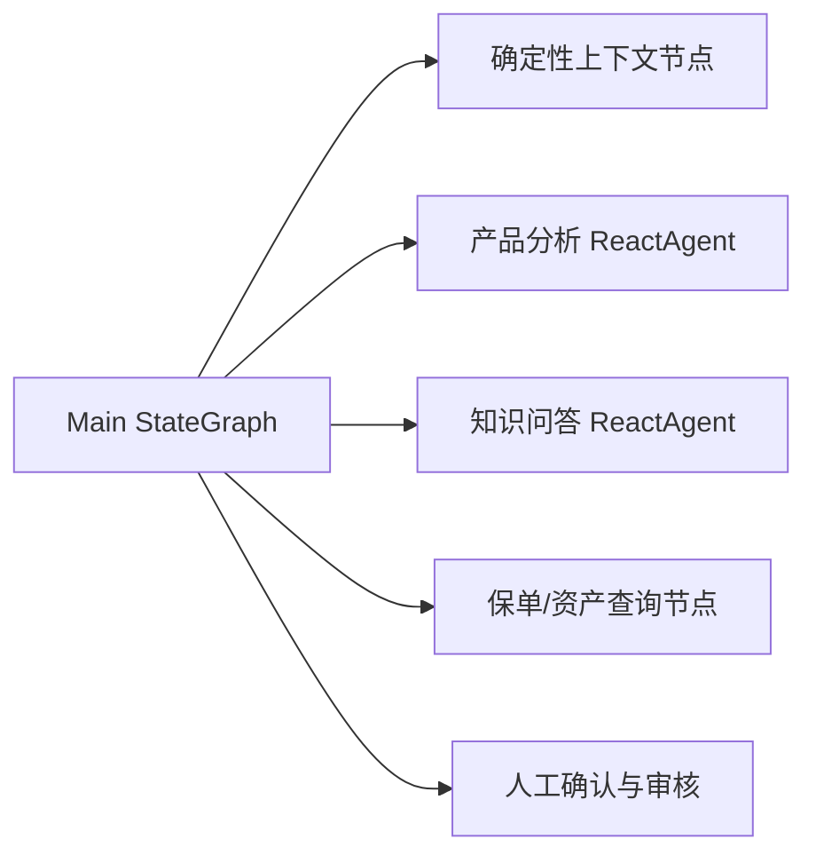

# Agent Framework 与 Graph Core

## 核心结论

| 维度 | Agent Framework | Graph Core |
|---|---|---|
| 主要问题 | LLM 自主推理、选工具、迭代执行 | 确定性流程、状态传递、路由、并行、暂停恢复 |
| 核心抽象 | `ReactAgent`、Tool、Hook、Interceptor、Skill、Flow Agent | `StateGraph`、Node、Edge、`OverAllState`、Saver |
| 决策者 | 模型为主 | Java 拓扑和条件函数为主 |
| 可预测性 | 相对低，应限制循环、工具和权限 | 高，节点和边显式 |
| 长任务恢复 | 复用 Graph Saver | 原生 Checkpoint、Replay、State History |
| 最佳用途 | 单领域开放式任务 | 审批、编排、跨域协作和审计 |

**源码结论**：`com.alibaba.cloud.ai.graph.agent.ReactAgent` 继承 `BaseAgent`，初始化时创建模型节点、工具节点和 Hook 节点，最后编译为 `CompiledGraph`。因此 Graph Core 是 Agent Framework 的运行时基础，而不是竞争依赖。

## ReactAgent 何时足够

直接使用 ReactAgent，适合边界清晰的单领域任务：模型需要在若干 Tool 中自主选择，执行轮次不固定，但业务不需要跨多节点审批和恢复。例如当前产品分析子智能体。

以下情况应直接使用 StateGraph：

- 金融审批、人工确认、合规审核顺序不可由模型改变。
- 多子智能体存在依赖、并行、跳过和降级规则。
- 服务重启后必须从中断点恢复。
- 需要按节点审计输入、输出、耗时和失败原因。

复杂保险智能体应采用混合方式：主流程用 StateGraph，领域推理节点封装 ReactAgent；确定性查询可直接用普通 Java/Tool 节点。

## 能力边界

| 构件 | 应负责 | 不应负责 |
|---|---|---|
| ReactAgent | 领域推理、Tool 选择、ReAct 循环 | 全平台流程生命周期、强审批顺序 |
| 子智能体 | 一个业务域的稳定能力入口 | 读取其他域私有 Skill/Tool |
| Tool | 单一可审计动作、参数校验、访问业务服务 | 长流程编排、自由生成最终答案 |
| Skill | 渐进披露的领域规则和使用方法 | 执行业务操作、保存业务状态 |
| Graph Node | 一步明确变换或副作用 | 隐式修改大量不相关 State |
| Graph | 节点拓扑、路由、恢复、并发和状态生命周期 | 代替领域模型完成开放式推理 |

Agent Framework 不能代替 Graph Core 的显式状态机、Checkpoint 和复杂控制；Graph Core 理论上能手写模型/工具循环，但会重复 ReactAgent 已提供的能力，因此不应完全代替 ReactAgent。

## 确定性与自主性

- **确定性工作流**：同一 State 和规则应选择相同边；适合监管、授权、数据查询和审批。
- **自主智能体**：模型根据上下文选择下一工具；适合知识分析、解释和开放式对比。
- **金融生产原则**：自主性只放在已授权的领域节点内部，资金、客户隐私、审批和最终发布由 Graph 与 Java 规则控制。

## 决策表

| 场景 | 推荐方案 | 原因 |
|---|---|---|
| 单一领域自主工具调用 | ReactAgent | 内建 ReAct、Tool、Hook 和流式输出 |
| 固定审批流程 | Graph Core | 拓扑显式，可暂停、持久化和审计 |
| 多领域问题路由 | Routing/Supervisor | 由路由器选择专家；强流程仍放主 Graph |
| 多节点强流程控制 | Graph Core | 条件边、并行边、恢复点更清晰 |
| 单 Agent 多能力扩展 | ReactAgent + Skills | Skill 渐进披露，降低常驻上下文 |
| 复杂保险智能体 | Graph + ReactAgent | Graph 控制流程，ReactAgent 完成领域推理 |
| 只读保单精确查询 | Graph Node/Tool | 无需模型自主循环，权限和审计更直接 |
| 多专家无依赖分析 | ParallelAgent 或 Graph 并行 | 前者编排 Agent，后者控制力更强 |

## 多智能体选型标准

1. 子任务固定且有依赖：StateGraph。
2. 子任务固定且只需顺序或并行：`SequentialAgent` / `ParallelAgent` 可简化代码。
3. 路由由自然语言决定：`LlmRoutingAgent`，但对高风险意图增加 Java 校验。
4. Supervisor、Handoffs 和 Agent As Tool 在官网属于推荐模式；当前 `1.1.2.0` 本地源码没有独立 `SupervisorAgent` 类，Agent As Tool 可使用 `AgentTool`，Handoffs 建议用 StateGraph 条件边实现。
5. 需要人工确认和服务重启恢复：无论采用何种 Agent，都以带持久化 Saver 的主 Graph 承载。

来源：官方[项目架构](https://github.com/alibaba/spring-ai-alibaba)、[Agents](https://java2ai.com/en/docs/frameworks/agent-framework/tutorials/agents/)、[Graph Core](https://java2ai.com/docs/frameworks/graph-core/core/core-library/)；API 存在性由本地 `1.1.2.0` 源码确认。

