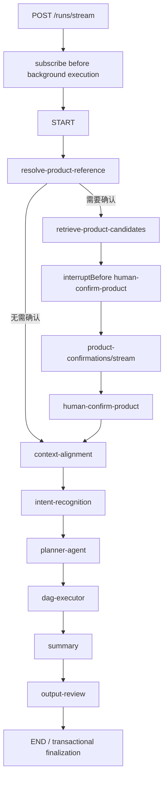

# 保险产品管理智能体落地指南

## 1. 目标架构

**项目建议**：主智能体不是另一个无边界 ReactAgent，而是 Main StateGraph 对外暴露的编排入口。领域内需要自主 Tool Calling 的能力使用 ReactAgent；精确客户查询优先使用确定性节点/受限 Agent。



## 2. Agent 划分

| 构件 | 推荐实现 | 职责 | 安全边界 |
|---|---|---|---|
| 主智能体 | Main `StateGraph` + Facade | 请求生命周期、路由、并行、HITL、恢复 | 不直接查询客户数据 |
| 产品分析 | `ProductAnalysisAgent`/ReactAgent | 条款、责任、客群、风险与产品对比 | 只加载 `skills/product-analysis` 和产品 Tool |
| 知识问答 | ReactAgent | 解释保险业务知识和引用召回材料 | 只读知识召回接口，不访问客户数据 |
| 保单查询 | 受限 ReactAgent | 调用只读保单 Tool 并解释脱敏字段 | 当前固定 Mock 客户；生产由 ToolContext 注入 customerId 并再次鉴权 |
| 资产查询 | 受限 ReactAgent | 调用只读资产 Tool 并说明结构、风险和流动性 | 当前固定 Mock 客户；与保单域隔离 Tool 和数据权限 |
| 总结 Agent | ReactAgent/结构化 LLM 节点 | 汇总已成功的结果和缺失项 | 不重新调用业务 Tool，不补造失败结果 |
| 输出审核 | Java 规则 + 结构化 LLM 节点 | 隐私、承诺收益、事实来源和格式检查 | 可阻断发布；保留审核记录 |

当前技术验证使用 ReactAgent + 单个只读 Mock Tool，目的是跑通四 Agent 的统一编排、流式输出与审计合同。生产接入若仍是单次精确 API 查询，应重新评估是否降为确定性 Java 节点；只有需要多个只读 Tool 自主组合时才保留 ReAct 循环。

## 3. Graph 节点设计

| 节点 | 职责 | 主要输入 | 主要输出 |
|---|---|---|---|
| `resolve-product-reference` | 加载当前 conversation 已确认产品，识别本轮具体/模糊产品线索并决定是否进入候选确认 | request、confirmedProducts | productReferenceResolution、productRecallDecision、resolvedProducts |
| `retrieve-product-candidates` | 调产品召回 Service，并写召回审计 | 原始问题、产品线索 | productRecallResult、humanConfirmRequired |
| `human-confirm-product` | `interruptBefore` 恢复后的校验节点；不在 JVM 内阻塞等待 | resolvedProducts | humanConfirmRequired=false |
| `context-alignment` | 产品实体确定后加载记忆，判断话题延续/切换并完成五步问题改写 | request、productReferenceResolution、resolvedProducts | alignedContext |
| `intent-recognition` | 基于 rewrittenQuestion 输出白名单意图和目标 Agent | alignedContext | intentRoutingResult |
| `planner-agent` | ReactAgent 生成任务及 dependsOn，再由 Java 确定性校验 | alignedContext、intentRoutingResult | workflowPlan |
| `dag-executor` | 动态调度四类领域 Agent 子图；并行、重试、失败传播和结果聚合都在该节点边界内完成 | workflowPlan、alignedContext、intentRoutingResult | dagExecutionResult |
| `summary` | 单结果透传；多个或混合结果调用模型生成统一候选答案并声明缺失 | dagExecutionResult、alignedContext | summaryResult |
| `output-review` | 调用行内审核服务，只有审核返回文本可发布 | summaryResult、dagExecutionResult、alignedContext | outputReviewResult、finalAnswer |

当前工程由 `resolve-product-reference` 负责唯一的产品候选召回判断；`context-alignment` 不再决定是否召回，
只在产品实体已确定后完成记忆加载、话题关系和问题改写。`intent-recognition` 始终基于改写后的本轮问题独立分类。
四个领域 Agent 通过 `dag-executor -> WorkflowTaskGraphRunner -> AgentInvokeNode` 调用，不是 Main Graph 上四个固定并行节点。

候选召回与产品详情读取必须分开：首次具体产品、模糊产品名和未确认产品追问需要候选召回；历史已确认产品的
延续追问不重复确认，但 ProductAnalysisAgent 仍通过 Tool 读取当前产品详情。仅按画像和缴费条件筛选也不进入
候选确认分支，应由后续产品条件检索能力直接处理。

## 4. State Schema

| 字段 | 类型 | 写入节点 | 读取节点 | Strategy | 持久化 | 审计 |
|---|---|---|---|---|---|---|
| `request` | `MainWorkflowRequest` | API/START | 产品解析、上下文对齐 | Replace | 是 | 是 |
| `workflowInstanceId` | `String` | API/START | 全部 | Replace | 是 | 是 |
| `workflowStepIds` | `Map<String,String>` | Workflow Service | 节点记录器、最终响应 | Replace | 是 | 是 |
| `tokenStreamingEnabled` | `boolean` | SSE/同步入口 | 模型节点与 Agent | Replace | 是 | 否 |
| `productReferenceResolution` | `ProductReferenceResolution` | resolve-product-reference | context-alignment/API | Replace | 是 | 是 |
| `productRecallDecision` | `ProductRecallDecision` | resolve-product-reference | 条件边/API | Replace | 是 | 是 |
| `productRecallResult` | `ProductRecallResult` | retrieve-product-candidates | 确认接口/API | Replace | 是 | 是 |
| `resolvedProducts` | `List<ConfirmedProduct>` | 产品解析或确认恢复 | context/DAG | Replace | 是 | 是 |
| `humanConfirmRequired` | `boolean` | retrieve/human-confirm | API | Replace | 是 | 是 |
| `alignedContext` | `AlignedWorkflowContext` | context-alignment | intent/planner/DAG/summary | Replace | 是 | 是 |
| `intentRoutingResult` | `IntentRoutingResult` | intent-recognition | planner/DAG/API | Replace | 是 | 是 |
| `workflowPlan` | `WorkflowPlan` | planner-agent | dag-executor/API | Replace | 是 | 是 |
| `dagExecutionResult` | `DagExecutionResult` | dag-executor | summary/review/API | Replace | 是 | 是 |
| `summaryResult` | `WorkflowSummaryResult` | summary | output_review/API | Replace | 是 | 是 |
| `outputReviewResult` | `OutputReviewResult` | output-review | 最终响应 | Replace | 是 | 是 |
| `finalAnswer` | `String` | output-review | 最终事务/API | Replace | 是 | 是 |

State 中不要保存 `SseEmitter`、`Disposable`、Mapper、Service 或完整召回文档。敏感客户字段应使用业务 ID，展示值在授权节点临时获取。

## 5. 串行、并行和依赖

1. 产品实体解析先基于当前输入和当前会话已确认产品完成召回判断；产品确定后，上下文对齐再结合标准产品、历史记忆完成改写，意图识别随后基于 rewrittenQuery 独立执行。
2. 候选确认是持久化中断，不占线程。
3. 无依赖的产品、知识、保单、资产任务并行，结果以带 taskId 的不可变任务结果聚合。
4. 有 `dependOn` 的任务仅在前置成功后执行；前置失败标记 `SKIPPED_DEPENDENCY_FAILED`。
5. 汇聚节点等待计划中的终态，不等待不存在的 Agent。
6. 顺序固定为 `summary -> output-review`；审核只处理完整候选答案，`complete.finalAnswer` 是唯一权威输出。

建议 AgentResult：

```java
public record AgentResult(
        String agentName,
        Status status,
        String content,
        List<String> sourceIds,
        String errorCode,
        long durationMs) {
    public enum Status { SUCCESS, FAILED, SKIPPED_DEPENDENCY_FAILED, TIMEOUT }
}
```

重试策略：模型超时/限流最多 2 次指数退避；格式错误最多一次修复；业务 4xx、权限拒绝不重试；保单/资产查询采用幂等请求号。一个无依赖 Agent 失败不取消其他分支。总结必须明确“保单结果暂不可用”等缺失，不允许模型推断缺失事实。

## 6. Human In The Loop

```text
retrieve_product_candidates
-> 保存 candidates + Checkpoint
-> interruptBefore(human_confirm_product)
-> API/SSE 返回 human_confirm
-> 前端携带 Last-Event-ID，提交 conversationId、selectedProductCodes
-> 数据库 CAS：WAITING_CONFIRM -> CONFIRMING
-> 重放遗漏事件并建立第二段 SSE 订阅
-> 服务端从 Checkpoint 读取候选并校验 selectedProductCodes
-> 保存 ConfirmedProduct，updateState(resolvedProducts, humanConfirmRequired=false)
-> withResume() 执行 human-confirm-product，再进入 context-alignment
```

确认数据建议单独审计：确认人、认证主体、候选版本、选择结果、确认时间、原始问题。本阶段只实现暂停、状态更新和恢复链路；产品候选确认接口的权限校验、候选有效期和版本冲突规则已明确延期，不纳入当前实现范围。

## 7. Memory 边界

| 数据 | 机制 | 生命周期 | 用途 |
|---|---|---|---|
| ChatMemory | Spring AI `ChatMemory` + MyBatis | 窗口/可裁剪 | 给模型的近期消息 |
| Graph State | `OverAllState` | 当前 workflow/thread | 节点协作数据 |
| Checkpoint | Graph Saver | 可恢复期限 | 暂停、恢复、Replay |
| 完整聊天历史 | `ai_long_term_memory` | 永久/按合规策略 | 客服追溯和再总结 |
| 业务审计 | invocation/workflow step 表 | 合规期限 | 谁在何时调用了什么 |
| 产品确认 | `ai_conversation_confirmed_product` + State | 当前 conversationId | 解释当前会话后续指代和责任追踪 |
| 客户长期画像 | 未来独立画像服务 | 按客户授权 | 稳定偏好，不等同聊天原文 |

ChatMemory 与长期历史保持当前事务一致性；Checkpoint 不替代长期历史。给模型装配上下文时只选一条消息来源，避免 ChatMemory 与 Graph messages 重复追加。

### 数据保留策略

| 数据 | 保存期限 | 到期动作 |
|---|---|---|
| 运行中/人工中断/失败 Checkpoint | 最后更新时间起 7 天 | 删除完整 State，保留执行摘要 |
| 成功完成 Checkpoint | 完成后 24 小时 | 删除完整 State，保留执行摘要 |
| 人工确认记录 | 5 年 | 按审计归档策略清理 |
| 工作流实例和节点执行历史 | 5 年 | 归档后清理；不长期复制敏感 State |
| SSE 重放事件 | 事件发生后 10 分钟 | 每30秒扫描并物理删除到期事件明细，保留 finalAnswer 与审计摘要 |
| 完整聊天历史 | 当前项目决策为永久 | 后续按客户授权、隐私删除和监管要求补充治理 |

期限是当前技术验证项目的生产化默认值，不作为法律结论；上线前由法务、数据治理和业务合规复核。

## 8. 统一 SSE 协议

事件类型：`start`、`stage`、`human_confirm`、`agent_start`、`agent_stream`、`agent_complete`、`summary`、`review`、`complete`、`error`。当前项目没有独立 `tool_start/tool_result` 前端协议事件；Tool 过程只通过 Agent 模型流和调用审计体现。`agent_stream` 采用 `LIVE_MODEL_STREAM`：产品线索解析、上下文对齐和意图识别通过 Spring AI `ChatModel.stream(Prompt)` 发布结构化 JSON 增量；Planner、子智能体和 Summary 通过 Spring AI Alibaba Agent 流发布模型增量。并行 Agent 使用 `streamId + taskId` 隔离。Summary 完成后再执行输出审核，因此流式正文属于临时展示，客户端必须以 `complete.finalAnswer` 覆盖为最终结果。

人工确认是一次显式的流连接分段：初始 `/runs/stream` 在 `human_confirm` 后结束；前端提交候选时调用 `/runs/{workflowInstanceId}/product-confirmations/stream` 并携带最后处理的 `Last-Event-ID`。后端先完成重放和订阅，再恢复 OceanBase Checkpoint，避免恢复事件先于新连接建立。

```java
import java.time.Instant;
import java.util.Map;

public record WorkflowSseEvent(
        String eventId,
        String type,
        String workflowInstanceId,
        String conversationId,
        String node,
        long sequence,
        Instant occurredAt,
        Map<String, Object> data) {
}
```

```java
import org.springframework.web.servlet.mvc.method.annotation.SseEmitter;
import java.io.IOException;

public final class WorkflowSseSender {
    public synchronized void send(SseEmitter emitter, WorkflowSseEvent event)
            throws IOException {
        emitter.send(SseEmitter.event()
                .id(event.eventId())
                .name(event.type())
                .data(event));
    }
}
```

协议规则：sequence 在 workflow 内单调递增；Token 事件仅含文本增量，不含完整 State；Tool 参数和结果做字段级脱敏；`complete` 仅发送一次；`error` 区分可恢复/不可恢复；当前人工确认事件包含 checkpointId 和脱敏候选列表，不包含候选版本字段。IDEA 日志使用相同类型：`[Agent]`、`[Tool]`、`[Skill]`、`[Memory]`、`[Workflow]`，但不要逐 Token 以 INFO 打印生产日志。

当前实现通过 `SseEmitter` 回调和发送异常移除本机连接，Main Graph 使用独立有界线程池，不占 MVC 请求线程。客户端断开不会取消已经开始的 Graph/模型任务，后台仍继续执行并把事件写入 OceanBase；是否增加可取消执行句柄属于后续资源治理能力。

### Last-Event-ID 与断线重连

事件 ID 固定为 `{workflowInstanceId}:{sequence}`。服务端把脱敏后的 SSE 事件写入 `ai_workflow_sse_event`，建议字段为 `event_id`、`workflow_instance_id`、`sequence_no`、`event_type`、`node_code`、`payload_json`、`created_at`、`expire_at`，并建立 `(workflow_instance_id, sequence_no)` 唯一索引。

重连流程：

```text
客户端携带 Last-Event-ID
-> 服务端解析 workflowInstanceId 和 sequence
-> 重放 sequence > lastSequence 的持久事件
-> 衔接当前实时事件流
-> 收到 complete 后关闭连接
```

为避免“查询历史”和“订阅实时流”之间丢事件，当前实现按 workflowInstanceId 加本机临界区，在其中读取 highWatermark、重放有效事件并注册本机连接；其他 JVM 产生的新事件由500ms数据库轮询按客户端 sequence 游标补齐。当前模型增量事件按框架输出块落库，没有实现额外的100-250ms聚合器。事件默认保留10分钟；超过期限且出现序号缺口时返回410，客户端应查询工作流最终结果，不从头重新执行模型。

## 9. 分阶段实施顺序

### 已完成

- 产品分析 ReactAgent + Tool + 隔离 Skill 闭环。
- ChatMemory、长期历史、会话摘要、调用审计。
- Main StateGraph v1：产品实体解析、候选召回与持久化人工确认、上下文对齐、意图、Planner、动态 DAG、总结和输出审核。
- OceanBase `BaseCheckpointSaver`、V4 数据表、状态序列化、版本链和保留策略。
- 同步 Swagger API 验证。
- 阶段级 SSE 协议、OceanBase 10 分钟事件重放和 `Last-Event-ID` 断线重连。
- ReactAgent 逐块流式执行；子智能体和 Summary 无需前置审核，最终 Summary 生成完成后调用输出审核节点，`complete.finalAnswer` 是审核后的权威答案。
- 产品实体前置解析、Mock 产品召回和召回审计记录。
- `interruptBefore` Human Confirm、会话级确认产品表、Checkpoint 更新和恢复 API。
- KnowledgeQAAgent、隔离 Skill/Tool、PRODUCT_ANALYSIS/KNOWLEDGE_QA 双意图单任务路由。
- 动态 DAG Executor、依赖失败跳过、部分成功汇聚和输出审核 Gateway 节点。

### 下一阶段

1. 对接真实行内输出审核微应用协议，替换当前 Mock Gateway。
2. 将产品、知识、保单和资产 Mock Service 替换为受鉴权的行内微应用接口。
3. 增加 Checkpoint Replay 管理接口和多实例容量验证。

### 未完成

- Checkpoint Replay 管理接口。
- 产品召回微服务真实接入，以及确认权限、候选有效期和版本冲突校验。
- 知识、保单、资产真实数据源；当前 Agent、Skill、Tool 和 Mock 闭环已经完成。
- 行内输出审核真实接口、超时和服务降级策略。
- 大规模 SSE 连接容量测试，以及客户端断开后是否取消仍在运行模型任务的策略评估。
- 多租户鉴权、脱敏、限流和完整观测指标。
