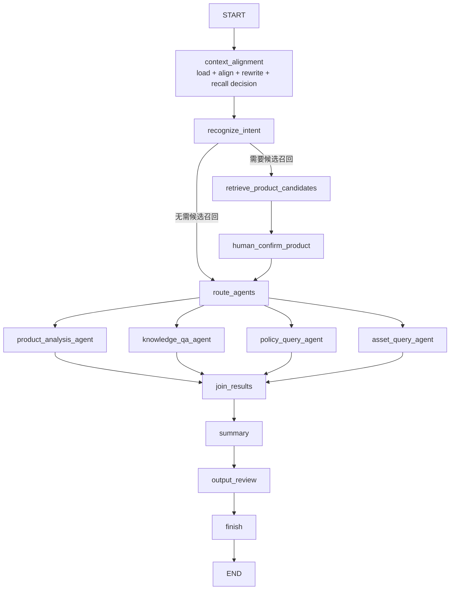

# 保险产品管理智能体落地指南

## 1. 目标架构

**项目建议**：主智能体不是另一个无边界 ReactAgent，而是 Main StateGraph 对外暴露的编排入口。领域内需要自主 Tool Calling 的能力使用 ReactAgent；精确客户查询优先使用确定性节点/受限 Agent。



## 2. Agent 划分

| 构件 | 推荐实现 | 职责 | 安全边界 |
|---|---|---|---|
| 主智能体 | Main `StateGraph` + Facade | 请求生命周期、路由、并行、HITL、恢复 | 不直接查询客户数据 |
| 产品分析 | `ProductAnalysisAgent`/ReactAgent | 条款、责任、客群、风险与产品对比 | 只加载 `skills/product-analysis` 和产品 Tool |
| 知识问答 | ReactAgent | 解释保险业务知识和引用召回材料 | 只读知识召回接口，不访问客户数据 |
| 保单查询 | 受限 ReactAgent | 调用只读保单 Tool 并解释脱敏字段 | 当前固定 Mock 客户；生产由 ToolContext 注入 customerId 并再次鉴权 |
| 资产查询 | 受限 ReactAgent | 调用只读资产 Tool 并说明结构、风险和流动性 | 当前固定 Mock 客户；与保单域隔离 Tool 和数据权限 |
| 总结 Agent | ReactAgent/结构化 LLM 节点 | 汇总已成功的结果和缺失项 | 不重新调用业务 Tool，不补造失败结果 |
| 输出审核 | Java 规则 + 结构化 LLM 节点 | 隐私、承诺收益、事实来源和格式检查 | 可阻断发布；保留审核记录 |

当前技术验证使用 ReactAgent + 单个只读 Mock Tool，目的是跑通四 Agent 的统一编排、流式输出与审计合同。生产接入若仍是单次精确 API 查询，应重新评估是否降为确定性 Java 节点；只有需要多个只读 Tool 自主组合时才保留 ReAct 循环。

## 3. Graph 节点设计

| 节点 | 职责 | 主要输入 | 主要输出 |
|---|---|---|---|
| `context_alignment` | 加载记忆，判断话题延续/切换，提取已确认信息，完成五步问题改写并给出候选召回判断 | conversationId、userQuery、历史消息、上一轮执行上下文 | topicRelation、rewriteQuery、confirmedInformation、productRecallDecision |
| `recognize_intent` | 输出结构化意图，可多选 | rewriteQuery、requestContext | intentions、intentionQueries、dependOn |
| `retrieve_product_candidates` | 调行内召回微服务 Mock/真实接口 | rewriteQuery、过滤条件 | productCandidates |
| `human_confirm_product` | 提供中断点，等待候选选择 | productCandidates | confirmedProducts、humanConfirmRequired |
| `route_agents` | 校验计划、构建可执行任务 | intentions、dependOn | executionPlan |
| `product_analysis_agent` | 调产品分析 ReactAgent | intentionQuery、confirmedProducts | product AgentResult |
| `knowledge_qa_agent` | 调知识 Agent | intentionQuery、retrievedKnowledge | knowledge AgentResult |
| `policy_query_agent` | 查询授权保单 | customerId、intentionQuery | policy AgentResult |
| `asset_query_agent` | 查询授权资产 | customerId、intentionQuery | asset AgentResult |
| `join_results` | 聚合成功、失败、跳过结果 | 各独立 outputKey | agentResults、failedAgents |
| `summary` | 单结果透传；多个或混合结果调用模型生成统一候选答案并声明缺失 | agentResults、failedAgents | summaryResult、candidateAnswer |
| `output_review` | 调用行内审核服务，只有审核返回文本可发布 | candidateAnswer、agentResults、来源、权限标签 | reviewResult、finalAnswer |
| `finish` | 写审计/长期历史，发 complete | finalAnswer、执行元数据 | completedAt、auditId |

当前工程的 `context-alignment` 已统一输出话题关系、精炼问题、已确认信息和候选召回判断；
`intent-recognition` 始终基于改写后的本轮问题独立分类。Graph 不再设置第二套正则召回判断节点，条件边只读取
`productRecallDecision.required`。后续扩展时应把 `AgentInvokeNode` 改成可并行领域节点，不必重写已跑通的 ProductAnalysisAgent。

候选召回与产品详情读取必须分开：首次具体产品、模糊产品名和未确认产品追问需要候选召回；历史已确认产品的
延续追问不重复确认，但 ProductAnalysisAgent 仍通过 Tool 读取当前产品详情。仅按画像和缴费条件筛选也不进入
候选确认分支，应由后续产品条件检索能力直接处理。

## 4. State Schema

| 字段 | 类型 | 写入节点 | 读取节点 | Strategy | 持久化 | 审计 |
|---|---|---|---|---|---|---|
| `conversationId` | `String` | API/START | 全部 | Replace | 是 | 是 |
| `workflowInstanceId` | `String` | API/START | 全部 | Replace | 是 | 是 |
| `tenantId` | `String` | `load_context` | 客户数据节点 | Replace | 是 | 是，脱敏展示 |
| `customerId` | `String` | `load_context` | 保单/资产 | Replace | 是 | 是，加密/脱敏 |
| `userQuery` | `String` | API/START | load/rewrite/audit | Replace | 是 | 是 |
| `rewriteQuery` | `String` | `context_alignment` | intent/recall/Agent | Replace | 是 | 是 |
| `topicRelation` | `ConversationTopicRelation` | context_alignment | audit/intent | Replace | 是 | 是 |
| `confirmedInformation` | `Map<String,List<String>>` | context_alignment | recall/Agent | Replace | 是 | 是 |
| `productRecallDecision` | `ProductRecallDecision` | context_alignment | Graph 条件边/API | Replace | 是 | 是 |
| `historyMessages` | `List<Message>` | `load_context` | rewrite/必要 Agent | Replace | Checkpoint 可裁剪 | 否，完整历史另表 |
| `intentions` | `List<Intent>` | `recognize_intent` | recall/route | Replace | 是 | 是 |
| `dependOn` | `Map<String,List<String>>` | intent/planner | route | Replace | 是 | 是 |
| `intentionQueries` | `Map<String,String>` | intent/planner | 各 Agent | Merge/Replace | 是 | 是 |
| `productCandidates` | `List<ProductCandidate>` | retrieve | confirm | Replace | 是 | 是 |
| `confirmedProducts` | `List<ProductRef>` | confirm/load memory | 产品 Agent | Replace | 是 | 是 |
| `humanConfirmRequired` | `boolean` | check/confirm | 条件边/API | Replace | 是 | 是 |
| `executionPlan` | `List<AgentTask>` | route/planner | 并行执行 | Replace | 是 | 是 |
| `agentResults` | `Map<String,AgentResult>` | join 或各 Agent 独立 key | summary/review | Merge | 是 | 是 |
| `failedAgents` | `List<AgentFailure>` | Agent 包装器/join | summary | Append | 是 | 是 |
| `summaryResult` | `WorkflowSummaryResult` | summary | output_review/API | Replace | 是 | 是 |
| `reviewResult` | `ReviewResult` | output_review | finish/API | Replace | 是 | 是 |
| `finalAnswer` | `String` | output_review | finish/API | Replace | 是 | 是 |
| `streamEvents` | 不建议放完整事件；最多序号摘要 | publisher | 诊断 | Append/外部事件表 | 可选 | 是 |

State 中不要保存 `SseEmitter`、`Disposable`、Mapper、Service 或完整召回文档。敏感客户字段应使用业务 ID，展示值在授权节点临时获取。

## 5. 串行、并行和依赖

1. 产品实体解析先基于当前输入和当前会话已确认产品完成召回判断；产品确定后，上下文对齐再结合标准产品、历史记忆完成改写，意图识别随后基于 rewrittenQuery 独立执行。
2. 候选确认是持久化中断，不占线程。
3. 无依赖的产品、知识、保单、资产任务并行，使用不同 outputKey。
4. 有 `dependOn` 的任务仅在前置成功后执行；前置失败标记 `SKIPPED_DEPENDENCY_FAILED`。
5. 汇聚节点等待计划中的终态，不等待不存在的 Agent。
6. 输出审核与总结串行；审核阻断时总结只输出安全降级说明。

建议 AgentResult：

```java
public record AgentResult(
        String agentName,
        Status status,
        String content,
        List<String> sourceIds,
        String errorCode,
        long durationMs) {
    public enum Status { SUCCESS, FAILED, SKIPPED_DEPENDENCY_FAILED, TIMEOUT }
}
```

重试策略：模型超时/限流最多 2 次指数退避；格式错误最多一次修复；业务 4xx、权限拒绝不重试；保单/资产查询采用幂等请求号。一个无依赖 Agent 失败不取消其他分支。总结必须明确“保单结果暂不可用”等缺失，不允许模型推断缺失事实。

## 6. Human In The Loop

```text
retrieve_product_candidates
-> 保存 candidates + Checkpoint
-> interruptBefore(human_confirm_product)
-> API/SSE 返回 human_confirm
-> 前端提交 threadId、checkpointId、candidateVersion、selectedIds
-> 校验候选归属和有效期
-> updateState(confirmedProducts)
-> resume
```

确认数据建议单独审计：确认人、认证主体、候选版本、选择结果、确认时间、原始问题。本阶段只实现暂停、状态更新和恢复链路；产品候选确认接口的权限校验、候选有效期和版本冲突规则已明确延期，不纳入当前实现范围。

## 7. Memory 边界

| 数据 | 机制 | 生命周期 | 用途 |
|---|---|---|---|
| ChatMemory | Spring AI `ChatMemory` + MyBatis | 窗口/可裁剪 | 给模型的近期消息 |
| Graph State | `OverAllState` | 当前 workflow/thread | 节点协作数据 |
| Checkpoint | Graph Saver | 可恢复期限 | 暂停、恢复、Replay |
| 完整聊天历史 | `ai_long_term_memory` | 永久/按合规策略 | 客服追溯和再总结 |
| 业务审计 | invocation/workflow step 表 | 合规期限 | 谁在何时调用了什么 |
| 产品确认 | `ai_conversation_confirmed_product` + State | 当前 conversationId | 解释当前会话后续指代和责任追踪 |
| 客户长期画像 | 未来独立画像服务 | 按客户授权 | 稳定偏好，不等同聊天原文 |

ChatMemory 与长期历史保持当前事务一致性；Checkpoint 不替代长期历史。给模型装配上下文时只选一条消息来源，避免 ChatMemory 与 Graph messages 重复追加。

### 数据保留策略

| 数据 | 保存期限 | 到期动作 |
|---|---|---|
| 运行中/人工中断/失败 Checkpoint | 最后更新时间起 7 天 | 删除完整 State，保留执行摘要 |
| 成功完成 Checkpoint | 完成后 24 小时 | 删除完整 State，保留执行摘要 |
| 人工确认记录 | 5 年 | 按审计归档策略清理 |
| 工作流实例和节点执行历史 | 5 年 | 归档后清理；不长期复制敏感 State |
| SSE 重放事件 | 事件发生后 10 分钟 | 每30秒扫描并物理删除到期事件明细，保留 finalAnswer 与审计摘要 |
| 完整聊天历史 | 当前项目决策为永久 | 后续按客户授权、隐私删除和监管要求补充治理 |

期限是当前技术验证项目的生产化默认值，不作为法律结论；上线前由法务、数据治理和业务合规复核。

## 8. 统一 SSE 协议

事件类型：`start`、`stage`、`agent_start`、`agent_stream`、`tool_start`、`tool_result`、`human_confirm`、`review`、`summary`、`complete`、`error`。当前保险项目的 `agent_stream` 采用 `LIVE_MODEL_STREAM`：产品线索解析、上下文对齐和意图识别通过 Spring AI `ChatModel.stream(Prompt)` 发布结构化 JSON 增量；Planner、子智能体和 Summary 通过 Spring AI Alibaba Agent 流发布模型增量。并行 Agent 使用 `streamId + taskId` 隔离。Summary 完成后再执行输出审核，因此流式正文属于临时展示，客户端必须以 `complete.finalAnswer` 覆盖为最终结果。

人工确认是一次显式的流连接分段：初始 `/runs/stream` 在 `human_confirm` 后结束；前端提交候选时调用 `/runs/{workflowInstanceId}/product-confirmations/stream` 并携带最后处理的 `Last-Event-ID`。后端先完成重放和订阅，再恢复 OceanBase Checkpoint，避免恢复事件先于新连接建立。

```java
import java.time.Instant;
import java.util.Map;

public record WorkflowSseEvent(
        String eventId,
        String type,
        String workflowInstanceId,
        String conversationId,
        String node,
        String agent,
        long sequence,
        Instant occurredAt,
        Map<String, Object> data) {
}
```

```java
import org.springframework.web.servlet.mvc.method.annotation.SseEmitter;
import java.io.IOException;

public final class WorkflowSseSender {
    public synchronized void send(SseEmitter emitter, WorkflowSseEvent event)
            throws IOException {
        emitter.send(SseEmitter.event()
                .id(event.eventId())
                .name(event.type())
                .data(event));
    }
}
```

协议规则：sequence 在 workflow 内单调递增；Token 事件仅含文本增量，不含完整 State；Tool 参数和结果做字段级脱敏；`complete` 仅发送一次；`error` 区分可恢复/不可恢复；人工确认事件包含 checkpointId 和候选版本。IDEA 日志使用相同类型：`[Agent]`、`[Tool]`、`[Skill]`、`[Memory]`、`[Workflow]`，但不要逐 Token 以 INFO 打印生产日志。

SSE 实现必须保存 Reactor `Disposable`，在 completion/timeout/error/client disconnect 释放；`SseEmitter.send` 异常后立即取消上游。主 Graph 执行线程池与 MVC 请求线程池隔离。

### Last-Event-ID 与断线重连

事件 ID 固定为 `{workflowInstanceId}:{sequence}`。服务端把脱敏后的 SSE 事件写入 `ai_workflow_sse_event`，建议字段为 `event_id`、`workflow_instance_id`、`sequence_no`、`event_type`、`node_code`、`payload_json`、`created_at`、`expire_at`，并建立 `(workflow_instance_id, sequence_no)` 唯一索引。

重连流程：

```text
客户端携带 Last-Event-ID
-> 服务端解析 workflowInstanceId 和 sequence
-> 重放 sequence > lastSequence 的持久事件
-> 衔接当前实时事件流
-> 收到 complete 后关闭连接
```

为避免“查询历史”和“订阅实时流”之间丢事件，服务端先取得当前 highWatermark，重放到该序号，再订阅实时流并补查大于 highWatermark 的间隙。Token 事件按 100-250ms 或约 1KB 合并后持久化，避免每个 Token 一行。当前项目事件默认保留 10 分钟；超过期限的 Last-Event-ID 返回“重放已过期”，客户端改查工作流最终结果，不从头重新执行模型。

## 9. 分阶段实施顺序

### 已完成

- 产品分析 ReactAgent + Tool + 隔离 Skill 闭环。
- ChatMemory、长期历史、会话摘要、调用审计。
- Main StateGraph v1：上下文对齐、意图、Planner、产品 Agent、总结。
- OceanBase `BaseCheckpointSaver`、V4 数据表、状态序列化、版本链和保留策略。
- 同步 Swagger API 验证。
- 阶段级 SSE 协议、OceanBase 10 分钟事件重放和 `Last-Event-ID` 断线重连。
- ReactAgent 逐块流式执行；子智能体和 Summary 无需前置审核，最终 Summary 生成完成后调用输出审核节点，`complete.finalAnswer` 是审核后的权威答案。
- 产品实体前置解析、Mock 产品召回和召回审计记录。
- `interruptBefore` Human Confirm、会话级确认产品表、Checkpoint 更新和恢复 API。
- KnowledgeQAAgent、隔离 Skill/Tool、PRODUCT_ANALYSIS/KNOWLEDGE_QA 双意图单任务路由。
- 动态 DAG Executor、依赖失败跳过、部分成功汇聚和输出审核 Gateway 节点。

### 下一阶段

1. 对接真实行内输出审核微应用协议，替换当前 Mock Gateway。
2. 实现独立 Summary Agent 或保留确定性 Summary 的选型验证。
3. 最后实现统一 SSE，避免同时调试多智能体编排和流式两个变量。

### 未完成

- Checkpoint Replay 管理接口。
- 产品召回微服务真实接入，以及确认权限、候选有效期和版本冲突校验。
- 知识、保单、资产子能力。
- 行内输出审核真实接口、超时和服务降级策略。
- SSE Streaming、客户端断连取消、事件持久化与 Last-Event-ID 重放。
- 多租户鉴权、脱敏、限流和完整观测指标。
