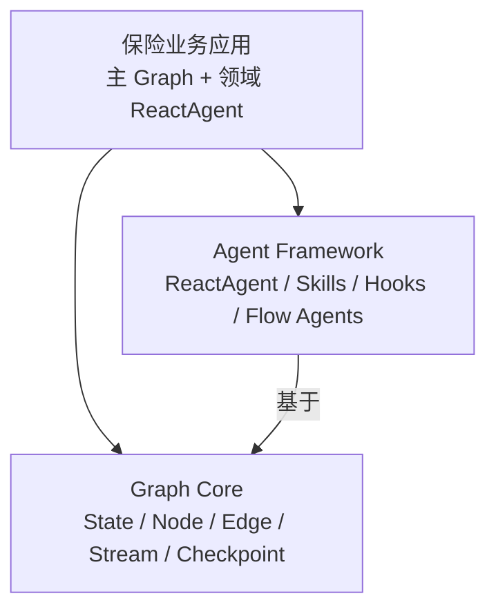

# Spring AI Alibaba 开发参考

## 文档目标

本文档集面向 `insurance-agent` 的开发、架构评审、源码阅读和故障排查。结论分为三类：

- **官方文档**：来自 java2ai.com 或官方 GitHub。
- **当前版本源码**：来自本机 Gradle Cache 中 `1.1.2.3` sources JAR，是 API 可用性的首要依据。
- **项目建议**：结合保险业务给出的设计，不代表框架强制要求。

## 当前项目版本

| 项目 | 实际版本/配置 |
|---|---|
| Java | 21 |
| Spring Boot | 3.5.8 |
| Gradle | Wrapper，Groovy DSL |
| Spring AI | 1.1.2 |
| Spring AI Alibaba | 1.1.2.3 |
| Agent Framework | `com.alibaba.cloud.ai:spring-ai-alibaba-agent-framework:1.1.2.3` |
| Graph Core | 由 Agent Framework 传递引入 `spring-ai-alibaba-graph-core:1.1.2.3` |
| 模型 | 全局 `ChatModel`，OpenAI-compatible；当前可接 DeepSeek |

版本依据：[build.gradle](../../build.gradle)、本地构件 `pom.properties`。架构与官方能力说明以具有公开 Tag/Commit 的 `v1.1.2.0` 为文档基准，项目运行和代码编译仍以实际依赖 `1.1.2.3` 为准。官网持续更新，本文所有关键 API 都按本地 `1.1.2.3` 源码复核。

## 当前实现基线

- `ProductAnalysisAgent` 已封装 `ReactAgent`，具备 Skill、Tool、模型调用、窗口记忆、长期历史与调用审计。
- Skill 使用 `ClasspathSkillRegistry`，根目录隔离为 `skills/product-analysis`。
- 主工作流已使用 `StateGraph`，当前为确定性串行 v1。
- 记忆使用 Spring AI `MessageWindowChatMemory`、MyBatis 和本地 OceanBase/MySQL 模式表；尚未采用 Graph Checkpoint Saver。
- 当前 HTTP API 为同步 MVC；尚未实现 SSE/Flux 流式端点。
- 尚未实现并行子智能体、Human In The Loop、Graph Replay 和持久化恢复。

## 官网与项目版本差异

| 官网当前/历史示例 | 项目 `1.1.2.3` 结论 |
|---|---|
| `SupervisorAgent.builder()` | 本地 sources JAR 未发现独立 `SupervisorAgent`；使用 `AgentTool` 或 StateGraph 实现同类模式 |
| `SaverConfig.register(SaverConstant, saver)` | 当前源码为 `SaverConfig.builder().register(saver).build()` |
| `checkpoint.savers.RedisSaver` | 当前源码为 `checkpoint.savers.redis.RedisSaver`；Postgres、Mongo 同样位于子包 |
| `PostgreSqlSaver` | 当前类名为 `PostgresSaver` |
| AllOf/AnyOf 作为并行聚合名词 | Release 明确提及，但本地没有同名公开类；使用并行边和 `NodeAggregationStrategy` |
| `StreamingOutput.chunk()` | 当前已 deprecated，使用 `message()` |

官网是滚动文档，不能据此推断项目构件一定具有相同 Builder。以上差异均由本地 `1.1.2.3` 源码确认。

## 已冻结的项目决策

| 决策项 | 结论 |
|---|---|
| Graph Checkpoint | 已实现 OceanBase `BaseCheckpointSaver` 自定义实现，不引入 Redis/Postgres Saver 作为生产主方案 |
| 官方功能基准 | Spring AI Alibaba `v1.1.2.0`；编译兼容基准仍为项目实际依赖 `1.1.2.3` |
| Checkpoint 保留 | 运行中、人工中断和失败记录保留 90 天；成功完成记录在线保留 30 天 |
| 人工确认记录 | 作为业务审计数据保留 5 年 |
| 工作流执行历史 | 节点结果摘要和审计元数据保留 5 年，敏感原始 State 不随审计记录长期复制 |
| SSE 重连 | 支持 `Last-Event-ID`；脱敏后的重放事件保留 7 天 |
| 候选确认权限/有效期 | 当前阶段暂不设计，进入真实客户数据接入前必须补齐 |

## 文档列表

1. [Agent Framework](01-agent-framework.md)
2. [Graph Core](02-graph-core.md)
3. [Agent Framework 与 Graph Core 选型](03-agent-framework-vs-graph-core.md)
4. [保险智能体落地指南](04-insurance-agent-implementation-guide.md)
5. [API 速查](05-api-cheatsheet.md)
6. [来源索引](06-source-index.md)

推荐先读本文和第 3 篇建立边界，再读第 1、2 篇，最后按第 4、5 篇实施。

## 两个模块的关系

Agent Framework 负责“模型如何自主推理并调用工具”；Graph Core 负责“多个确定性步骤如何编排、持久化、暂停和恢复”。`ReactAgent` 内部也会构造并编译 `StateGraph`，但这不等于业务主流程无需 Graph。

## 维护方式

1. 升级依赖前记录目标版本与 Git Tag/Commit。
2. 用 sources JAR 复核文档中的类名、包名和 Builder 方法。
3. 运行文档示例的编译测试后，才把“待验证”改为“已验证”。
4. 新增子智能体时，同步更新第 4 篇的节点、State、事件协议和记忆边界。
5. 官网与本地源码冲突时，以项目锁定版本源码为准，并保留差异说明。
