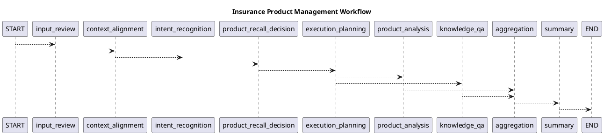

# Spring AI Alibaba Graph Core 示例开发参考文档

## 文档用途

本文用于指导 Codex 在现有保险产品管理智能体项目中实现和排查：

* LLM 流式节点
* SSE 流式接口
* Graph 会话记忆
* Redis Checkpoint
* 状态历史与回溯
* 长时间任务恢复
* Human-in-the-Loop
* MCP 工具按节点分配
* 并行节点和并行流式输出
* 子图拆分与复用
* Supervisor 多智能体模式
* Graph 可视化
* 工作流取消

---

## 版本兼容性警告

官网“示例”栏目主要用于说明机制，部分代码存在版本差异或表达不一致，例如：

* `node_async`、`nodeasync` 等辅助方法名称存在差异。
* `checkpointId`、`checkPointId` 的方法命名存在差异。
* 部分页面将 `CompiledGraph.stream()` 描述为返回 `Flux<NodeOutput>`，部分页面仍使用 `AsyncGenerator<NodeOutput>` 解释底层机制。
* Redis 示例使用了 `1.0.0.3-SNAPSHOT`，不能直接替换当前项目的 `1.1.2.3`。
* 部分示例使用已经变化的 Spring AI Function Callback API。
* 部分示例将 Graph 直接在 Controller 构造器中编译，不适合生产项目。

因此 Codex 在使用本文开发前必须执行：

```text
1. 检查 build.gradle 中的实际版本
2. 查看本地 1.1.2.3-sources.jar
3. 查看对应类的真实方法签名
4. 编写最小编译测试
5. 再将实现合入业务工作流
```

---

# Spring AI Alibaba LLM 流式集成

## 1. 章节目标

该章节主要说明两层流式能力：

1. 直接使用 Spring AI `ChatClient` 获取模型流式响应。
2. 在 Graph Node 中返回流，由 Graph 统一消费并继续执行工作流。

Spring AI 的 `ChatClient` 可以通过：

```java
chatClient.prompt()
        .user(userMessage)
        .stream()
        .chatResponse();
```

返回 `Flux<ChatResponse>`；也可以使用 `.content()` 直接得到文本片段流。

---

## 2. ChatClient 流式调用

推荐封装：

```java
public Flux<String> streamChat(String userMessage) {
    return chatClient.prompt()
            .user(userMessage)
            .stream()
            .content()
            .filter(Objects::nonNull);
}
```

调用方通过 Reactor 操作符处理：

```java
streamChat(userMessage)
        .doOnNext(chunk -> log.debug("chunk={}", chunk))
        .doOnError(error -> log.error("LLM stream failed", error))
        .doOnComplete(() -> log.info("LLM stream completed"))
        .subscribe();
```

### 不推荐的阻塞方式

官网也展示了：

```java
flux.collectList().block();
```

这只适合：

* 单元测试。
* 命令行 Demo。
* 本地调试。

在 Web 请求线程中调用 `block()` 会失去真正的流式效果，并长期占用线程。

---

## 3. Graph 流式节点

节点可以返回 `Flux`：

```java
public final class StreamingSummaryNode implements NodeAction {

    private final ChatClient chatClient;

    @Override
    public Map<String, Object> apply(OverAllState state) {
        String prompt = buildPrompt(state);

        Flux<String> contentFlux = chatClient.prompt()
                .user(prompt)
                .stream()
                .content();

        return Map.of(
                InsuranceStateKeys.FINAL_ANSWER,
                contentFlux
        );
    }
}
```

Graph 会处理该流，并把流式片段作为工作流输出发送给调用方。官网示例使用 `answer` Key 返回 `Flux<String>`。

### 强制要求

节点返回 Flux 后，不要在节点内部再次执行：

```java
contentFlux.subscribe();
```

否则可能导致：

* 模型请求被订阅两次。
* 相同回答生成两次。
* Graph State 与前端显示不一致。
* 请求无法正常取消。
* 资源释放失效。

---

## 4. 推荐 Graph 结构

```text
START
  ↓
上下文处理
  ↓
业务查询
  ↓
结果聚合
  ↓
流式 Summary Node
  ↓
END
```

对于当前保险智能体：

* 产品分析、保单查询、资产查询等中间节点不必全部流式展示。
* 最终 `SummaryAgent` 或 `SummaryNode` 负责用户可见的正文流式输出。
* 中间节点只发送进度事件。

---

## 5. SSE 接口建议

```java
@PostMapping(
        value = "/insurance/chat/stream",
        produces = MediaType.TEXT_EVENT_STREAM_VALUE)
public Flux<ServerSentEvent<WorkflowStreamEvent>> stream(
        @RequestBody WorkflowRequest request) {

    RunnableConfig config = RunnableConfig.builder()
            .threadId(request.conversationId())
            .addMetadata("customerId", request.customerId())
            .build();

    return compiledGraph
            .stream(buildInput(request), config)
            .map(output -> workflowEventConverter.convert(
                    request.conversationId(),
                    output))
            .map(event -> ServerSentEvent.builder(event)
                    .event(event.type().name())
                    .build());
}
```

不要直接把完整 `NodeOutput` 序列化给前端，应转换成白名单事件。

---

# 为图添加持久化（记忆）

## 1. 核心机制

Graph 通过 Checkpointer 保存工作流状态。主要步骤是：

1. 创建 Checkpointer，例如 `MemorySaver`。
2. 在编译 Graph 时注册 Checkpointer。
3. 执行时传入 `threadId`。
4. 后续使用相同 `threadId` 恢复历史 State。

官网示例对比了无 Checkpointer 和使用 `MemorySaver` 时的多轮对话效果，并展示了不同 `threadId` 的会话隔离。

---

## 2. State 策略

示例使用：

```java
KeyStrategyFactory keyStrategyFactory = () -> {
    Map<String, KeyStrategy> strategies = new HashMap<>();

    strategies.put("messages", new AppendStrategy());
    strategies.put("user_name", new ReplaceStrategy());
    strategies.put("context", new ReplaceStrategy());

    return strategies;
};
```

含义：

* `messages`：逐轮追加。
* `user_name`：新值覆盖旧值。
* `context`：使用最新上下文。

### Codex 注意事项

使用 `AppendStrategy` 时，节点只返回本次新增内容：

```java
return Map.of(
        "messages",
        List.of(newMessage)
);
```

不要返回：

```java
return Map.of(
        "messages",
        allOldMessagesPlusNewMessage
);
```

否则旧消息会重复追加。

---

## 3. 配置 Checkpointer

当前版本建议优先确认以下形式：

```java
MemorySaver saver = new MemorySaver();

SaverConfig saverConfig = SaverConfig.builder()
        .register(saver)
        .build();

CompileConfig compileConfig = CompileConfig.builder()
        .saverConfig(saverConfig)
        .build();

CompiledGraph graph = stateGraph.compile(compileConfig);
```

官网不同页面也出现过：

```java
CompileConfig.builder()
        .checkpointSaver(checkpointer)
```

Codex 必须查看 `1.1.2.3` 的 `CompileConfig` 源码后选择正确写法。

---

## 4. 会话隔离

```java
RunnableConfig config = RunnableConfig.builder()
        .threadId(conversationId)
        .build();
```

同一个 `threadId`：

```text
恢复之前的 Graph State
```

不同 `threadId`：

```text
形成完全隔离的工作流会话
```

官网示例分别使用 Alice 和 Bob 的不同 Thread，验证了记忆隔离。

当前项目建议：

```text
conversationId = Graph threadId
```

后端必须校验该 `conversationId` 是否属于当前登录用户，不能让前端任意读取其他会话。

---

## 5. 状态查询

可查询：

```java
StateSnapshot snapshot = graph.getState(config);
```

以及：

```java
Collection<StateSnapshot> history =
        graph.getStateHistory(config);
```

用于：

* 查看当前节点。
* 查看下一节点。
* 查看 Checkpoint ID。
* 查看历史 State。
* 调试状态变化。
* 判断是否处于人工等待状态。

---

## 6. 当前项目的存储边界

```text
ai_chat_memory
    保存聊天消息、前端展示、审计

Graph Checkpointer
    保存工作流 State、执行位置、中断状态

Long-term Store
    保存跨会话偏好和长期事实
```

禁止每轮同时：

```text
数据库加载完整历史
+
Checkpointer 恢复完整历史
```

否则会造成消息重复。

---

# Redis 检查点持久化

## 1. 适用场景

`MemorySaver` 只适合单 JVM 开发测试。

RedisSaver 适合：

* 多实例部署。
* 服务重启后恢复。
* 长时间工作流。
* 人工审批等待。
* 高并发状态访问。
* 需要 TTL 自动清理。

官网说明 Redis Checkpoint 支持工作流状态恢复、高性能访问以及 TTL 管理，并建议生产环境配置高可用、持久化和安全控制。

---

## 2. 依赖

官网示例中的依赖版本：

```gradle
implementation(
    "com.alibaba.cloud.ai:spring-ai-alibaba-graph-checkpoint-redis:1.0.0.3-SNAPSHOT"
)
implementation("org.redisson:redisson:3.24.3")
```

该版本不能直接用于当前项目。

Codex 应先确认 `1.1.2.3` 对应的 Redis Checkpoint 模块是否：

* 已发布正式版本。
* 包含在 Agent Framework 依赖中。
* 需要额外仓库。
* 与当前 Redisson 版本兼容。

---

## 3. RedisSaver 初始化

示意：

```java
@Bean(destroyMethod = "shutdown")
public RedissonClient redissonClient(
        RedisCheckpointProperties properties) {

    Config config = new Config();

    config.useSingleServer()
            .setAddress(properties.address())
            .setPassword(properties.password());

    return Redisson.create(config);
}

@Bean
public RedisSaver redisSaver(
        RedissonClient redissonClient) {

    return new RedisSaver(redissonClient);
}
```

再注册到 `SaverConfig`。

---

## 4. 生产配置要求

至少配置：

* Redis 地址。
* 用户名和密码。
* TLS。
* 连接池。
* 请求超时。
* 重试次数。
* Checkpoint TTL。
* Key 前缀。
* 机构或租户隔离。
* RDB 或 AOF。
* Sentinel 或 Cluster。
* 内存上限和淘汰策略。

官网建议监控 Redis 内存、连接数和性能指标，并为检查点设置合理 TTL。

---

## 5. Thread ID 设计

推荐：

```text
graph:{environment}:{application}:{tenantId}:{conversationId}
```

示例：

```text
graph:prod:insurance-agent:branch-001:conv-123456
```

不要仅使用：

```text
user-1
test-thread
demo
```

生产环境需要：

* 防止不同系统冲突。
* 支持租户隔离。
* 支持按环境清理。
* 便于监控与排查。

---

## 6. 数据安全

Checkpoint 中可能包含：

* 用户问题。
* 客户号。
* 产品代码。
* 保单摘要。
* Tool 参数。
* 模型响应。
* 审批信息。

因此应：

* 对敏感字段脱敏。
* 限制 Redis 网络访问。
* 开启认证和 TLS。
* 控制 Checkpoint 保留时间。
* 禁止通过 Redis Key 暴露客户身份。
* 避免保存不必要的完整业务对象。

---

# 时光旅行 - 状态历史回溯

## 1. 核心能力

时光旅行基于 Checkpointer 保存的 `StateSnapshot`，支持：

* 查看状态历史。
* 选择历史 Checkpoint。
* 从历史状态继续执行。
* 基于历史状态创建新的执行分支。

使用时需要：

```text
threadId + checkPointId
```

官网示例通过 `getStateHistory()` 获取历史，再使用历史快照中的 Checkpoint ID 构建新的 `RunnableConfig`。

---

## 2. 获取状态历史

```java
Collection<StateSnapshot> history =
        graph.getStateHistory(config);
```

建议将其转换为受控 DTO：

```java
public record WorkflowHistoryItem(
        String checkpointId,
        String nodeId,
        Instant createdAt,
        WorkflowStatus status,
        Map<String, Object> summary) {
}
```

不要把完整 StateSnapshot 直接返回前端。

---

## 3. 从历史节点继续

```java
RunnableConfig historicalConfig =
        RunnableConfig.builder()
                .threadId(conversationId)
                .checkPointId(checkpointId)
                .build();

graph.invoke(
        Map.of("userQuery", newQuery),
        historicalConfig
);
```

具体方法名 `checkPointId` 或 `checkpointId` 必须以本地源码为准。

---

## 4. 分支语义

从历史 Checkpoint 继续执行，不是修改原有历史，而是形成新的后续执行路径。

适用场景：

* 用户修改了之前确认的产品。
* 人工审核发现意图识别错误。
* 调试不同模型结果。
* 从某个失败节点重新执行。
* 对同一历史输入执行 A/B 测试。

---

## 5. 副作用风险

从历史 Checkpoint 重放后，后续节点可能重新执行。

以下节点必须幂等：

* 发送客户经理提醒。
* 写入数据库。
* 创建任务。
* 提交审批。
* 修改保单状态。
* 调用外部写接口。

推荐幂等键：

```text
workflowThreadId
+
checkpointBranchId
+
nodeId
+
businessOperationId
```

---

# 持久化执行

## 1. 核心概念

持久化执行指工作流在关键阶段保存状态，发生中断、失败或长时间等待后，可以从之前的状态继续，而不必从头执行。

配置 Checkpointer 后，Graph 已具备持久化执行基础。官网强调，恢复不是从 Java 方法中断的代码行继续，而是从对应 Node 的开始位置重新执行。

---

## 2. 节点是恢复边界

错误设计：

```java
public Map<String, Object> apply(OverAllState state) {
    Result queryResult = callExternalApi();
    saveDatabase(queryResult);
    sendNotification(queryResult);
    return Map.of("result", queryResult);
}
```

如果节点中途失败，恢复时整个节点可能重新运行。

推荐拆分：

```text
external_api_query
    ↓
save_result
    ↓
send_notification
```

这样每个副作用有独立 Checkpoint 边界。

---

## 3. 确定性操作

以下属于非确定性操作：

* 随机数。
* 当前时间。
* 临时外部数据。
* 模型生成。
* 无幂等 Key 的第三方调用。

应将其封装在独立 Node 中，并将结果保存到 State。

不要在条件 Edge 中调用模型或随机生成路由结果。

---

## 4. 幂等性

写操作节点必须：

1. 生成业务操作 ID。
2. 执行前查询是否已经完成。
3. 已完成则返回原结果。
4. 未完成才执行。
5. 成功后记录完成状态。

```java
public Map<String, Object> apply(OverAllState state) {
    String operationId = buildOperationId(state);

    return operationRepository.findResult(operationId)
            .map(result -> Map.<String, Object>of(
                    "notificationResult",
                    result))
            .orElseGet(() -> {
                NotificationResult result =
                        notificationService.send(...);

                operationRepository.save(
                        operationId,
                        result);

                return Map.of(
                        "notificationResult",
                        result);
            });
}
```

---

## 5. 批量任务

官网示例展示了批量处理模式：

```text
处理一批数据
    ↓
更新 processedCount
    ↓
判断是否全部完成
    ├── 否 → 回到处理节点
    └── 是 → END
```

每批次结果可以使用 `AppendStrategy` 累积，处理进度使用 `ReplaceStrategy` 更新。

适合：

* 批量扫描到期保单。
* 批量分析产品。
* 批量生成客户经理提醒。
* 大规模知识文件处理。

---

# 人类反馈

## 1. 两种实现模式

官网提供两种 Graph 人工反馈机制：

1. `InterruptionMetadata`：节点根据运行时状态动态决定是否中断。
2. `interruptBefore`：编译 Graph 时配置固定节点，在节点执行前中断。

---

## 2. InterruptionMetadata 模式

适合中断条件需要动态判断的场景。

例如：

```text
产品候选数量 = 1 且置信度足够
    → 自动继续

产品候选数量 > 1
    → 中断等待人工确认
```

节点需要实现 `InterruptableAction`，并在满足条件时返回：

```java
InterruptionMetadata interruption =
        InterruptionMetadata.builder(nodeId, state)
                .addMetadata(
                        "message",
                        "请选择需要分析的保险产品")
                .addMetadata(
                        "candidates",
                        productCandidates)
                .build();
```

官网示例通过流式输出检测 `InterruptionMetadata`，然后等待用户输入。

---

## 3. 更新人工反馈

用户提交反馈后：

```java
RunnableConfig updatedConfig = graph.updateState(
        invokeConfig,
        Map.of(
                "humanFeedback",
                feedback,
                "confirmedProducts",
                confirmedProducts),
        interruption.node()
);
```

官网动态中断示例使用中断节点 ID 作为 `updateState` 的节点参数。

---

## 4. 恢复执行

```java
graph.stream(null, updatedConfig)
        .doOnNext(this::handleOutput)
        .blockLast();
```

传入 `null` 或空输入，表示基于已保存状态继续运行。具体允许形式需要根据 `1.1.2.3` 方法签名确认。

---

## 5. interruptBefore 模式

固定审批点：

```java
CompileConfig compileConfig =
        CompileConfig.builder()
                .saverConfig(saverConfig)
                .interruptBefore(
                        "product_confirmation")
                .build();
```

Graph 执行到该节点之前自动停止。

这种模式：

* 节点不需要实现特殊接口。
* 中断位置清晰。
* 适合固定人工审批节点。
* 不适合运行时动态判断是否需要审批。

---

## 6. 当前项目选型

### 产品召回确认

建议：

```text
InterruptionMetadata
```

因为是否需要确认取决于：

* 是否已在历史中确认过。
* 候选数量。
* 召回置信度。
* 产品简称是否唯一。

### 高风险业务操作

建议：

```text
interruptBefore
```

例如：

* 发送客户经理提醒。
* 修改数据库状态。
* 提交审批。

---

## 7. 人工反馈 DTO

```java
public record HumanInterruptionResponse(
        String conversationId,
        String nodeId,
        String message,
        List<HumanOption> options,
        Map<String, Object> context) {
}

public record HumanDecisionRequest(
        String conversationId,
        String checkpointId,
        String nodeId,
        DecisionType decision,
        Map<String, Object> data,
        String reason) {
}
```

后端必须校验：

* Thread 是否属于当前用户。
* 当前是否确实处于该中断节点。
* Checkpoint 是否仍有效。
* 决策值是否合法。
* 用户是否有审批权限。

---

# 分配MCP工具给指定节点

## 1. 核心目的

该示例演示如何将不同 MCP Server 提供的工具分配给指定 Graph Node，而不是让所有节点看到全部 MCP 工具。官网通过 `spring.ai.graph.nodes.node2servers` 建立 Node 与 MCP Server 的映射。

---

## 2. 配置结构

官网示例：

```yaml
spring:
  ai:
    mcp:
      client:
        enabled: true
        type: ASYNC
        sse:
          connections:
            server1:
              url: http://localhost:19000

    graph:
      nodes:
        node2servers:
          mcp-node:
            - server1
```

含义：

```text
Graph Node：mcp-node
    ↓
只允许使用 MCP Server：server1
```

---

## 3. 配置映射类

```java
@ConfigurationProperties(
        prefix = "spring.ai.graph.nodes")
public class McpNodeProperties {

    private Map<String, Set<String>> node2servers;

    // getter/setter
}
```

然后从 `McpClientToolCallbackProvider` 中筛选属于目标 Server 的 `ToolCallback`，注入对应 Node。

---

## 4. 推荐设计

```java
public interface NodeToolResolver {

    List<ToolCallback> resolve(
            String nodeId,
            RunnableConfig config);
}
```

实现时同时检查：

* Node ID。
* MCP Server ID。
* 用户权限。
* 机构权限。
* 工具白名单。
* 工具风险级别。

---

## 5. 不应只依赖配置过滤

即使某个工具没有暴露给模型，Tool 执行层仍应校验权限。

正确安全边界：

```text
节点工具白名单
+
模型 Tool Schema 过滤
+
工具调用前业务权限校验
+
MCP Server 自身认证授权
```

---

## 6. 当前项目建议

当前保险项目中的本地 Tool，不必为了使用 Graph 而全部改造成 MCP。

MCP 更适合：

* 工具由其他团队维护。
* 工具独立部署。
* 工具需要被多个系统复用。
* 工具语言栈不同。
* 工具需要动态发现。

当前本地 Service 查询优先使用普通 `@Tool` 或 `ToolCallback`。

---

# 并行节点定义

## 1. Fork-Join 模型

并行 Graph 通常是：

```text
          ┌→ A1 ─┐
A ────────┼→ A2 ─┼→ B
          └→ A3 ─┘
```

其中：

* A 是分叉节点。
* A1、A2、A3 并行执行。
* B 是汇聚节点。

官网示例通过多个普通 Edge 从 A 指向多个节点，再将多个分支连接至 B。

---

## 2. Executor 配置

官网说明可以通过 `RunnableConfig` 为并行节点设置 Executor：

```java
RunnableConfig config = RunnableConfig.builder()
        .addParallelNodeExecutor(
                "execution_planning",
                insuranceAgentExecutor)
        .build();
```

若未提供 Executor，分支可能按顺序调度；真正并发还依赖节点本身的异步实现。

具体参数中的 Node ID 是：

* 分叉节点。
* 并行组标识。
* 目标节点。

必须以 `1.1.2.3` 源码测试确定，不能仅凭名称推断。

---

## 3. 官网列出的限制

当前文档指出并行节点主要遵循 Fork-Join 模型，并存在以下限制：

* 并行区域需要统一汇聚。
* 并行分支内部不适合再嵌套新的并行步骤。
* 并行区域中条件边能力受限。

Codex 必须针对当前版本实际测试，因为并行能力可能随版本变化。

---

## 4. State Key 设计

推荐每个并行分支写入独立 Key：

```text
productAnalysisResult
knowledgeResult
policyResult
assetResult
```

不要全部写入：

```text
result
```

聚合节点：

```java
public Map<String, Object> apply(OverAllState state) {
    AggregatedResult result = new AggregatedResult(
            state.value("productAnalysisResult").orElse(null),
            state.value("knowledgeResult").orElse(null),
            state.value("policyResult").orElse(null),
            state.value("assetResult").orElse(null));

    return Map.of(
            "aggregatedResult",
            result);
}
```

---

## 5. Executor 建议

当前项目单个 Agent 主要等待大模型响应，属于 I/O 密集型任务。

不要直接使用：

```java
ForkJoinPool.commonPool()
```

推荐自建并监控：

```java
@Bean
public Executor insuranceAgentExecutor() {
    return new ThreadPoolExecutor(
            corePoolSize,
            maximumPoolSize,
            keepAliveSeconds,
            TimeUnit.SECONDS,
            new ArrayBlockingQueue<>(queueCapacity),
            new NamedThreadFactory("insurance-agent-"),
            new ThreadPoolExecutor.AbortPolicy()
    );
}
```

还需配置：

* 单 Agent 超时。
* 整体工作流超时。
* 拒绝策略。
* 指标监控。
* 上游并发限制。

---

# 并行流式输出

## 1. 核心能力

多个并行 Node 都可以返回 `Flux`，Graph 会保留每个流式片段对应的节点 ID。这样调用方可以区分不同 Agent 的输出。

---

## 2. 输出过滤

```java
graph.stream(input, config)
        .filter(StreamingOutput.class::isInstance)
        .map(StreamingOutput.class::cast)
        .doOnNext(output -> {
            String nodeId = output.node();
            Object chunk = output.chunk();
        });
```

每个事件至少携带：

```text
nodeId
eventType
sequence
chunk
timestamp
```

---

## 3. 前端不能直接混合 Token

错误：

```text
产品分析 Token
知识问答 Token
保单查询 Token
资产查询 Token
```

全部拼到同一段文字中。

正确：

```text
节点进度区域：
    分别展示各节点状态

最终回答区域：
    只展示 Summary Node Token
```

---

## 4. 推荐事件结构

```java
public record WorkflowStreamEvent(
        String conversationId,
        String nodeId,
        WorkflowEventType type,
        long sequence,
        Object data,
        Instant timestamp) {
}
```

---

## 5. 错误隔离

每个并行流应独立记录：

* 成功。
* 失败。
* 超时。
* 取消。
* 产生 Token 数量。
* 首 Token 耗时。
* 总耗时。

一个非关键分支失败，不应自动取消其他无依赖分支。

---

# 子图 Subgraphs

## 1. 子图用途

子图是作为另一个 Graph 节点使用的 Graph，主要用于：

* 多智能体系统。
* 复杂流程模块化。
* 组件复用。
* 团队并行开发。
* 隐藏内部实现。
* 定义稳定的输入输出接口。

官网列出了三种子图接入方式：

1. 将 `CompiledGraph` 直接作为节点。
2. 在 `NodeAction` 中手动调用子图。
3. 将 `StateGraph` 直接嵌入父图。

---

## 2. 三种方式选型

| 方式            | 状态关系             | 优点         | 适用场景       |
| ------------- | ---------------- | ---------- | ---------- |
| CompiledGraph | 父子共享部分 State Key | 预编译、直接复用   | 接口一致的稳定子流程 |
| NodeAction 包装 | 父子 Schema 可完全不同  | 映射灵活、隔离清晰  | 独立领域模块     |
| StateGraph 嵌入 | 父子状态紧密共享         | 构建期组合、结构直观 | 同一业务内部拆分   |

---

## 3. 子图接口

每个子图应明确：

```text
输入 Key
输出 Key
是否共享 messages
是否独立 Checkpointer
是否支持人工中断
是否支持流式输出
失败如何向父图传播
```

建议定义 Java 接口 DTO，而不是仅靠字符串 Key 约定。

---

## 4. 当前项目建议

可拆成：

```text
product_recall_subgraph
product_analysis_subgraph
knowledge_qa_subgraph
customer_information_subgraph
output_review_subgraph
```

但不要过度拆分。

只有同时满足以下条件才建立子图：

* 内部包含多个节点。
* 能够独立测试。
* 有稳定输入输出。
* 可能被复用。
* 拆分后复杂度确实降低。

---

# 子图作为 CompiledGraph

## 1. 特点

先编译子图：

```java
CompiledGraph productAnalysisSubGraph =
        productAnalysisStateGraph.compile();
```

再直接加入父图：

```java
parentGraph.addNode(
        "product_analysis",
        productAnalysisSubGraph);
```

官网对比指出，CompiledGraph 已经完成编译，适合直接复用，但编译后不可继续修改。

---

## 2. State Key 共享

直接作为节点时，父图和子图必须至少共享必要的 State Key。

例如：

```text
父图：
confirmedProducts
productAnalysisResult

子图：
confirmedProducts
productAnalysisResult
```

父图中子图不认识的 Key 会被忽略；子图返回但父图未定义的 Key 也可能无法进入父图状态。官网对子图共享 Key 的行为作了说明。

---

## 3. 适用场景

适合：

* 子图 Schema 与父图兼容。
* 子图已经稳定。
* 需要多处复用。
* 希望统一父图 Checkpointer。
* 不需要复杂输入输出转换。

不适合：

* 父子字段完全不同。
* 需要严格隔离内部 State。
* 需要动态改变子图结构。

---

## 4. Bean 管理

```java
@Bean
public CompiledGraph productAnalysisSubGraph(...) {
    return buildProductAnalysisGraph(...).compile();
}

@Bean
public CompiledGraph insuranceMainGraph(
        @Qualifier("productAnalysisSubGraph")
        CompiledGraph productSubGraph) {

    return buildMainGraph(productSubGraph).compile();
}
```

不要每次调用时重新编译子图。

---

# 子图作为节点操作

## 1. 核心模式

将子图包装在 `NodeAction` 中：

```java
public final class ProductAnalysisSubGraphNode
        implements NodeAction {

    private final CompiledGraph subGraph;

    @Override
    public Map<String, Object> apply(
            OverAllState parentState) {

        Map<String, Object> childInput =
                convertInput(parentState);

        OverAllState childResult =
                subGraph.invoke(childInput);

        return convertOutput(childResult);
    }
}
```

这样父图和子图可以使用完全不同的 State Schema。官网展示了输入 Mapper 和输出 Mapper 的通用包装模式。

---

## 2. 优点

* 父子状态隔离。
* 可以重命名字段。
* 可以过滤敏感字段。
* 可以复用通用子图。
* 可以为不同父图提供不同映射。

---

## 3. 缺点

* 需要手工处理 `RunnableConfig`。
* 需要手工传递 `threadId`。
* 需要决定子图是否使用独立 Checkpointer。
* 中断传播需要自行设计。
* 流式输出需要额外桥接。
* 错误需要显式转换。

官网说明该模式的中断支持需要由调用方自行实现。

---

## 4. 不能直接阻塞响应式线程

如果父图通过 WebFlux 流式执行，包装节点内部调用：

```java
subGraph.invoke(...)
```

可能形成阻塞。

应检查当前版本是否支持：

```java
subGraph.stream(...)
```

并考虑在专用 Executor 中运行。

---

## 5. 当前项目适用位置

如果产品分析内部 State 与主 Graph 差异较大，可以使用该模式：

```text
父图输入：
confirmedProducts
rewriteQuery
customerContext

子图输入：
productCodes
analysisQuestion
analysisDimensions

子图输出：
ProductAnalysisResult

父图输出：
productAnalysisResult
```

---

# 子图作为 StateGraph

## 1. 核心模式

在父图构建阶段直接加入未编译的 `StateGraph`：

```java
StateGraph productSubGraph =
        createProductSubGraph();

StateGraph parentGraph =
        new StateGraph(parentStrategyFactory)
                .addNode(
                        "product_analysis",
                        productSubGraph);
```

官网认为该方式适合父子图紧密相关、共享状态的模块化结构。

---

## 2. 与 CompiledGraph 的区别

```text
StateGraph：
    构建期结构
    尚未编译
    可以继续组合

CompiledGraph：
    已编译运行时对象
    结构固定
    可直接执行和复用
```

---

## 3. 优点

* 父图统一编译。
* 可统一应用 Checkpointer。
* 可统一生成可视化。
* 子图内部结构可纳入整体 Graph。
* 更适合同一应用内的复杂业务模块。

---

## 4. 风险

* 父子 KeyStrategy 必须兼容。
* 同名 Key 的语义必须一致。
* `AppendStrategy` 可能造成重复合并。
* 子图内部节点名可能与父图冲突。
* 调试时需要区分父图和子图层级。

建议为子图节点增加前缀：

```text
product_recall.validate
product_recall.search
product_recall.rank
product_recall.confirm
```

---

# 多智能体监督者模式

## 1. 架构

Supervisor 模式由：

```text
Supervisor Agent
    ↓
根据任务路由
    ├── Researcher Agent
    ├── Coder Agent
    ├── Product Agent
    └── Policy Agent
```

Supervisor 负责选择 Worker，Worker 负责执行专业任务。官网示例使用 Researcher 和 Coder Worker，并由 Supervisor 通过条件 Edge 路由。

---

## 2. State 设计

通常包括：

```text
messages             Append
next                 Replace
workerResult         Replace
finalAnswer          Replace
```

Supervisor 输出结构化路由结果：

```java
public record SupervisorDecision(
        String next,
        String reason,
        String task) {
}
```

`next` 必须是受控枚举：

```text
PRODUCT_ANALYSIS
KNOWLEDGE_QA
POLICY_QUERY
ASSET_QUERY
FINISH
```

---

## 3. 循环

```text
Supervisor
    ↓
Worker
    ↓
Supervisor
    ↓
Worker 或 FINISH
```

必须限制：

* 最大 Supervisor 循环次数。
* 每个 Worker 最大调用次数。
* 工作流总模型调用次数。
* 总执行时间。
* 同一 Worker 连续重复次数。

---

## 4. 当前项目是否适合

你的保险产品管理流程已经具备明确节点、依赖和人工确认要求，因此不建议把总体编排完全交给 Supervisor。

推荐：

```text
StateGraph：
    决定总体流程、依赖、并行和人工确认

ReactAgent：
    负责节点内部推理

Supervisor：
    仅用于某个边界清晰、执行步骤不可预先确定的子任务
```

例如复杂研究型产品分析可以考虑 Supervisor，但产品召回、保单查询和输出审核应保持确定性。

---

# PlantUML 图表可视化

## 1. GraphRepresentation

Graph 可以导出成 `GraphRepresentation`：

```java
GraphRepresentation representation =
        compiledGraph.getGraph(
                GraphRepresentation.Type.PLANTUML,
                "Insurance Product Management Workflow");
```

然后通过：

```java
representation.content();
```

获得 PlantUML 文本。

---

## 2. 输出示例



---

## 3. 工程用途

适合：

* 自动生成架构文档。
* Code Review。
* 流程设计评审。
* 对比 Graph 版本变化。
* 排查边和节点缺失。
* 向领导展示智能体流程。

官网也将文档生成、调试、团队协作和版本对比列为主要场景。

---

## 4. Codex 自动校验建议

每次修改 Graph 后：

1. 导出 PlantUML。
2. 保存到 `docs/graph/`。
3. 与上一个版本比较。
4. 检查关键节点是否仍存在。
5. 检查 END 是否可达。
6. 检查是否出现无入边节点。
7. 检查是否出现意外循环。

推荐文件：

```text
docs/graph/
├── insurance-workflow.puml
├── product-recall-subgraph.puml
└── product-analysis-subgraph.puml
```

---

# Graph 执行取消

## 1. 核心机制

Graph 执行取消用于停止长时间运行的工作流。

官网底层说明使用 `AsyncGenerator.cancel(boolean mayInterruptIfRunning)`，但当前示例页面的代码又使用 Reactor `Flux` 和 `Disposable.dispose()`；这说明不同版本或适配层的 API 形态存在差异，必须以当前 `1.1.2.3` 源码为准。

---

## 2. 立即取消与优雅取消

底层语义：

```text
cancel(true)
    尝试中断当前执行线程

cancel(false)
    允许当前节点完成
    在启动下一节点前停止
```

官网说明异步消费时，立即取消可能使 Future 以 `InterruptedException` 结束；优雅取消则允许当前 Node 完成。

---

## 3. Reactor 模式

如果当前版本返回 Flux：

```java
Disposable disposable = graph
        .stream(input, config)
        .subscribe(
                this::handleOutput,
                this::handleError,
                this::handleComplete);

disposable.dispose();
```

`dispose()` 表示取消当前订阅。

但是取消订阅是否真正中断：

* 当前模型 HTTP 请求。
* Tool 调用。
* JDBC 查询。
* 子线程任务。

取决于各组件是否支持响应式取消和线程中断。

---

## 4. 取消注册表

为了支持前端“停止生成”：

```java
@Component
public final class WorkflowCancellationRegistry {

    private final ConcurrentMap<String, Disposable>
            runningWorkflows = new ConcurrentHashMap<>();

    public void register(
            String executionId,
            Disposable disposable) {

        runningWorkflows.put(executionId, disposable);
    }

    public boolean cancel(String executionId) {
        Disposable disposable =
                runningWorkflows.remove(executionId);

        if (disposable == null) {
            return false;
        }

        disposable.dispose();
        return true;
    }

    public void remove(String executionId) {
        runningWorkflows.remove(executionId);
    }
}
```

必须校验 Execution ID 归属，不能让用户取消其他人的任务。

---

## 5. 子图取消

官网说明父图取消会传播到正在执行的子图。

但需要集成测试确认：

* 父图流是否停止。
* 子图模型请求是否停止。
* 并行分支是否全部停止。
* 已进入的 Tool 是否仍继续执行。
* Checkpoint 是否记录取消状态。

---

## 6. 取消不等于事务回滚

当用户停止生成时，以下操作可能已经完成：

* 数据库写入。
* 通知发送。
* 外部接口调用。
* 客户经理任务创建。

取消 SSE 连接不会自动撤销这些副作用。

因此写操作必须：

* 在执行前人工确认。
* 支持幂等。
* 明确事务边界。
* 保存操作状态。
* 必要时提供补偿流程。

---

# 当前保险产品管理智能体推荐实现

## 1. 总体 Graph

```text
START
  ↓
input_review
  ↓
context_alignment_and_rewrite
  ↓
intent_recognition
  ↓
product_recall_decision
  ↓
需要产品召回？
  ├── 是
  │    ↓
  │ product_recall_subgraph
  │    ↓
  │ human_product_confirmation
  │    ↓
  │ execution_planning
  │
  └── 否
       ↓
     execution_planning
       ↓
 ┌─────┼────────┬────────┐
 ↓     ↓        ↓        ↓
产品   知识     保单     资产
分析   问答     查询     查询
 └─────┼────────┴────────┘
       ↓
result_aggregation
       ↓
output_review
       ↓
streaming_summary
       ↓
END
```

---

## 2. 示例能力映射

| 官网示例             | 当前项目用途               |
| ---------------- | -------------------- |
| LLM 流式集成         | Summary Agent SSE 输出 |
| 为图添加持久化          | 多轮会话和工作流 State       |
| Redis Checkpoint | 生产状态恢复               |
| 时光旅行             | 故障排查、历史分支重跑          |
| 持久化执行            | 长时间 Agent 和批量扫描      |
| 人类反馈             | 产品确认、高风险工具审批         |
| MCP Node         | 外部工具按节点授权            |
| 并行节点             | 四个子智能体并行             |
| 并行流式输出           | 节点进度和调试事件            |
| 子图               | 产品召回、产品分析模块化         |
| Supervisor       | 仅复杂动态子任务             |
| PlantUML         | 自动生成架构文档             |
| 取消执行             | 前端停止生成               |

---

# Codex 开发强制检查清单

## 版本检查

* [ ] 检查 `spring-ai-alibaba-agent-framework:1.1.2.3` 源码。
* [ ] 检查是否单独依赖 Graph Core。
* [ ] 检查 `CompileConfig` 的真实 Builder 方法。
* [ ] 检查 `RunnableConfig` 中 Checkpoint ID 方法名称。
* [ ] 检查 `CompiledGraph.stream()` 的真实返回类型。
* [ ] 检查 RedisSaver 的模块坐标和构造方法。
* [ ] 不使用官网 SNAPSHOT 版本。

## State

* [ ] 所有 State Key 使用常量。
* [ ] 每个 Key 配置明确的 KeyStrategy。
* [ ] AppendStrategy 只返回增量。
* [ ] 并行节点不写相同 Replace Key。
* [ ] State 中不保存 Spring Bean 和连接对象。
* [ ] State DTO 可序列化和反序列化。
* [ ] 不将完整大型文档写入 Checkpoint。

## 持久化

* [ ] `conversationId` 与 `threadId` 统一。
* [ ] Thread 归属经过权限校验。
* [ ] 生产环境不使用 MemorySaver。
* [ ] Redis 配置 TTL、认证和 TLS。
* [ ] Checkpoint 与聊天记录分表存储。
* [ ] 历史查询结果进行脱敏。
* [ ] Replay 后写操作保持幂等。

## Human-in-the-Loop

* [ ] 动态确认使用 InterruptionMetadata。
* [ ] 固定审批点使用 interruptBefore。
* [ ] 用户反馈必须校验当前 Checkpoint。
* [ ] 前端不能任意指定恢复节点。
* [ ] 人工反馈记录单独审计。
* [ ] 恢复执行使用原 threadId。

## 并行执行

* [ ] 只有无依赖节点才能并行。
* [ ] 使用专用 Executor。
* [ ] 配置单节点和总工作流超时。
* [ ] 每个并行节点有独立结果 Key。
* [ ] 聚合节点处理部分失败。
* [ ] 验证当前版本是否支持嵌套并行和条件边。

## 流式输出

* [ ] 节点返回 Flux 后不再次 subscribe。
* [ ] SSE 只输出白名单字段。
* [ ] 每个事件包含 nodeId。
* [ ] 并行 Token 不直接混合。
* [ ] 最终回答只输出 Summary Token。
* [ ] 客户端断开时取消订阅。
* [ ] Thinking 内容不在生产环境展示。
* [ ] 流式异常转换为标准 ERROR 事件。

## 子图

* [ ] 子图有明确输入和输出。
* [ ] 明确父子图是否共享 State。
* [ ] 明确父子图是否共享 Checkpointer。
* [ ] NodeAction 包装时处理 Config 和异常传播。
* [ ] 子图节点名称增加业务前缀。
* [ ] 对嵌套 AppendStrategy 编写集成测试。
* [ ] 子图流式和中断传播经过测试。

## 取消和副作用

* [ ] 每次执行生成唯一 executionId。
* [ ] 取消接口校验用户归属。
* [ ] 取消后清理运行注册表。
* [ ] 检查子图和并行分支是否真正停止。
* [ ] 取消不依赖数据库事务自动回滚。
* [ ] 写操作具备幂等和补偿机制。

---

# 建议测试用例

## 流式测试

```text
单 LLM 节点正常流式
流式中途模型异常
客户端主动取消
最终 State 保存完整回答
Summary 前置节点失败
Thinking 和正文分离
```

## 持久化测试

```text
相同 threadId 恢复
不同 threadId 隔离
应用重启后恢复
Checkpoint TTL 到期
历史状态查询
从指定 Checkpoint 分支执行
```

## 人工反馈测试

```text
动态条件无需确认
动态条件触发中断
固定节点中断
人工批准
人工修改
人工拒绝
过期 Checkpoint 提交
重复提交人工反馈
```

## 并行测试

```text
四个节点全部成功
一个非关键节点失败
一个依赖节点失败
一个节点超时
并行节点写入同名 Key
Executor 队列满
客户端取消所有并行分支
```

## 子图测试

```text
共享 State 的 CompiledGraph
不同 Schema 的 NodeAction 子图
StateGraph 嵌入
父图 Checkpointer 传播
子图独立 Checkpointer
子图中断传播
子图流式输出
子图异常转换
```

## 副作用测试

```text
通知节点执行一次
节点失败后恢复不重复通知
Replay 不重复创建任务
取消后已完成写操作保持可追踪
补偿操作正确执行
```
